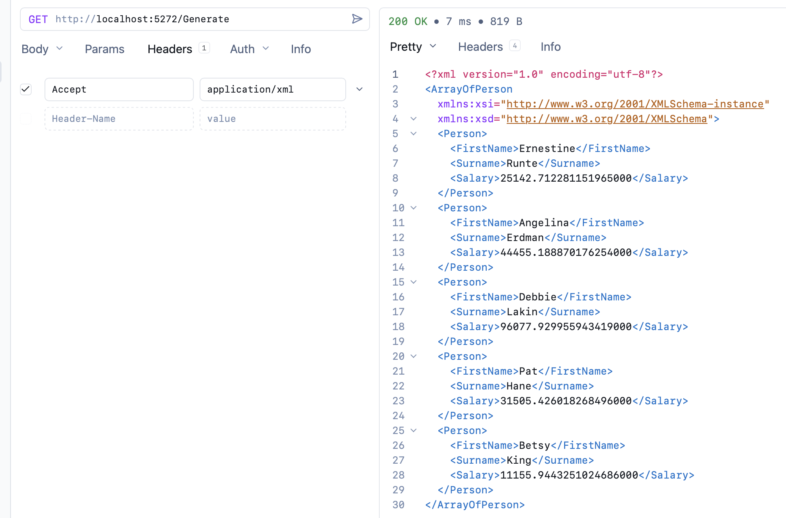
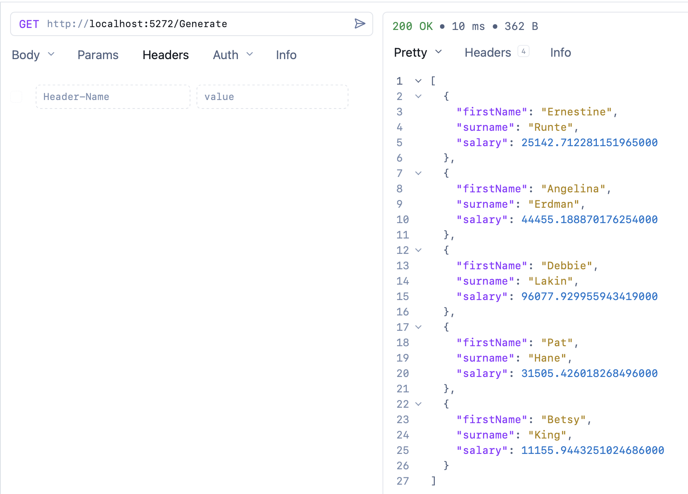

In the previous post, "[Extending The Results Type For XML Serialization In C# & .NET]()", we looked at how to extend the [Results](https://learn.microsoft.com/en-us/dotnet/api/microsoft.aspnetcore.http.results?view=aspnetcore-10.0) `type` to simplify and improve the **discoverability** of `XML` serialization at the API level.

However, the API in question will **always** serialize the response in `XML`.

As a reminder, the API looked like this:

```c#
app.MapGet("/Generate", () =>
{
  var faker = new Faker<Person>().UseSeed(0)
    .RuleFor(person => person.FirstName, faker => faker.Person.FirstName)
    .RuleFor(person => person.Surname, faker => faker.Person.LastName)
    .RuleFor(person => person.Salary, faker => faker.Random.Decimal(10_000, 99_000));

  return Results.Xml(faker.Generate(5));
});
```

What if we wanted the **requesting client** to be able to **choose the serialization** required?

In a previous post, "[Conditionally Output XML or JSON Using ASP.NET Minimal API]()", we looked at how to achieve this using [content negotiation](https://developer.mozilla.org/en-US/docs/Web/HTTP/Guides/Content_negotiation) and the [Carter](https://github.com/CarterCommunity/Carter) package.

In this post, we will look at how to achieve this **manually** if we **cannot, or don't want to**, use a solution like `Carter`.

Our solution will use the fact that the client can request the [content type](https://developer.mozilla.org/en-US/docs/Web/HTTP/Reference/Headers/Content-Type) it accepts via the [Accept](https://developer.mozilla.org/en-US/docs/Web/HTTP/Reference/Headers/Accept) header.

```c#
app.MapGet("/Generate", async (HttpRequest request) =>
{
    var faker = new Faker<Person>().UseSeed(0)
        .RuleFor(person => person.FirstName, faker => faker.Person.FirstName)
        .RuleFor(person => person.Surname, faker => faker.Person.LastName)
        .RuleFor(person => person.Salary, faker => faker.Random.Decimal(10_000, 99_000));

    var people = faker.Generate(5).ToList();
    // Get the request header
    var header = request.Headers.Accept.ToString();
    // Check if XML was requested
    if (header.Contains(MediaTypeNames.Application.Xml, StringComparison.OrdinalIgnoreCase))
        return await Results.Xml(people);
    // Return JSON otherwise
    return Results.Ok(people);
});
```

Here we fetch the `Accept` header and then check whether it is "`application/xml`" using the constant [MediaTypeNames.Application.Xml](https://learn.microsoft.com/en-us/dotnet/api/system.net.mime.mediatypenames.application.xml?view=net-10.0) constant, case-insensitive.

If it is, return the content as `XML`.

In all other cases, return `JSON`.

If we now make a request and specify the XML content type in the `Accept` **header**:



We get the results as `XML`.

Otherwise, we get `JSON`:



### TLDR

**We can use the `content-type` header to decide how to serialize responses to clients.**

The code is in my GitHub.

Happy hacking!
