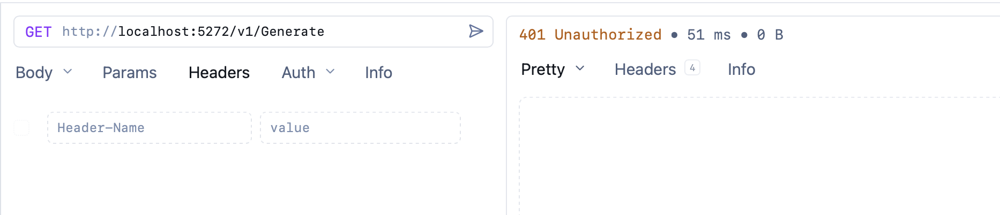
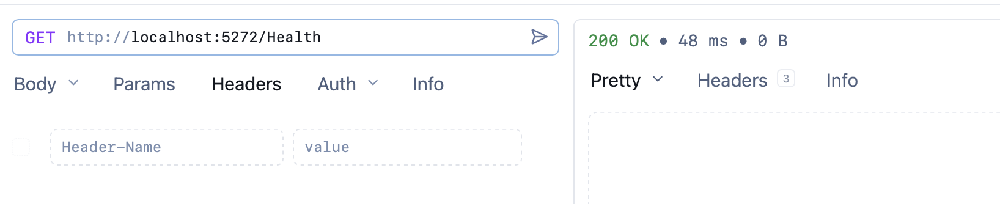

API **authentication** is almost always required to **secure your API endpoints** from **unauthorized users**.

Take this example from the post "[Dynamically Changing Decimal & Thousand Separators At Runtime"]();

```c#
var builder = WebApplication.CreateBuilder(args);
builder.Services.AddOptions<Settings>()
    .Bind(builder.Configuration.GetSection(nameof(Settings)))
    .ValidateDataAnnotations()
    .ValidateOnStart();

var app = builder.Build();

app.MapGet("/v1/Generate", () =>
{
    var faker = new Faker<Person>().UseSeed(0)
        .RuleFor(person => person.FirstName, faker => faker.Person.FirstName)
        .RuleFor(person => person.Surname, faker => faker.Person.LastName)
        .RuleFor(person => person.Salary, faker => faker.Random.Decimal(10_000, 99_000));
    var sb = new StringBuilder();
    foreach (var person in faker.Generate(10).ToList())
    {
        sb.AppendLine($"| {person.FirstName} | {person.Surname} | {person.Salary.ToString("0.00")} |");
    }

    return Results.Text(sb.ToString());
});

app.MapGet("/v2/Generate", () =>
{
    var french = new CultureInfo("fr-FR");
    var faker = new Faker<Person>().UseSeed(0)
        .RuleFor(person => person.FirstName, faker => faker.Person.FirstName)
        .RuleFor(person => person.Surname, faker => faker.Person.LastName)
        .RuleFor(person => person.Salary, faker => faker.Random.Decimal(10_000, 99_000));
    var sb = new StringBuilder();
    foreach (var person in faker.Generate(10).ToList())
    {
        sb.AppendLine($"| {person.FirstName} | {person.Surname} | {person.Salary.ToString("0,0.00", french)} |");
    }

    return Results.Text(sb.ToString());
});

app.MapGet("/v3/Generate", (IOptions<Settings> options) =>
{
    var settings = options.Value;
    // We are cloning an existing one instead of creating a new one
    // to avoid the need to specify all the settings.
    var numberFormatInfo = (NumberFormatInfo)
        CultureInfo.InvariantCulture.NumberFormat.Clone();
    // Set the formats
    numberFormatInfo.NumberDecimalSeparator = settings.DecimalSeparator;
    numberFormatInfo.NumberGroupSeparator = settings.ThousandSeparator;
    var faker = new Faker<Person>().UseSeed(0)
        .RuleFor(person => person.FirstName, faker => faker.Person.FirstName)
        .RuleFor(person => person.Surname, faker => faker.Person.LastName)
        .RuleFor(person => person.Salary, faker => faker.Random.Decimal(10_000, 99_000));
    var sb = new StringBuilder();
    foreach (var person in faker.Generate(10).ToList())
    {
        sb.AppendLine(
            $"| {person.FirstName} | {person.Surname} | {person.Salary.ToString("0,0.00", numberFormatInfo)} |");
    }

    return Results.Text(sb.ToString());
});

app.Run();
```

Suppose we wanted to **secure these endpoints**.

The first step would be to set up the security.

***NOTE: The actual workings for this will be covered in a future post, so I am just going to set up a dummy. The exact security scheme does not matter.***

```c#
// Authentication
builder.Services.AddAuthentication(JwtBearerDefaults.AuthenticationScheme)
    .AddJwtBearer(options =>
    {
        options.Authority = "https://fake-provider.com";
        options.Audience = "api";
    });
builder.Services.AddAuthorization();
```

The next step is to **configure the endpoints to require authorization**.

This is done by calling the [RequireAuthorization()](https://learn.microsoft.com/en-us/dotnet/api/microsoft.aspnetcore.builder.authorizationendpointconventionbuilderextensions.requireauthorization?view=aspnetcore-10.0) method for each endpoint.

```c#
app.MapGet("/v1/Generate", () =>
{
    var faker = new Faker<Person>().UseSeed(0)
        .RuleFor(person => person.FirstName, faker => faker.Person.FirstName)
        .RuleFor(person => person.Surname, faker => faker.Person.LastName)
        .RuleFor(person => person.Salary, faker => faker.Random.Decimal(10_000, 99_000));
    var sb = new StringBuilder();
    foreach (var person in faker.Generate(10).ToList())
    {
        sb.AppendLine($"| {person.FirstName} | {person.Surname} | {person.Salary.ToString("0.00")} |");
    }

    return Results.Text(sb.ToString());
}).RequireAuthorization();

app.MapGet("/v2/Generate", () =>
{
    var french = new CultureInfo("fr-FR");
    var faker = new Faker<Person>().UseSeed(0)
        .RuleFor(person => person.FirstName, faker => faker.Person.FirstName)
        .RuleFor(person => person.Surname, faker => faker.Person.LastName)
        .RuleFor(person => person.Salary, faker => faker.Random.Decimal(10_000, 99_000));
    var sb = new StringBuilder();
    foreach (var person in faker.Generate(10).ToList())
    {
        sb.AppendLine($"| {person.FirstName} | {person.Surname} | {person.Salary.ToString("0,0.00", french)} |");
    }

    return Results.Text(sb.ToString());
}).RequireAuthorization();

app.MapGet("/v3/Generate", (IOptions<Settings> options) =>
{
    var settings = options.Value;
    // We are cloning an existing one instead of creating a new one
    // to avoid the need to specify all the settings.
    var numberFormatInfo = (NumberFormatInfo)
        CultureInfo.InvariantCulture.NumberFormat.Clone();
    // Set the formats
    numberFormatInfo.NumberDecimalSeparator = settings.DecimalSeparator;
    numberFormatInfo.NumberGroupSeparator = settings.ThousandSeparator;
    var faker = new Faker<Person>().UseSeed(0)
        .RuleFor(person => person.FirstName, faker => faker.Person.FirstName)
        .RuleFor(person => person.Surname, faker => faker.Person.LastName)
        .RuleFor(person => person.Salary, faker => faker.Random.Decimal(10_000, 99_000));
    var sb = new StringBuilder();
    foreach (var person in faker.Generate(10).ToList())
    {
        sb.AppendLine(
            $"| {person.FirstName} | {person.Surname} | {person.Salary.ToString("0,0.00", numberFormatInfo)} |");
    }

    return Results.Text(sb.ToString());
}).RequireAuthorization();
```

This works, but:

1. It is very **tedious** having to **remember** to do this for **every endpoint**.
2. Is prone to **errors** - you might forget to call the method for new endpoints.

There is a better way to go about this: using [MapGroup](https://learn.microsoft.com/en-us/dotnet/api/microsoft.aspnetcore.builder.endpointroutebuilderextensions.mapgroup?view=aspnetcore-10.0).

Instead of directly manipulating the [WebApplication](https://learn.microsoft.com/en-us/dotnet/api/microsoft.aspnetcore.builder.webapplication?view=aspnetcore-10.0) represented by `app`, we invoke `MapGroup` for purposes of collectively managing all the routes in our application and attach the [RequireAuthorization()](https://learn.microsoft.com/en-us/dotnet/api/microsoft.aspnetcore.builder.authorizationendpointconventionbuilderextensions.requireauthorization?view=aspnetcore-10.0) call at that level.

We do this as follows:

```c#
var builder = WebApplication.CreateBuilder(args);
builder.Services.AddOptions<Settings>()
    .Bind(builder.Configuration.GetSection(nameof(Settings)))
    .ValidateDataAnnotations()
    .ValidateOnStart();

// Authentication - the exact scheme does not matter for this example!
builder.Services.AddAuthentication(JwtBearerDefaults.AuthenticationScheme)
    .AddJwtBearer(options =>
    {
        options.Authority = "https://fake-provider.com";
        options.Audience = "api";
    });
builder.Services.AddAuthorization();

var app = builder.Build();
app.UseAuthorization();

// Create a group for all routes, and set to require authentication
var secured = app.MapGroup("")
    .RequireAuthorization();
```

The object `secured` here is of type [RouteGroupBuilder](https://learn.microsoft.com/en-us/dotnet/api/microsoft.aspnetcore.routing.routegroupbuilder?view=aspnetcore-10.0), and that is what we actually use to define and attach our API routes.

```c#
secured.MapGet("/v1/Generate", () =>
{
    var faker = new Faker<Person>().UseSeed(0)
        .RuleFor(person => person.FirstName, faker => faker.Person.FirstName)
        .RuleFor(person => person.Surname, faker => faker.Person.LastName)
        .RuleFor(person => person.Salary, faker => faker.Random.Decimal(10_000, 99_000));
    var sb = new StringBuilder();
    foreach (var person in faker.Generate(10).ToList())
    {
        sb.AppendLine($"| {person.FirstName} | {person.Surname} | {person.Salary.ToString("0.00")} |");
    }

    return Results.Text(sb.ToString());
});

secured.MapGet("/v2/Generate", () =>
{
    var french = new CultureInfo("fr-FR");
    var faker = new Faker<Person>().UseSeed(0)
        .RuleFor(person => person.FirstName, faker => faker.Person.FirstName)
        .RuleFor(person => person.Surname, faker => faker.Person.LastName)
        .RuleFor(person => person.Salary, faker => faker.Random.Decimal(10_000, 99_000));
    var sb = new StringBuilder();
    foreach (var person in faker.Generate(10).ToList())
    {
        sb.AppendLine($"| {person.FirstName} | {person.Surname} | {person.Salary.ToString("0,0.00", french)} |");
    }

    return Results.Text(sb.ToString());
});

secured.MapGet("/v3/Generate", (IOptions<Settings> options) =>
{
    var settings = options.Value;
    // We are cloning an existing one instead of creating a new one
    // to avoid the need to specify all the settings.
    var numberFormatInfo = (NumberFormatInfo)
        CultureInfo.InvariantCulture.NumberFormat.Clone();
    // Set the formats
    numberFormatInfo.NumberDecimalSeparator = settings.DecimalSeparator;
    numberFormatInfo.NumberGroupSeparator = settings.ThousandSeparator;
    var faker = new Faker<Person>().UseSeed(0)
        .RuleFor(person => person.FirstName, faker => faker.Person.FirstName)
        .RuleFor(person => person.Surname, faker => faker.Person.LastName)
        .RuleFor(person => person.Salary, faker => faker.Random.Decimal(10_000, 99_000));
    var sb = new StringBuilder();
    foreach (var person in faker.Generate(10).ToList())
    {
        sb.AppendLine(
            $"| {person.FirstName} | {person.Surname} | {person.Salary.ToString("0,0.00", numberFormatInfo)} |");
    }

    return Results.Text(sb.ToString());
});
```

In this manner, **all endpoints that we create from the `secured` class** automatically require authorization.

We can, however, conditionally **skip authorization for an endpoint** added using the `secured` `RouteGroupBuilder` by calling the [AllowAnonymous()](https://learn.microsoft.com/en-us/dotnet/api/microsoft.aspnetcore.authorization.allowanonymousattribute?view=aspnetcore-10.0) method on the endpoint.

Like this:

```c#
secured.MapGet("/Health", () => Results.Ok()).AllowAnonymous();
```

We can see the effects by invoking a **secured** endpoint:



We then invoke an **unsecured** endpoint:



You can still add endpoints directly to `app`, in which case those will **not** require authentication.

### TLDR

**The `MapGroup` allows us to create a grouping of endpoints that can be configured together, for security or other purposes.**

The code is in my [GitHub](https://github.com/conradakunga/BlogCode/tree/master/2025-12-19%20-%20Separators).

Happy hacking!
