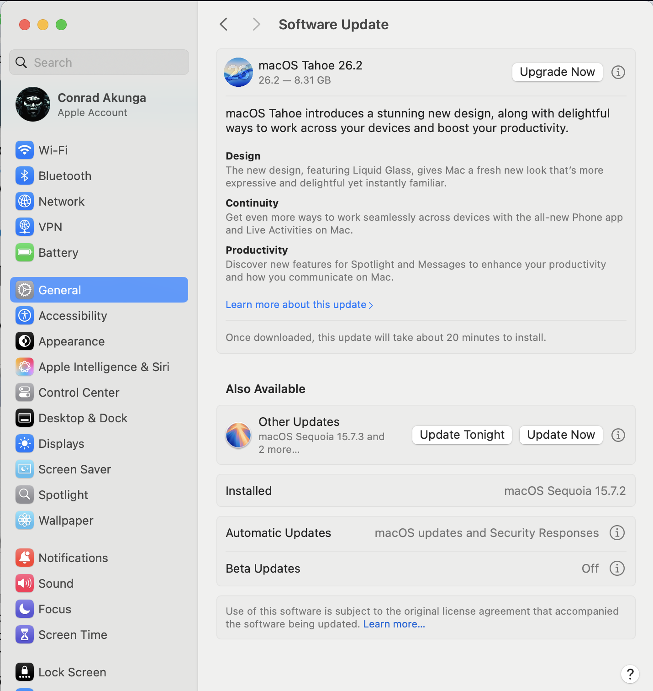
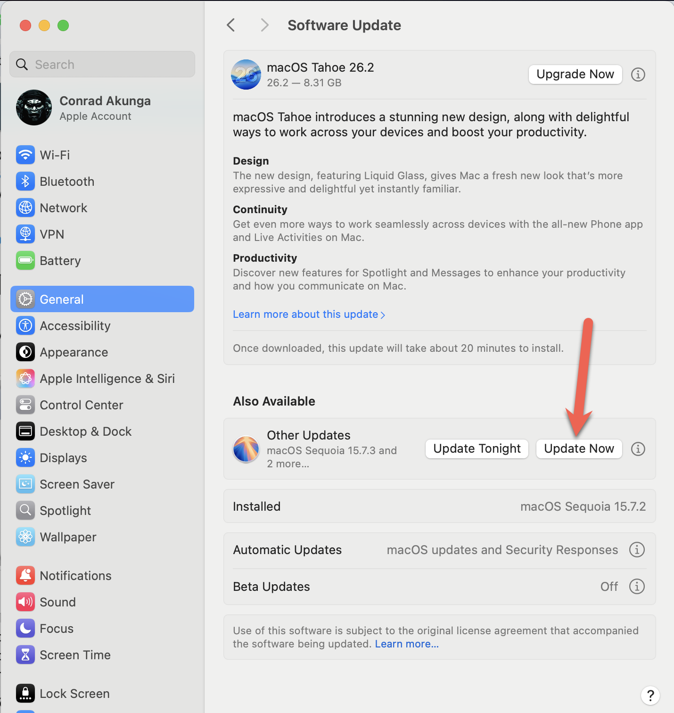
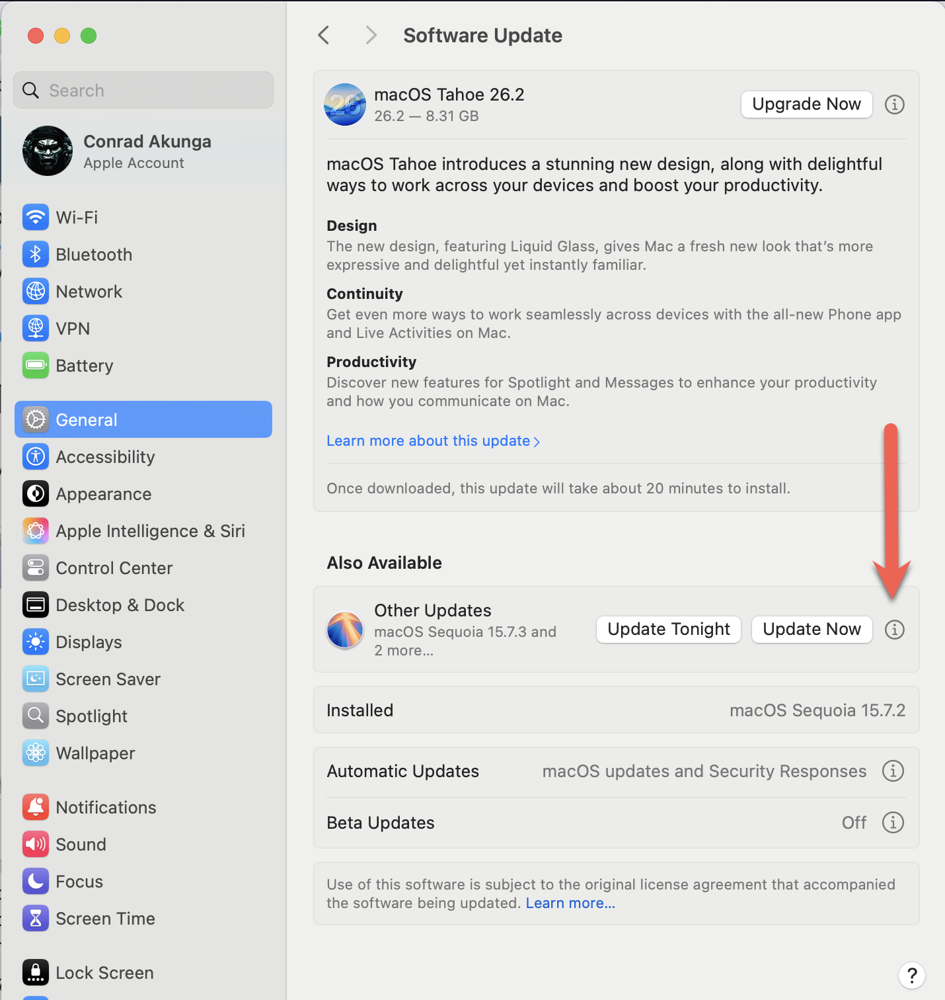
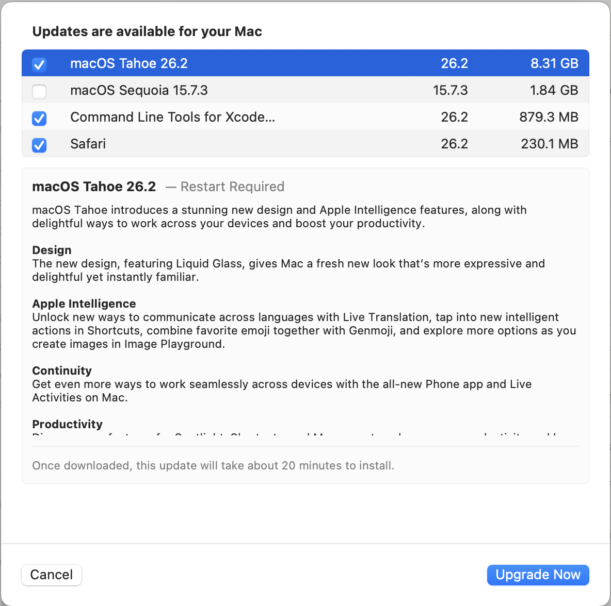

I am running macOS [Seuqoia](https://en.wikipedia.org/wiki/MacOS_Sequoia), and I have no plans to upgrade to [Tahoe](https://en.wikipedia.org/wiki/MacOS_Tahoe) in the immediate future.

This is for several reasons:

1. I have not heard good things about `Tahoe`.
2. When new OS releases come, I seldom upgrade. In fact, I upgraded to `Sequoia` from [Sonoma](https://en.wikipedia.org/wiki/MacOS_Sonoma) just a couple of months ago.
3. I have a very complex setup of virtual machines, [Docker](https://www.docker.com/) [containers](https://hub.docker.com/), [Parallels](https://www.parallels.com/), and various **tools** and **utilities** set up that I am loath to interfere with until I am sure `Tahoe` has no surprises.

So recently, I got an update notification.

Nothing surprising about this.

Since I don't want `Tahoe`, the obvious choice is to click this button:

But since I am not trusting, I wanted to see **exactly** what was going to be upgraded and so I clicked this instead:

Which took me to the following screen:

Note that not only has it helpfully **deselected** `Sequoia`, but it has also **selected** `Tahoe` for me!

What an **underhanded** trick!

### TLDR

**Don't trust what any update screen tells you. Check for yourself what it is going to do!**

Happy hacking!
