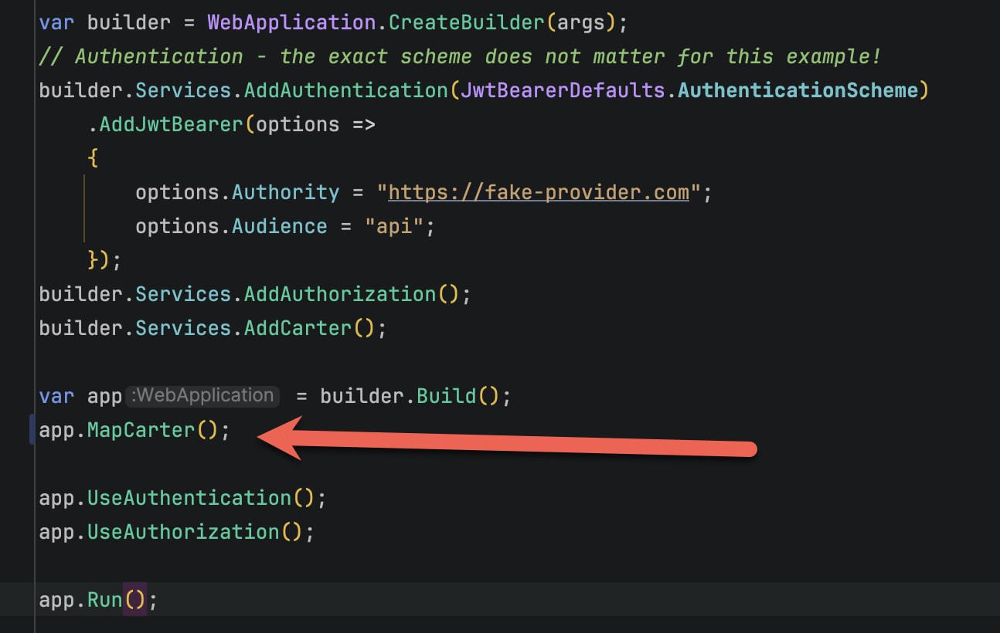
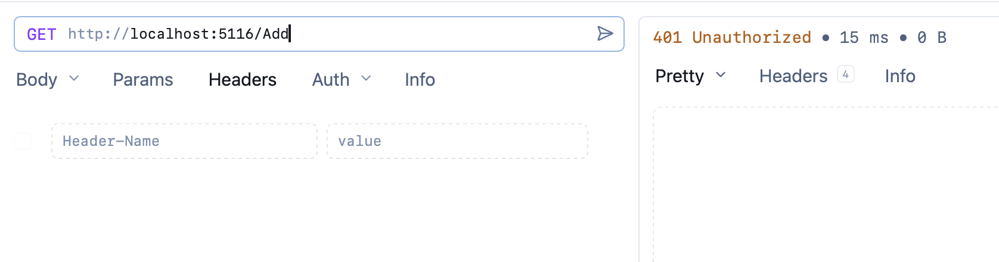
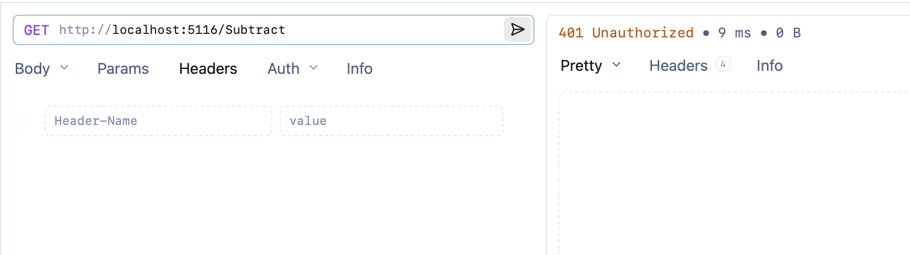

In a previous post, "[Setting Up Web API Endpoints To Collectively Require Authentication In C# & .NET]()", we looked at how to use [MapGroup](https://learn.microsoft.com/en-us/dotnet/api/microsoft.aspnetcore.builder.endpointroutebuilderextensions.mapgroup?view=aspnetcore-10.0) to ensure all [ASP.NET](https://dotnet.microsoft.com/en-us/apps/aspnet) Web API endpoints require **authorization**.

In this post, we will look at how to achieve the same result using the [Carter](https://github.com/CarterCommunity/Carter) [Nuget](https://www.nuget.org/) package.

The first order of business is to create an empty **web project**.

```bash
dotnet new web -o CarterGrouped
```

Next, we add the `Carter` nuget package.

```bash
dotnet add package Carter
```

Next, we add the [JwtBearer](https://learn.microsoft.com/en-us/aspnet/core/security/authentication/configure-jwt-bearer-authentication?view=aspnetcore-10.0) library for authentication.

```bash
dotnet add package Microsoft.AspNetCore.Authentication.JwtBearer
```

Next, we create our endpoints by implementing the `ICarterModule` interface.

For this example, we will implement **two** modules. The first is `Add`, which looks like this:

```c#
public class AddModule : ICarterModule
{
    public void AddRoutes(IEndpointRouteBuilder app)
    {
        app.MapGet("/Add", () => "Add");
    }
}
```

The next is `Subtract`, which looks like this:

```c#
public class SubtractModule : ICarterModule
{
    public void AddRoutes(IEndpointRouteBuilder app)
    {
        app.MapGet("/Subtract", () => "Subtract");
    }
}
```

Next, we wire everything together.

```c#
using Carter;
using Microsoft.AspNetCore.Authentication.JwtBearer;

var builder = WebApplication.CreateBuilder(args);
// Authentication - the exact scheme does not matter for this example!
builder.Services.AddAuthentication(JwtBearerDefaults.AuthenticationScheme)
    .AddJwtBearer(options =>
    {
        options.Authority = "https://fake-provider.com";
        options.Audience = "api";
    });
builder.Services.AddAuthorization();
builder.Services.AddCarter();

var app = builder.Build();
app.MapCarter();

app.UseAuthentication();
app.UseAuthorization();

app.Run();
```

We are almost there.

The magic is taking place here:



We need to make our changes here to tell the `Carter` pipeline what to do.

Rather than calling `MapCarter()` on the `app`  WebApplication, we can call `MapGroup()` at this point, and then invoke `MapCarter()` on that.

This is due to the fact that `MapCarter()` operates on objects that implement the [IEndPointRouteBuilder](https://learn.microsoft.com/en-us/dotnet/api/microsoft.aspnetcore.routing.iendpointroutebuilder?view=aspnetcore-10.0) interface.

We can thus rewrite the code like this:

```c#
var app = builder.Build();
// Create a default group and require authentication on it
app.MapGroup("")
    .RequireAuthorization()
    .MapCarter();
```

If we now test the `Add` module:



We get a [401 Unauthorized](https://developer.mozilla.org/en-US/docs/Web/HTTP/Reference/Status/401) error.

Similarly, for the `Subtract` module:



### TLDR

**We can use `MapGroup` to configure the `IEndPointRouteBuider` before calling `MapCarter` when using the `Carter` package.**

The code is in my [GitHub](https://github.com/conradakunga/BlogCode/tree/master/2025-12-21%20-%20CarterGrouped).

Happy hacking!
