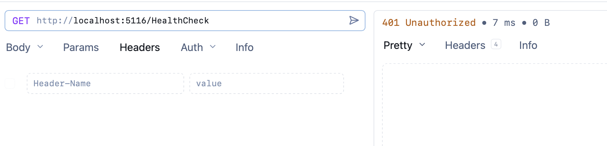
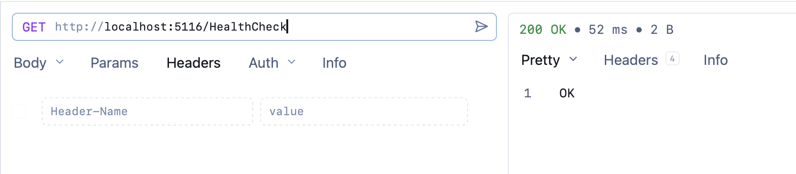

In a previous post, "[Setting Up Web API Endpoints To Collectively Require Authentication With Carter In C# & .NET]()", we looked at how to set up an [ASP.NET](https://dotnet.microsoft.com/en-us/apps/aspnet) Web API project to require that all endpoints are **authorized** while using the [Carter](https://github.com/CarterCommunity/Carter) [Nuget](https://www.nuget.org/) package.

In this post, we will look at how to **override** the authorization configuration on an endpoint-by-endpoint basis.

In our example there are two endpoints.

The first, Add, looks like this:

```c#
public class AddModule : ICarterModule
{
    public void AddRoutes(IEndpointRouteBuilder app)
    {
        app.MapGet("/Add", () => "Add");
    }
}
```

The second, subtract, looks like this:

```c#
public class SubtractModule : ICarterModule
{
    public void AddRoutes(IEndpointRouteBuilder app)
    {
        app.MapGet("/Subtract", () => "Subtract");
    }
}
```

Note that there is nothing in the modules themselves to do with security.

This is because the magic happens in program setup, which looks like this:

```c#
var builder = WebApplication.CreateBuilder(args);
// Authentication - the exact scheme does not matter for this example!
builder.Services.AddAuthentication(JwtBearerDefaults.AuthenticationScheme)
    .AddJwtBearer(options =>
    {
        options.Authority = "https://fake-provider.com";
        options.Audience = "api";
    });
builder.Services.AddAuthorization();
builder.Services.AddCarter();

var app = builder.Build();
// Create a default group and require authentication on it
app.MapGroup("")
    .RequireAuthorization()
    .MapCarter();

app.UseAuthentication();
app.UseAuthorization();

app.Run();
```

This setup ensures that all endpoints require authorization.

Suppose we wanted to add a **HealthCheck** endpoint.

This would look like this:

```c#
public class HealthCheckModule : ICarterModule
{
    public void AddRoutes(IEndpointRouteBuilder app)
    {
        app.MapGet("/HealthCheck", () => "OK");
    }
}
```

If we run this:



We see that it requires authorization.

Which is, in fact, **what we want** - all endpoints, by default, should be **secured**.

To **override** that, we do the following:

```c#
public class HealthCheckModule : ICarterModule
{
    public void AddRoutes(IEndpointRouteBuilder app)
    {
        app.MapGet("/HealthCheck", () => "OK")
            .AllowAnonymous();
    }
}
```

Here we have invoked the [AllowAnonymous()](https://learn.microsoft.com/en-us/dotnet/api/microsoft.aspnetcore.builder.authorizationendpointconventionbuilderextensions.allowanonymous?view=aspnetcore-10.0#microsoft-aspnetcore-builder-authorizationendpointconventionbuilderextensions-allowanonymous-1(-0)) method when mapping the **HealthCheck** endpoint.

When we run it now, we see the following:



### TLDR

**To override the default secured authorization status, invoke the AllowAnonymous() method when mapping endpoints.**

The code is in my [GitHub](https://github.com/conradakunga/BlogCode/tree/master/2025-12-23%20-%20CarterGrouped).

Happy hacking!
