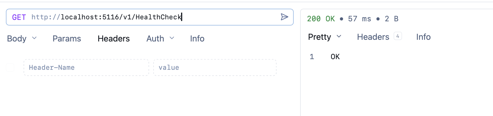
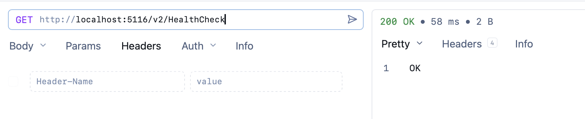

In our last post, "[Overriding EndPoint Authorization When Using Multiple ASP.NET Carter Modules In C# & .NET]()", we looked at how to **override authorization** so that we can have endpoints that **do not enforce authorization**, as the pipeline has been configured to **authorize all the endpoints by default**.

Also, in a previous post, "[Alternatively Setting Up Web API Endpoints To Collectively Require Authentication With Carter In C# & .NET]()" we had looked at how to use `Carter` with a single `ICarterModule` implementation.

In this post, we will look at how to **override the default authorizatio**n when using a **single** `Carter` module.

The single module that contains the endpoints looks like this:

```c#
public class Modules : ICarterModule
{
    public void AddRoutes(IEndpointRouteBuilder app)
    {
        // Configure authorization
        var secured = app.MapGroup("").RequireAuthorization();

        // Add module
        secured.MapGet("/Add", () => "Add");
        // Subtract module
        secured.MapGet("/Subtract", () => "Subtract");
    }
}
```

The setup for the minimal API looks like this:

```c#
using Carter;
using Microsoft.AspNetCore.Authentication.JwtBearer;

var builder = WebApplication.CreateBuilder(args);
// Authentication - the exact scheme does not matter for this example!
builder.Services.AddAuthentication(JwtBearerDefaults.AuthenticationScheme)
    .AddJwtBearer(options =>
    {
        options.Authority = "https://fake-provider.com";
        options.Audience = "api";
    });
builder.Services.AddAuthorization();
builder.Services.AddCarter();

var app = builder.Build();
// Create a default group and require authentication on it
app.MapCarter();

app.UseAuthentication();
app.UseAuthorization();

app.Run();
```

This is the standard setup for a typical API.

If we were to add a new `HealthCheck` endpoint that would not require authorization, we have two ways to go about it.

## Override the authorization of the `secured` group

The first way is to register the endpoint on the `secured` group, and then **override** the authorization settings by calling [AllowAnonymous()](https://learn.microsoft.com/en-us/dotnet/api/microsoft.aspnetcore.builder.authorizationendpointconventionbuilderextensions.allowanonymous?view=aspnetcore-10.0#microsoft-aspnetcore-builder-authorizationendpointconventionbuilderextensions-allowanonymous-1(-0)) on the endpoint.

The code will look like this:

```c#
public class Modules : ICarterModule
{
    public void AddRoutes(IEndpointRouteBuilder app)
    {
        // Configure authorization
        var secured = app.MapGroup("").RequireAuthorization();

        // Add module
        secured.MapGet("/Add", () => "Add");
        // Subtract module
        secured.MapGet("/Subtract", () => "Subtract");
        // First version of the Health Check module
        secured.MapGet("/v1/HealthCheck", () => "OK")
            .AllowAnonymous();
    }
}
```

If we call the API we should get the following:



## Register directly using the `app` object

The simplest way is not to use the `secured` object at all, and instead use the `app` object that is a parameter to the `AddRoutes` method.

The code is as follows:

```c#
public class Modules : ICarterModule
{
    public void AddRoutes(IEndpointRouteBuilder app)
    {
        // Configure authorization
        var secured = app.MapGroup("").RequireAuthorization();

        // Add module
        secured.MapGet("/Add", () => "Add");

        // Subtract module
        secured.MapGet("/Subtract", () => "Subtract");

        // Second version of the Health Check module
        app.MapGet("/v1/HealthCheck", () => "OK");
    }
}
```

If we call this, we should see the following:



### TLDR

**Even with a single `Carter` module, it is possible to override the default authorization for endpoints.**

The code is in my [GitHub](https://github.com/conradakunga/BlogCode/tree/master/2025-12-24%20-%20CarterGrouped).

Happy hacking!
