Recently, I opened one of my [recent blog posts]() and noticed something curious - the **syntax highlighting for code samples was gone**.

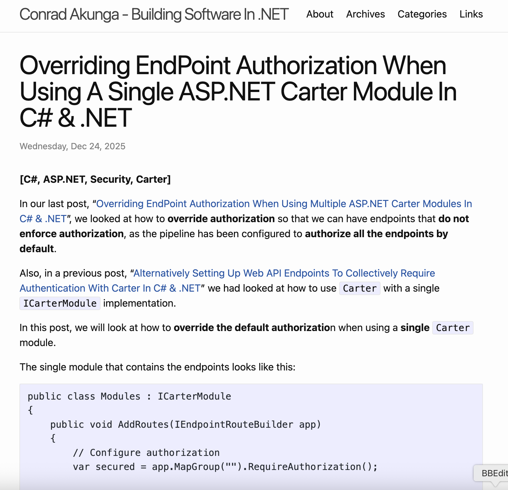

Perhaps it was an isolated incident. I tried [another post]():

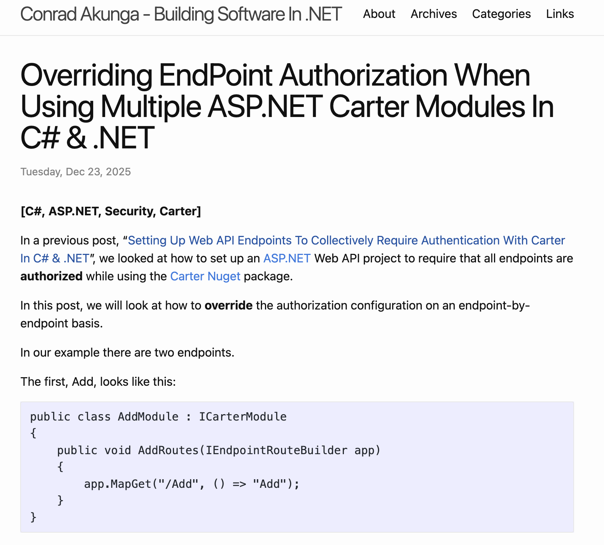

Same problem.

Strange.

I tried with a different **browser**, [Firefox](https://www.firefox.com/).

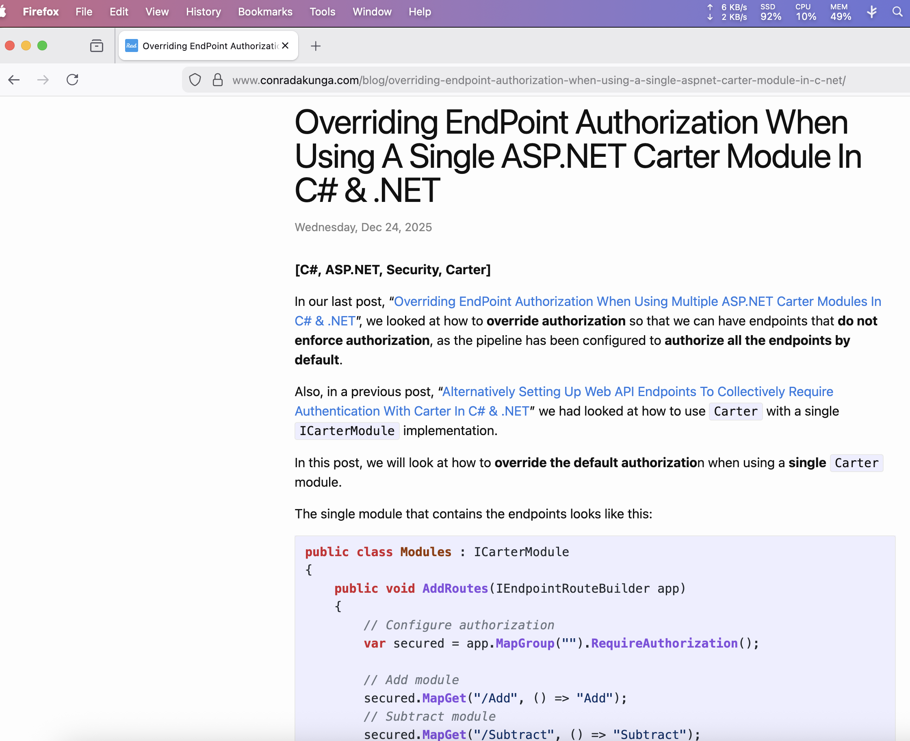

Works ok.

Tried with yet another browser, [Microsoft Edge](https://www.microsoft.com/en-us/edge).

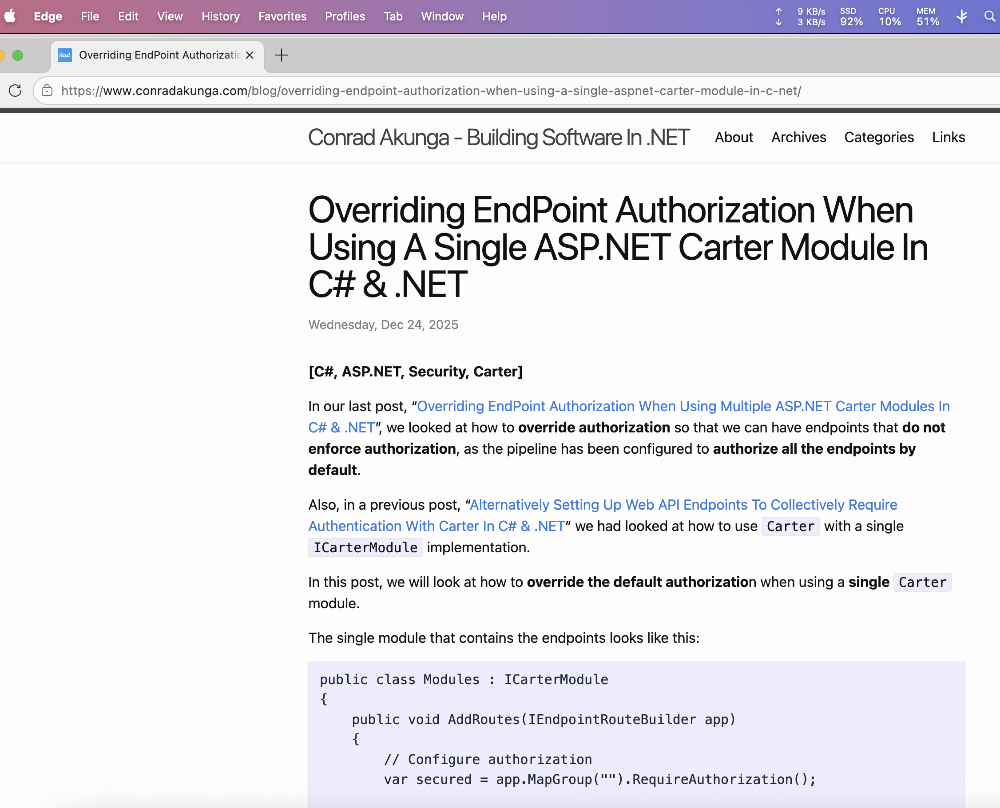

What do these three scenarious have in common?

- **Edge** and **Chrome** are based on the [Chromium](https://www.chromium.org/Home/) engine.
- **Firefox** has its own rendering engine.

It could also be that the problem was [Jekyll](https://jekyllrb.com/) itself, but I dismissed that because I have been using the same version of **Jekyll** for quite some time, and I know for a fact that at some point it worked well.

I looked even closer at the browsers.

Turns out the other thing they had in common was that **Edge** and **Chrome** both had the [1Password](https://1password.com/) [browser extension](https://1password.com/downloads/browser-extension) installed and turned on, but Firefox didn't.

When I **disabled** the extension in **Chrome**:

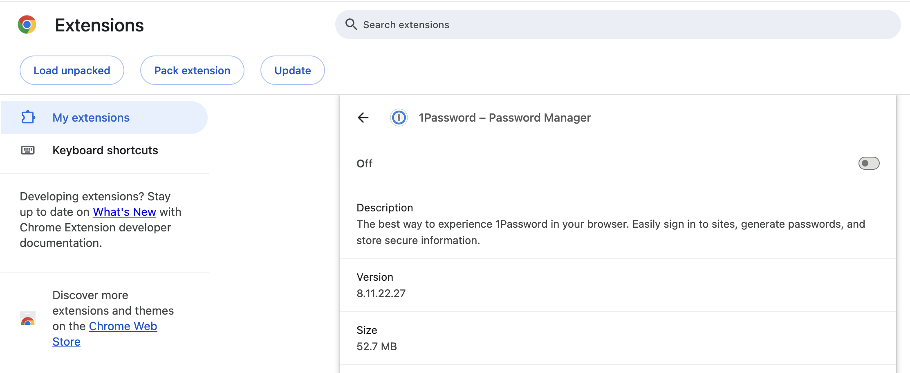

The page rendered correctly:

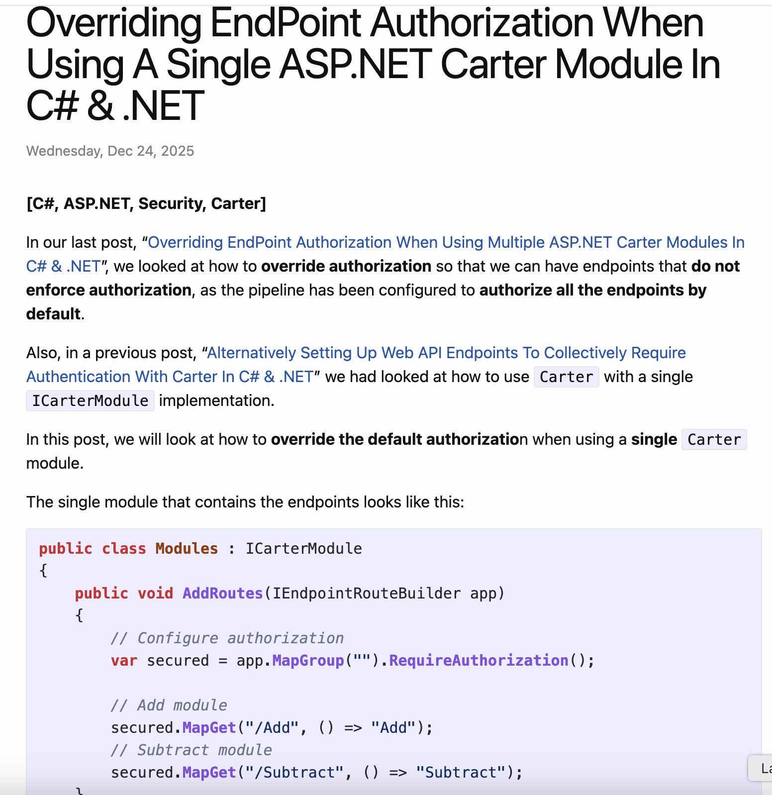

The same when I **disabled** the extension for **Edge**:

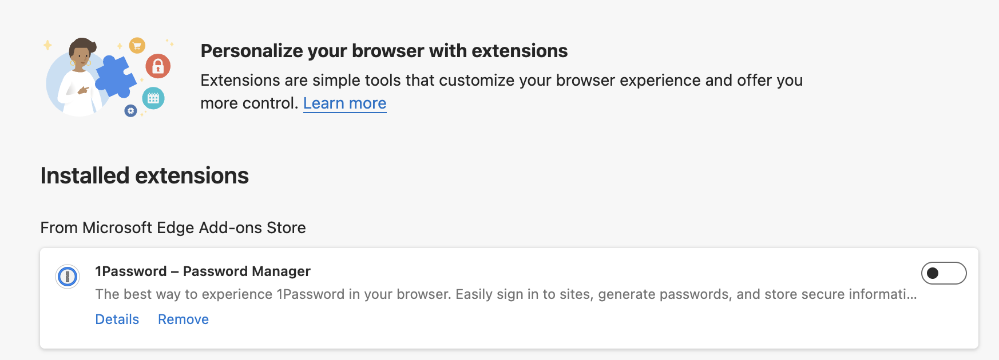

The page also loaded correctly:

I was curious what would happen if I installed and **enabled** the extension on **Firefox**:

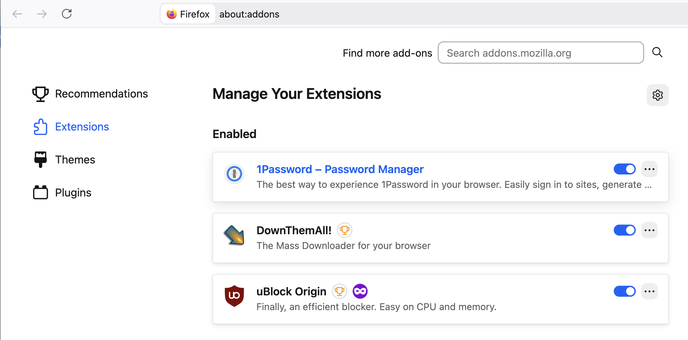

The page formatting broke:

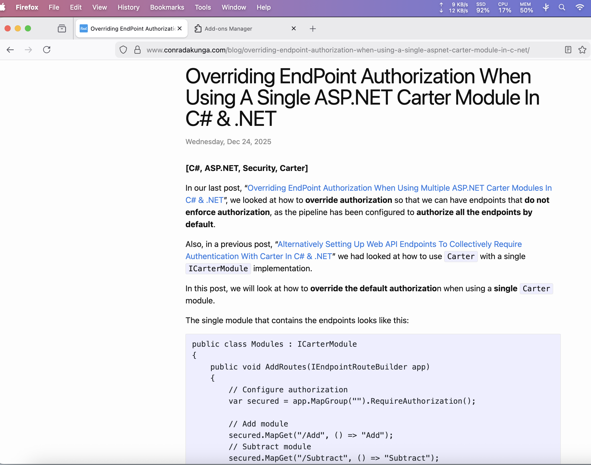

But when I turned it off:

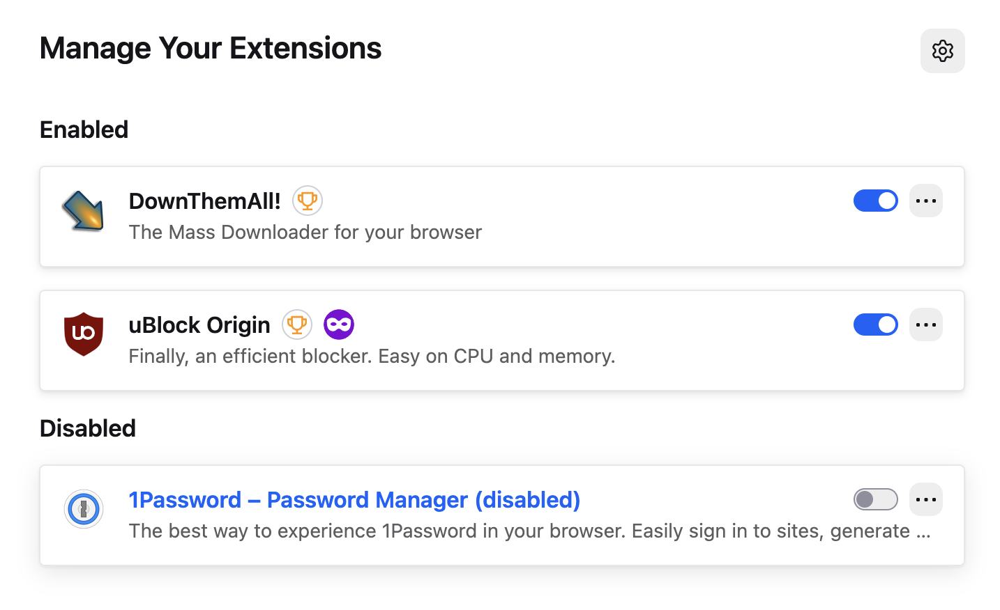

All was well.

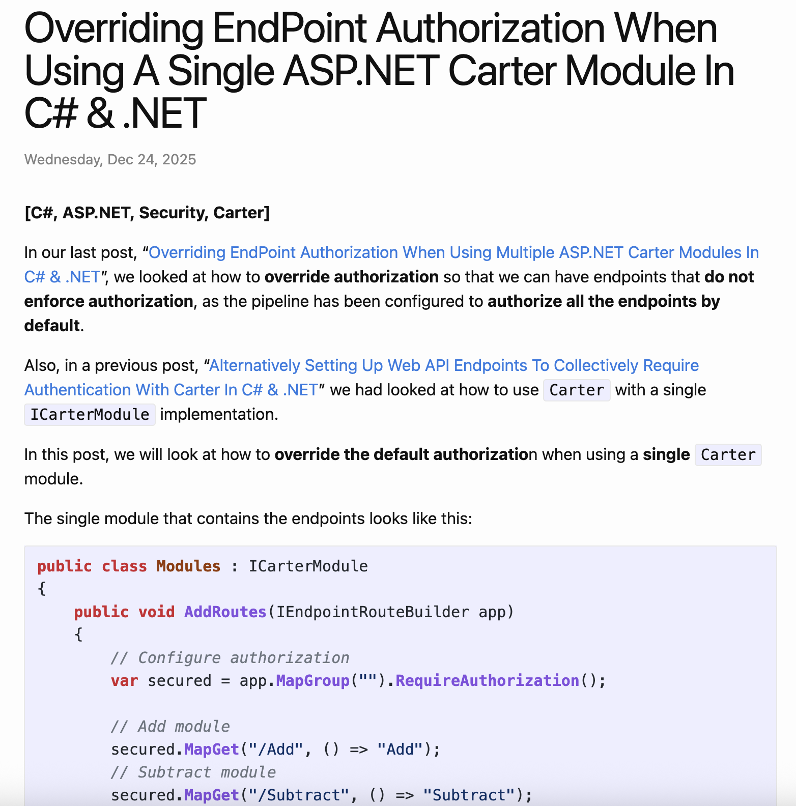

The versions tested were as follows:

| Browser | Version        | 1Password Version |
| ------- | -------------- | ----------------- |
| Firefox | 146.0.1        | 8.11.23.2         |
| Edge    | 143.0.3650.96  | 8.11.2            |
| Chrome  | 143.0.7499.170 | 8.11.22.27        |

### TLDR

**The 1Password extension breaks Jekyll's syntax highlighting.**

Happy hacking!
