Long-term readers of this blog will know I have always been a keen proponent of the API testing tool [Insomnia](https://insomnia.rest/), which I vastly prefer to the usual suspect, [Postman](https://www.postman.com/).

The maker of **Insomnia** subsequently [sold it off](https://schier.co/blog/indie-to-acquisition), and the new owners seem to be taking it along the same path as Post**m**an, with the addition of [enterprise and group features](https://insomnia.rest/pricing), which is **totally in order**. But for me, the essence of a fast, **simple API testing tool** is getting lost in translation.

Greg, the original author, [subsequently decided to build another REST client](https://yaak.app/blog/yet-another-api-client), [Yaak](https://yaak.app/).

A common issue when testing APIs is the requirement for an **access token** to access an **authenticated endpoint**.

One of **Insomnia's** features is the ability to specify scripts that run **pre- or post-request**. This could be used to solve the above problem.

 **Yaak does not have this**.

It does, however, have a feature that helps achieve this: **request chaining**.

It works as follows:

First, **create an endpoin**t that is responsible for **fetching the authentication token**.

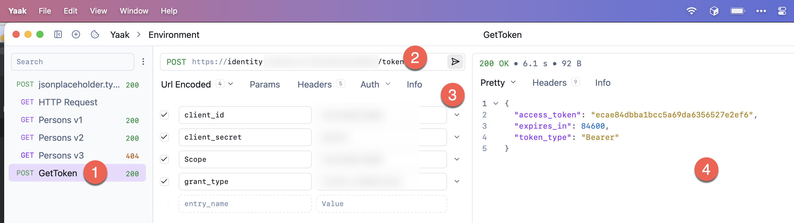

Here we specify the following:

1. **Name** of the request (a POST request)
2. The **URL** to the endpoint
3. The **OAUTH** parameters

Once we submit the request, we get back the token in the following `JSON` response:

```json
{
  "access_token": "ecae84dbba1bcc5a69da6356527e2ef6",
  "expires_in": 84600,
  "token_type": "Bearer"
}
```

With that in place, the next order of business is to set up the request chain.

Typically, you would have **a bunch of APIs you want to authenticate with the same credentials**, in which case you would want to set up the token at the **global** level.

At the very tip of the application, click the Environment section:

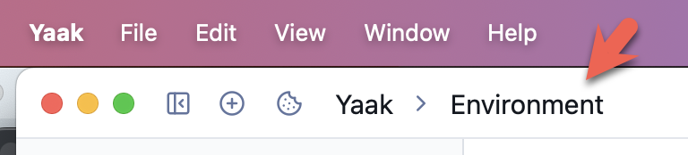

You will see the following menu:

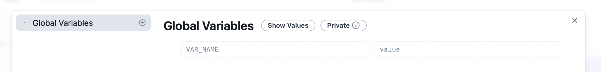

From here, we go on to create our variable, in this case, `AccessToken,` by simply typing the name in the section `VAR_NAME`:

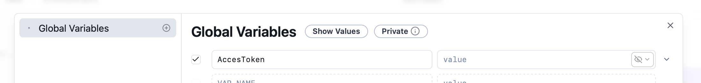

By default, the value is encrypted. We can change that by clicking on the following icon and choosing **Show** from the menu.

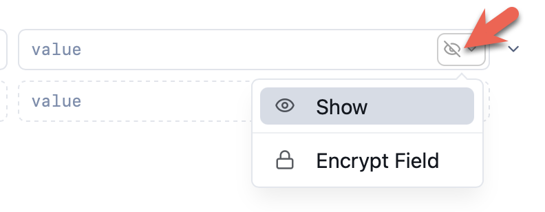

Next is to define the **expression** that we want, which in this case is the following:

```plaintet
response.body.path()
```

The expression is how we capture our desired element(s) from the returned `JSON`.

You will see the value change from text to have a **highlight** indicating **further configuration** is possible:

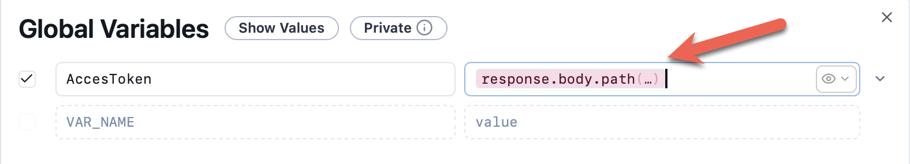

If you click on the highlighted text you get the following screen:

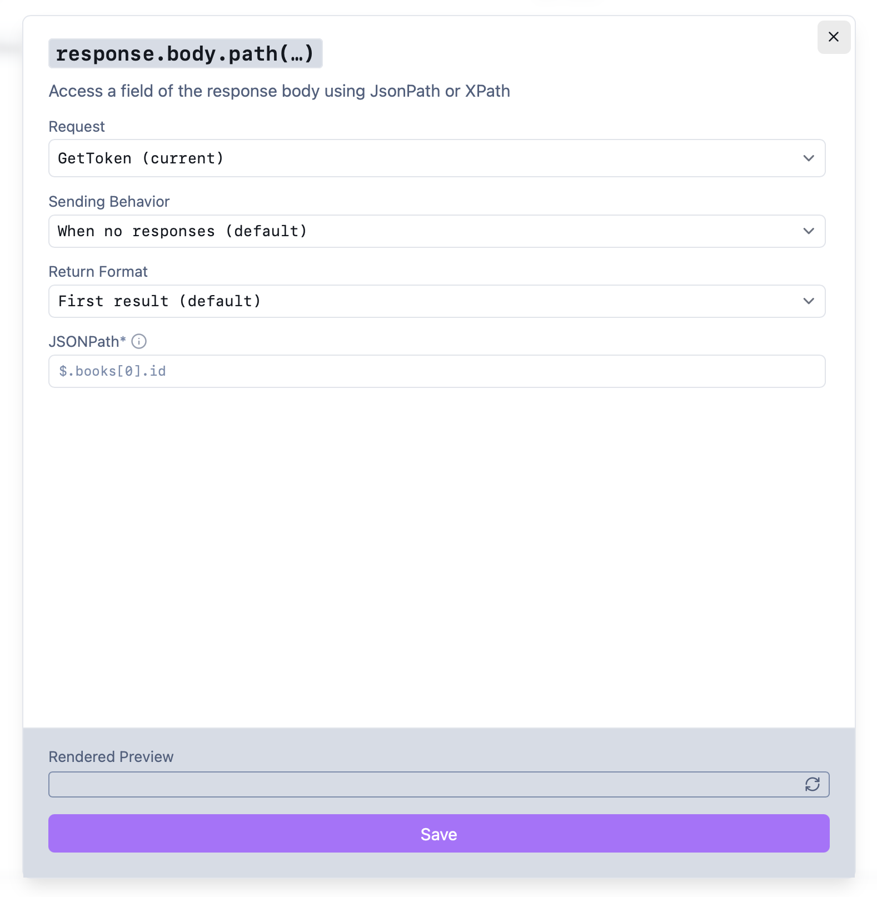

First, we choose the **endpoint** that we want to invoke (that we defined and named earlier)

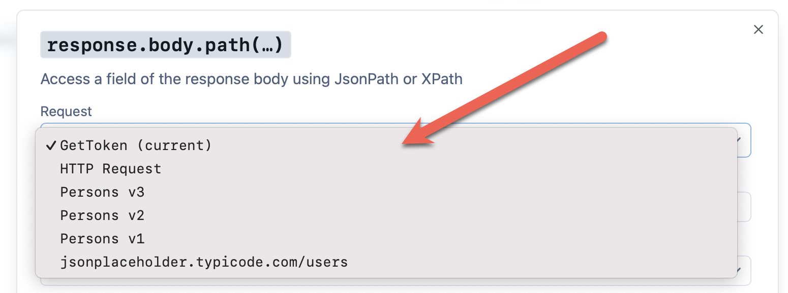

Next, we decide how often to invoke the endpoint.

We don't want to invoke it a**ll the time**, so we set the timeout to **what we get back from the token server**.

The `JSON` was as follows:

```json
{
  "access_token": "ecae84dbba1bcc5a69da6356527e2ef6",
  "expires_in": 84600,
  "token_type": "Bearer"
}
```

So from this, we specify the **timeout** as `84600`:

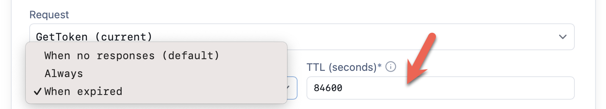

Here we are saying the token **expires** after `84600` seconds, and only then should another be requested.

Next, we tell Yaak about the shape of the response.

In this case, we do not expect a **collection**, but a **single response**, and so we indicate as follows:

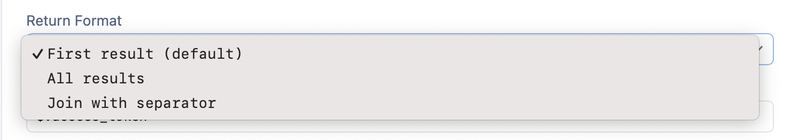

Then, finally, we write an **expression** that **extracts the value** we want from the `JSON`.

In this case, that expression is:

```plaintexxt
$.access_token
```

This is because the `access_token` value is at the root level of the response.

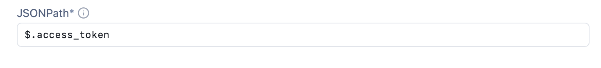

If all goes well, you should be able to see a **response** in the preview:

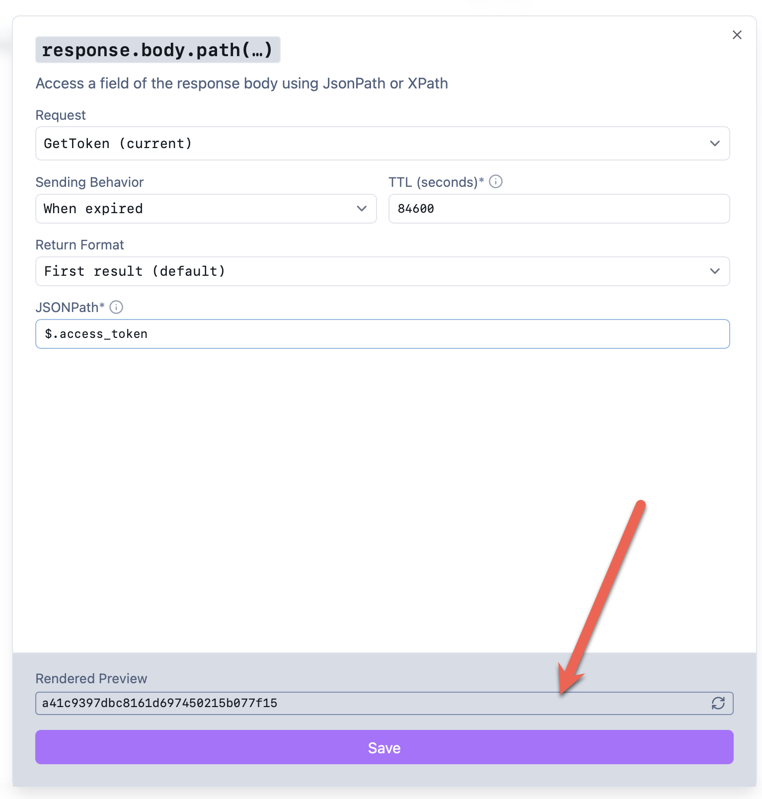

Almost there.

Finally, in the endpoint you want to authenticate, navigate to the **Auth** section and choose **Bearer Token** from the menu:


From here we start to type `AccessToken`, and the **autocomplete** should find the **variable** for us:

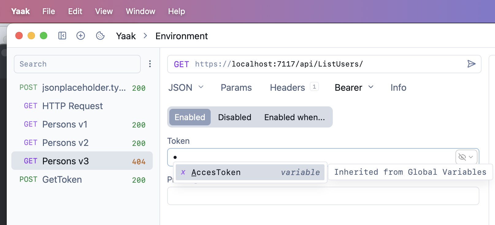

Finally, we specify the `Bearer` prefix:

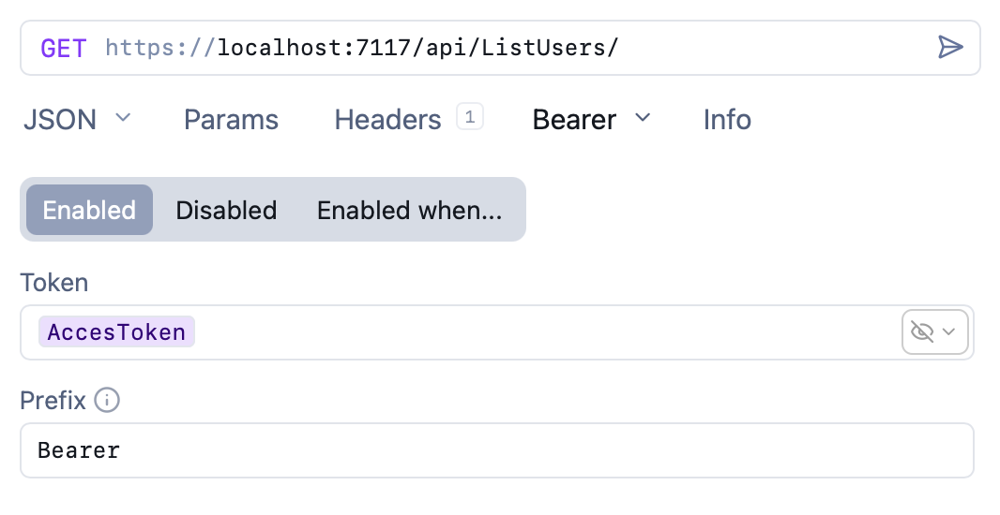

If we run this, we should see results:

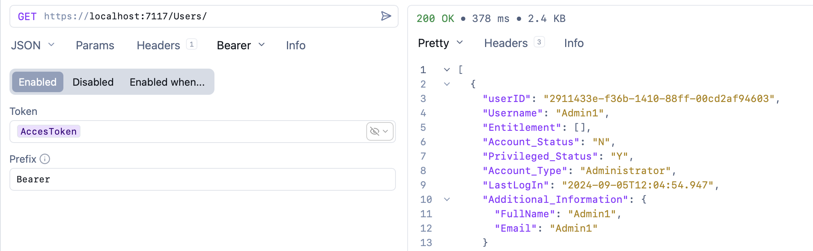 

### TLDR

**Yaak supports *request chaining* as a technique for calling requests from other requests and capturing responses.**

Happy hacking!
