The previous post, "[Automatically Fetching an Identity Server Token with Yaak]()", looked at how to set up [Yaak](https://yaak.app/) to **fetch and store tokens** issued by an identity server to secure endpoints using **request chaining**.

**NOTE: For this post, I am using a Yaak beta version, Version `2025.10.0-beta.8 (2025.10.0-beta.8)`**

In that technique, the token was stored in a **global variable**, given that you need a valid identity server token **regardless of circumstances**.

Sometimes you would like some **fine-grained control** over the variables.

Consider a situation where you have a third-party API that offers a **test environment** and a **live environment**, each differentiated by an API key.

We need, therefore, to tell **Yaak** in some way when to use the **test** and when to use the **live** key.

In our approach, **we will use this key in a HTTP header** so that the back-end service can retrieve and utilize it.

This is done as follows:

First, click on the **environment** section:

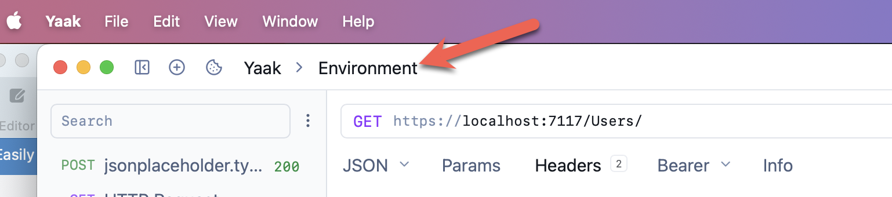

This will open a dialog that shows you your **global variables**, if any.

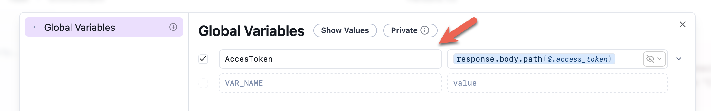

In our case, we have already defined the `AccessToken`. This will **always be available**, regardless of the environment.

To create an **environment**, click the `(+)` next to **Global Variables**.

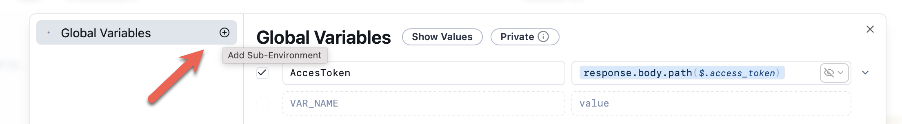

In the dialog presented, you provide a **name** for the environment and **optionally** choose a **colour** to differentiate it **visually**.

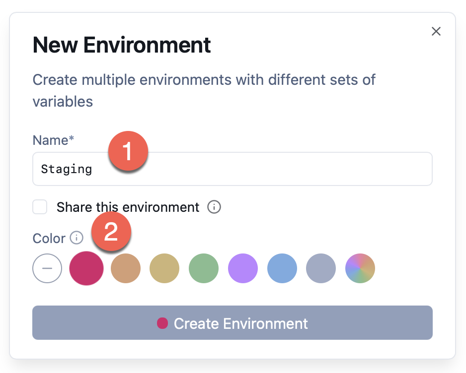

Upon saving, you should see the new **environment** added as a node.

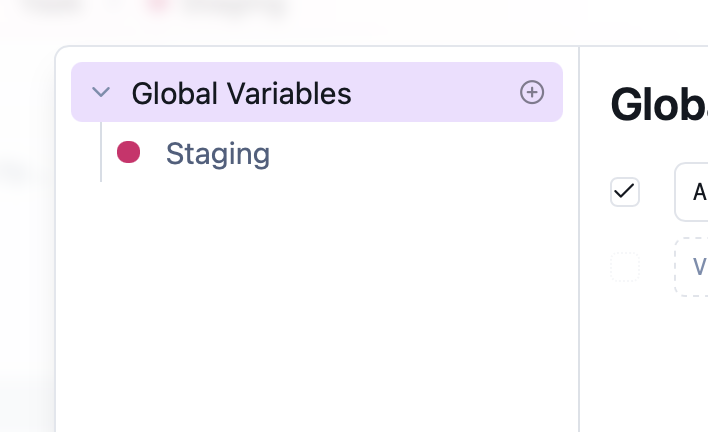

Next, we click on our new environment.

The UI will change to allow us to add our custom environment variable.

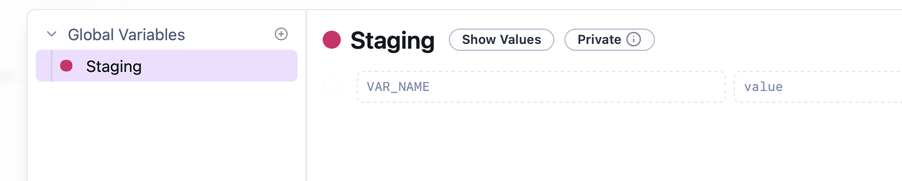

We can then **define** and **set** our variable.

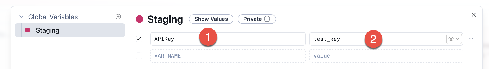

1. The **name** of the variable
2. The **value**

We then create a **second** environment, `Production`, and also define a **key** for that.

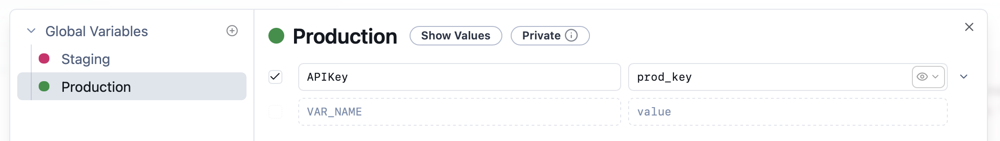

Finally, we set up our endpoint to populate the `APIKey` in the **request** as a **header**.

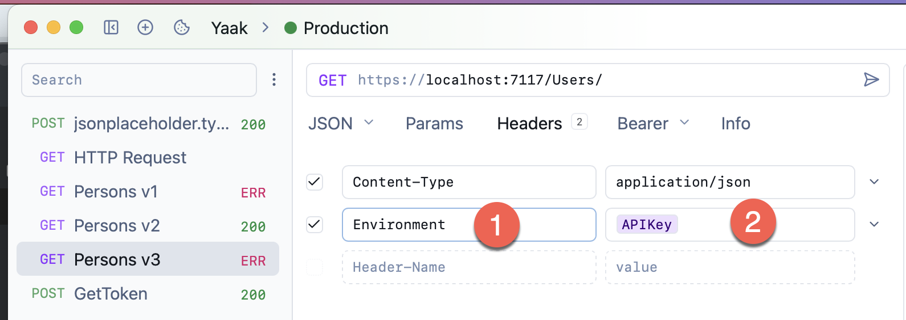

To set the appropriate header, we toggle the environment we want to user here:

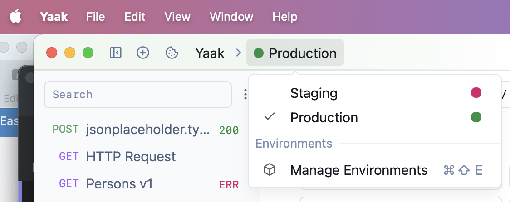

For `Staging`:

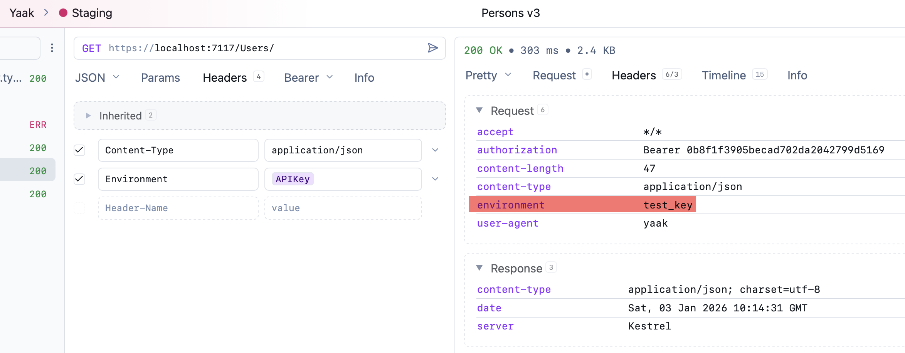

For `Production`:

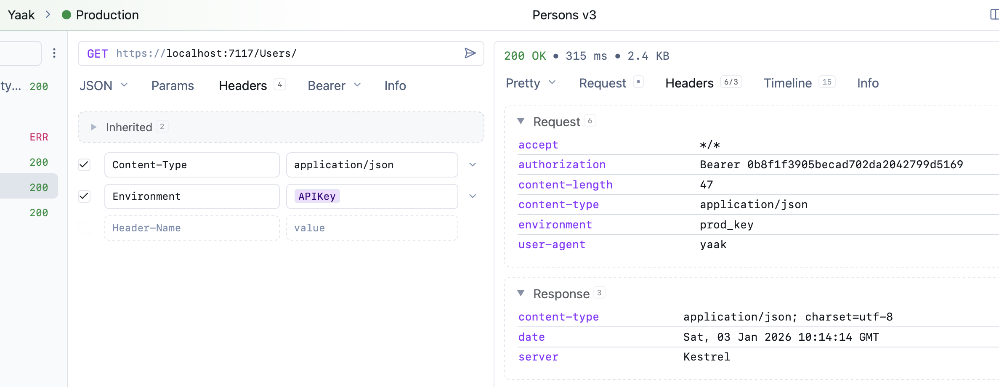

We can see in both environments that **the key is set correctly**.

### TLDR

**You can set up environments in Yaak to control environment-specific settings you want it to use.**

Happy hacking!
