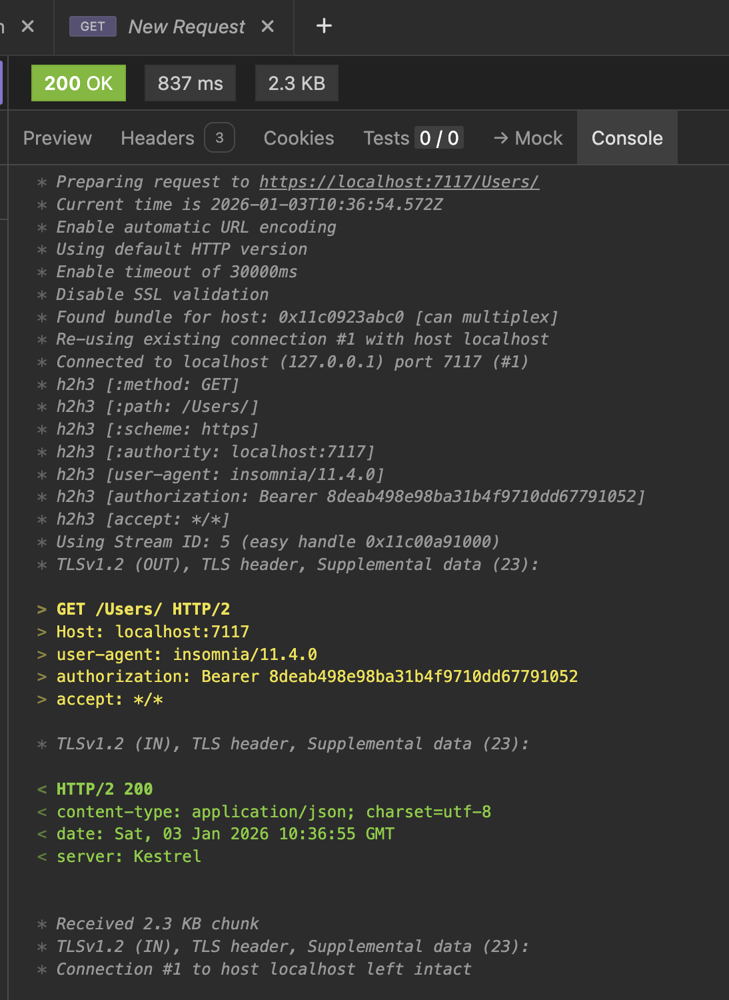
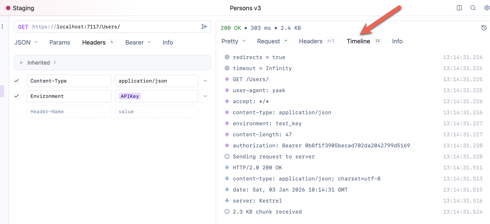

One of [Insomnia's](https://insomnia.rest/) strengths was its ability to display the **raw HTTP traffic** between the server and the client.

You could access it using the **Console** tab, and it looked something like this:

Yaak, as of the official release, `2025.9.3`, does not have this.

But the beta, `2025.10.0-beta.8`, does, via the **Timeline** tab. This is a feature that was added as of Beta `6`.

This allows you to see (most) of the traffic.

### TLDR

**The *Timeline* tab in `Yaak` allows you to view the HTTP traffic between a server and a client.**

Happy hacking!
