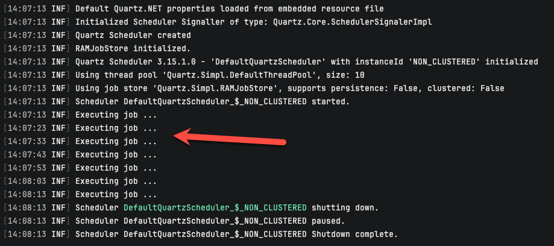
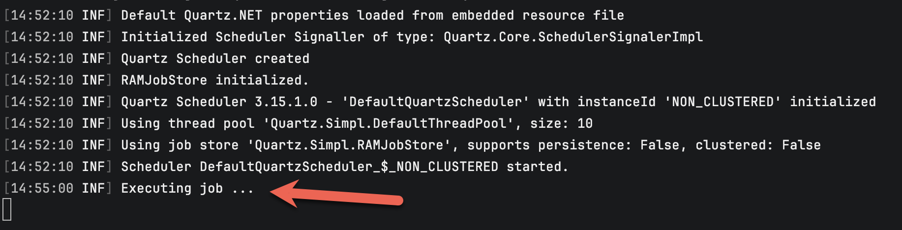
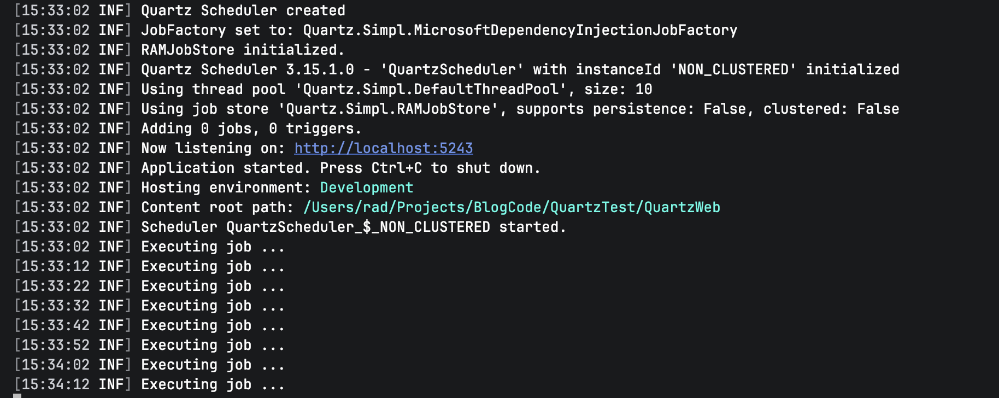
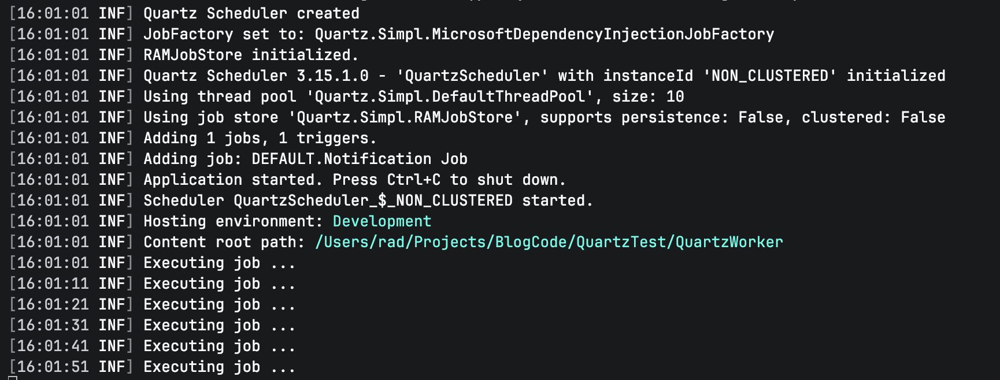
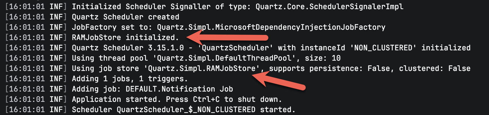
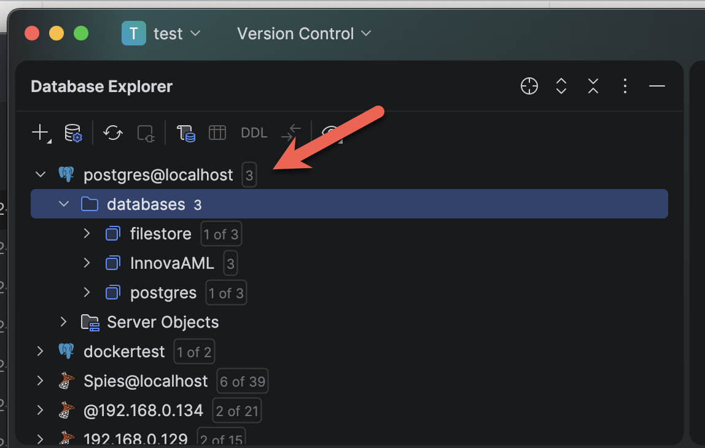
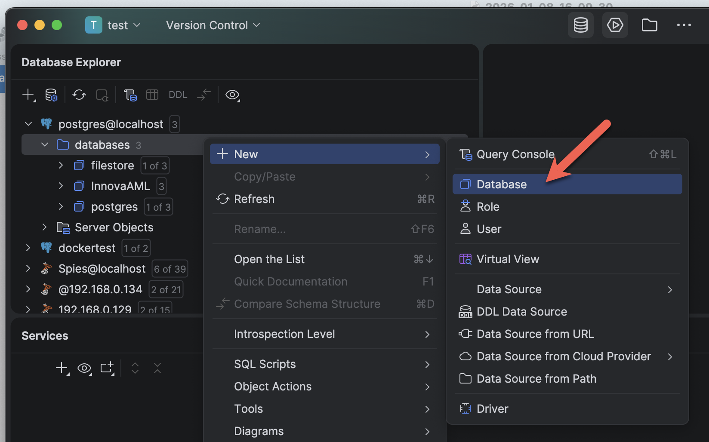
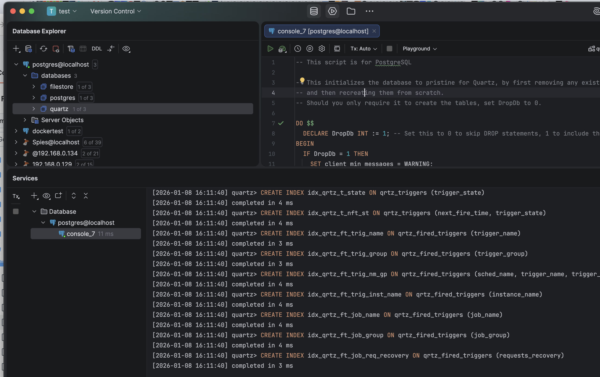
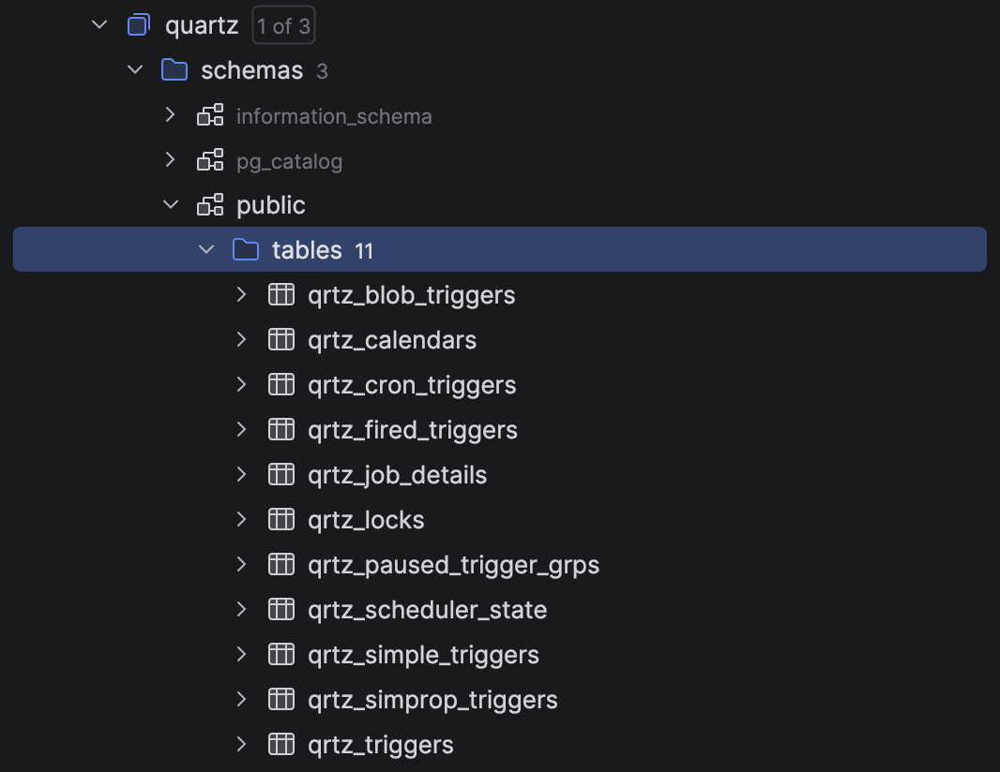
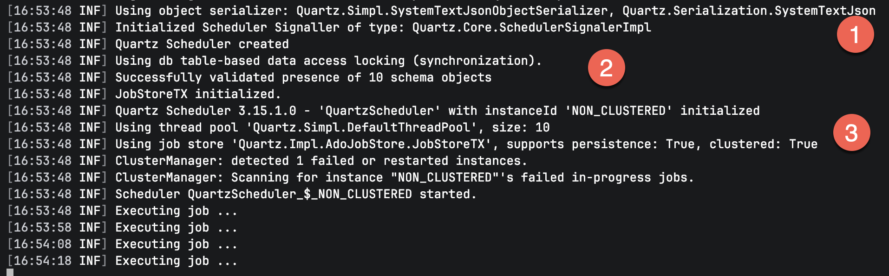

This is Part 1 of a series on [scheduling libraries]() in C# & .NET.

In this post, we will look at the [Quartz.NET](https://www.quartz-scheduler.net/) library.

## Configuration & Setup

To set up the library, use nuget to install the Quartz package

```bash
dotnet add package Quartz
```

## Recurring Events

A recurring event is an event you want to fire periodically after a defined threshold.

For example, want to print a message every 10 seconds.

The first set is to create a `class` that **implements** the `IJob` interface. This interface has one method, `Execute`, that you should implement.

```c#
public sealed class NotificationJob : IJob
{
    public Task Execute(IJobExecutionContext context)
    {
        Log.Information("Executing job ...");
        return Task.CompletedTask;
    }
}
```

The next thing is to schedule the job.

This is down as follows:

```c#
using Quartz;
using Quartz.Impl;
using Serilog;

// Configure logging
Log.Logger = new LoggerConfiguration()
    .WriteTo.Console()
    .CreateLogger();

// Create a scheduler
var factory = new StdSchedulerFactory();
var scheduler = await factory.GetScheduler();

// Start the scheduler
await scheduler.Start();

// Define our recurring job
var recurringJob = JobBuilder.Create<NotificationJob>()
    .WithDescription("Print a notification periodically")
    .WithIdentity("Recurring Jon", "Group 1")
    .Build();

//  Define the trigger for the recurring job
var recurringTrigger = TriggerBuilder.Create()
    .WithIdentity("Recurring Trigger", "Group 1")
    // Start immediately
    .StartNow()
    // Schedule every 10 seconds
    .WithSimpleSchedule(x => x.WithIntervalInSeconds(10)
        .RepeatForever())
    .Build();

// Register job with quartz
await scheduler.ScheduleJob(recurringJob, recurringTrigger);

// wait for a minute
await Task.Delay(TimeSpan.FromMinutes(1));

// Shut down the schedular
await scheduler.Shutdown();
```

The steps are as follows:

1. Create a `ScheduleFactory`. This is what starts up the scheduling infrastructure.
2. Fetch a `Scheduler` from the factory. The returned object implements the `IScheduler` interface.
3. Start the `Scheduler`.
4. Define our `Job` using the `JobBuilder` class and the `IJob` we had created earlier, the `NotificationJob`. 
5. Create a `Trigger`, which defines the start and repetition parameters using the `TriggerBuilder`. Here we configure the job to start immediately and then **repeat** after the **scheduled** threshold, which in this case is `10` seconds.
6. **Schedule** the `Job` using the `Trigger`.
7. **Shut down** the `Scheduler` when done.

If we run this application, we should see the following:



We can see here that the `job` fired **immediately**, and then **every** `10` seconds thereafter.

You can also see that the `Quartz` engine itself is **logging** what it is doing.

## Timed Events

Another problem you might run into is situations when the recurrence is **timed** - e.g., **repeats at a particular time** over a certain period, or f**ires once at a particular time**.

For example, you want a job to run every day at 14:55.

The code would look like this:

```c#
sing Quartz;
using Quartz.Impl;
using Serilog;

// Configure logging
Log.Logger = new LoggerConfiguration()
    .WriteTo.Console()
    .CreateLogger();

// Create a scheduler
var factory = new StdSchedulerFactory();
var scheduler = await factory.GetScheduler();

// Start the scheduler
await scheduler.Start();

// Define our timed job
var timedJob = JobBuilder.Create<NotificationJob>()
    .WithDescription("Print a notification periodically")
    .WithIdentity("Recurring Job", "Group 1")
    .Build();

//  Define the trigger for the timed job
var timedTrigger = TriggerBuilder.Create()
    .WithIdentity("Recurring Trigger", "Group 1")
    // every day at 12:00
    .WithCronSchedule("0 55 14 * * ?")
    .Build();

// Register job with quartz
await scheduler.ScheduleJob(timedJob, timedTrigger);

// wait for a minute
await Task.Delay(Timeout.Infinite);

// Shut down the schedular
await scheduler.Shutdown();
```

The setup is **largely the same** as before, only that the scheduling is done with the `WithCronSchedule` method, which takes a cron string as a parameter. There are some nuances to this for `Quartz` that you can read about [here](https://www.quartz-scheduler.net/documentation/quartz-3.x/how-tos/crontrigger.html#examples).

Here we are saying we want the job to run at `14:55` **daily**.

If we run this code, we should see the following:



## Features Of Note

### ASP.NET DI Support

ASP.NET is fully supported by `Quartz`, so you can leverage dependency injection to fully utilize its functionality.

First, **install** the following packages:

```bash
dotnet add package Quartz.Extensions.DependencyInjection
dotnet add package Quartz.Extensions.Hosting
```

Next, the program startup, where we will configure `Quartz`.

```c#
using Quartz;
using Serilog;

try
{
    // Setup logging
    Log.Logger = new LoggerConfiguration()
        .WriteTo.Console()
        .CreateLogger();

    var builder = WebApplication.CreateBuilder(args);
    
    // Register Quartz  
    builder.Services.AddSerilog();
    builder.Services.AddQuartz();
    builder.Services.AddQuartzHostedService(opt => { opt.WaitForJobsToComplete = true; });

    var app = builder.Build();
    
    // Fetch a Scheduler Factory from DI
    var schedulerFactory = app.Services.GetRequiredService<ISchedulerFactory>();
    var scheduler = await schedulerFactory.GetScheduler();

    // define the job 
    var job = JobBuilder.Create<NotificationJob>()
        .WithIdentity("Notification Job", "Group 1")
        .Build();

    // Trigger the job to run now, and then every 40 seconds
    var trigger = TriggerBuilder.Create()
        .WithIdentity("ASP.NET Job Trigger", "Group 1")
        .StartNow()
        .WithSimpleSchedule(x => x
            .WithIntervalInSeconds(10)
            .RepeatForever())
        .Build();
    await scheduler.ScheduleJob(job, trigger);
    await app.RunAsync();
}
catch (Exception ex)
{
    Log.Fatal(ex, "Application terminated");
}
finally
{
    Log.CloseAndFlush();
}
```

The key difference here is that, unlike before, we do not create a **SchedulerFactory**, `StdSchedulerFactory`, ourselves; we **request** one from the **container**.

If we run this app, we should see the following:



We can see here that it runs every `10` seconds.

We can use this for some of the typical tasks that are required in a web application:

1. **Populating a cache** from external sources
2. **Clearing** temporal caches
3. **Periodic** jobs

### HostedService DI Support

For a hosted service, such as a Windows service or Linux system daemon, the code is similar.

First, add the following package:

```bash
dotnet add package Quartz.Extensions.Hosting
```

The code itself will look like this:

```c#
using Quartz;
using Serilog;

var builder = Host.CreateApplicationBuilder(args);

try
{
    Log.Logger = new LoggerConfiguration()
        .WriteTo.Console()
        .CreateLogger();

    builder.Services.AddQuartz(x =>
    {
        // Define a jey for the job
        var jobKey = new JobKey("Notification Job");

        // Add the job
        x.AddJob<NotificationJob>(opts => opts.WithIdentity(jobKey));

        // Add the trigger
        x.AddTrigger(opts => opts
            .ForJob(jobKey)
            .WithIdentity("Notification Trigger")
            .StartNow()
            .WithSimpleSchedule(_ => _
                .WithInterval(TimeSpan.FromSeconds(10))
                .RepeatForever()));
    }).AddSerilog();

    builder.Services.AddQuartzHostedService(options => { options.WaitForJobsToComplete = true; });

    var app = builder.Build();

    await app.RunAsync();
}
catch (Exception ex)
{
    Log.Fatal(ex, "Application terminated");
}
finally
{
    Log.CloseAndFlush();
}
```

The magic is happening in the builder.Services.AddQuartz invocation where we:

1. **Define** a `jobKey` to refer to our `IJob`
2. **Register** and add our `IJob`
3. **Add** a `ITrigger`

If we run this app, everything should work as expected:



### Database Storage Support

By default, `Quartz` will use an **in-memory** data store to store state such as scheduled **jobs**, **schedules**, etc.

`Quartz` will **log** whichever store it is using.



Here, `RAMJobStore` means that the storage is in memory.

This means that **once you stop the application, that data is lost**.

To work around this, `Quartz` allows for the **configuration** of storage to a **database** using [ADO.NET](https://learn.microsoft.com/en-us/dotnet/framework/data/adonet/). This means that, provided you have the **drivers** installed and (where necessary) configured, you can use the following databases:

- [PostgreSQL](https://www.postgresql.org/)
- [SQL Server](https://www.microsoft.com/en-us/sql-server)
- [Oracle](https://www.oracle.com/)
- [MySQL](https://www.mysql.com/)
- [SQLite](https://sqlite.org/)

To set this up, you need to pick and run the appropriate script from [here](https://github.com/quartznet/quartznet/tree/main/database/tables).

For our example, we will use [PostgreSQL](https://github.com/quartznet/quartznet/blob/main/database/tables/tables_postgres.sql).

First, **create a database**, using whatever method you prefer - terminal, [pgAdmin,](https://www.pgadmin.org/) or a tool like [DataGrip](https://www.jetbrains.com/datagrip/).

In my case, I am using `DataGrip`.



Create the database:



Run the script:



Once complete, you should be able to see the newly **created** objects.



Next, we add the following packages to our project:

```bash
dotnet add package Quartz
dotnet add package Npgsql
dotnet add package Quartz.Serialization.Json
```

This will add the `Quartz` library and the `PostgreSQL` database support.

Finally we write the code to configure the `Scheduler`.

```c#
using System.Collections.Specialized;
using Quartz;
using Serilog;

// Configure logging
Log.Logger = new LoggerConfiguration()
    .WriteTo.Console()
    .CreateLogger();

// Create an empty nameValue collection to store the properties
var properties = new NameValueCollection();

// Create a scheduler
var scheduler = await SchedulerBuilder.Create(properties)
    .UsePersistentStore(x =>
    {
        x.UseProperties = true;
        x.UseClustering();
        x.UseSystemTextJsonSerializer();
        x.UsePostgres("host=localhost;username=myuser;password=mypassword;database=quartz");
    })
    .BuildScheduler();

// Start the scheduler
await scheduler.Start();

// Define job key
var jobKey = new JobKey("Recurring Job", "Group 1");
// Define trigger key
var triggerKey = new TriggerKey("Recurring Trigger", "Group 1");

// Check if job already exists
if (!await scheduler.CheckExists(jobKey))
{
    // It doesn't. Create one
    var recurringJob = JobBuilder.Create<NotificationJob>()
        .WithDescription("Print a notification periodically")
        .WithIdentity(jobKey)
        .StoreDurably() // Optional but recommended for persistent stores
        .Build();

    await scheduler.AddJob(recurringJob, replace: true); // safe on restarts
}

// Check if the trigger exists
if (!await scheduler.CheckExists(triggerKey))
{
    // It doesn't exist. Create one
    var recurringTrigger = TriggerBuilder.Create()
        // Set the identity to the trigger key
        .WithIdentity(triggerKey)
        // Link trigger to existing job
        .ForJob(jobKey)
        // Start immediately, then wait
        .StartNow()
        // Wait 10 seconds
        .WithSimpleSchedule(x => x
            .WithIntervalInSeconds(10)
            .RepeatForever())
        .Build();

    // Schedule trigger (Quartz will create or replace if needed)
    await scheduler.ScheduleJob(recurringTrigger);
}

// wait for a minute
await Task.Delay(TimeSpan.FromMinutes(1));

// Shut down the schedular
await scheduler.Shutdown();
```

If we run this code, we should see the following



Here we can observe  the following:

1. We have set the serialization to use the [System.Text.Json](https://learn.microsoft.com/en-us/dotnet/api/system.text.json?view=net-10.0) serializer
2. Our storage is now a **database**.
3. The storage is correctly **registered**.
4. 

### TLDR

**In this post, we have looked at how to use the `Quartz` library for *recurrent* and *timed* schedules, as well as how to use it in a ASP.NET project, a worker service, and also how to use a database to store state.**

The code is in my [GitHub](https://github.com/conradakunga/BlogCode/tree/master/2025-12-30%20-%20Quartz).

Happy hacking!
