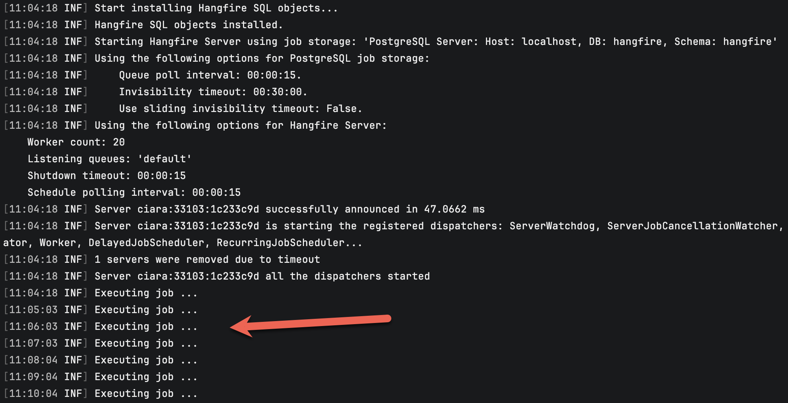
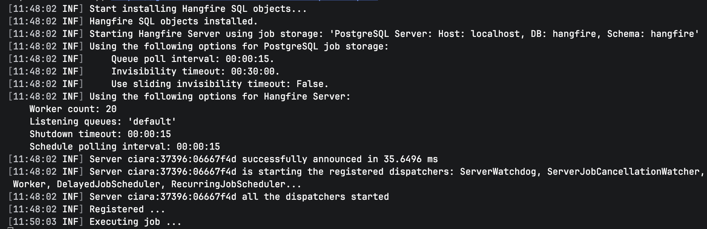
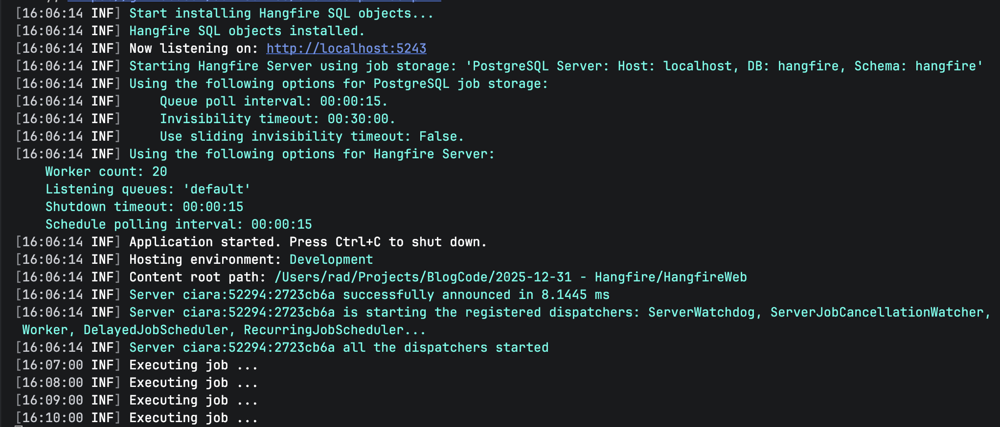
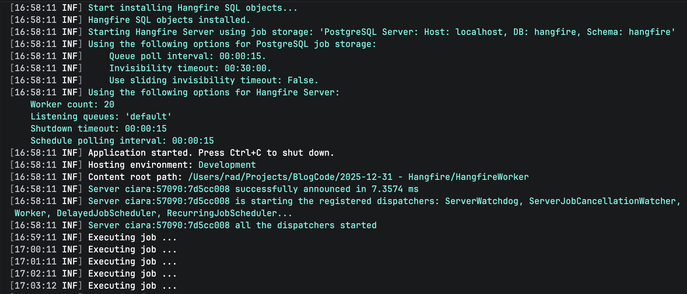
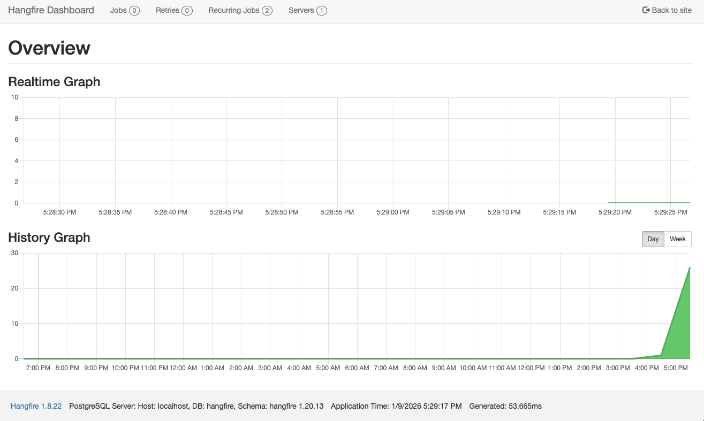
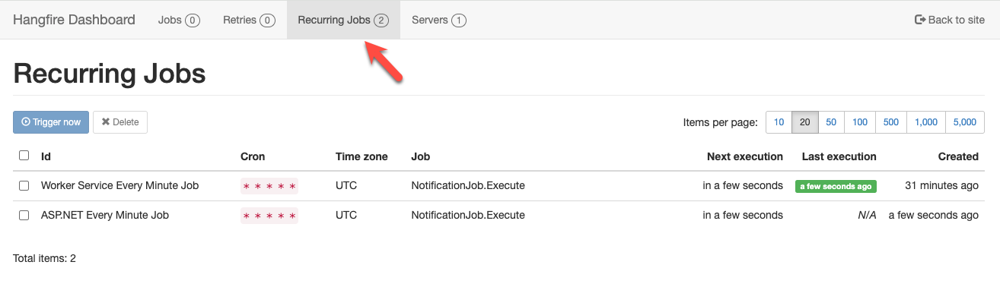
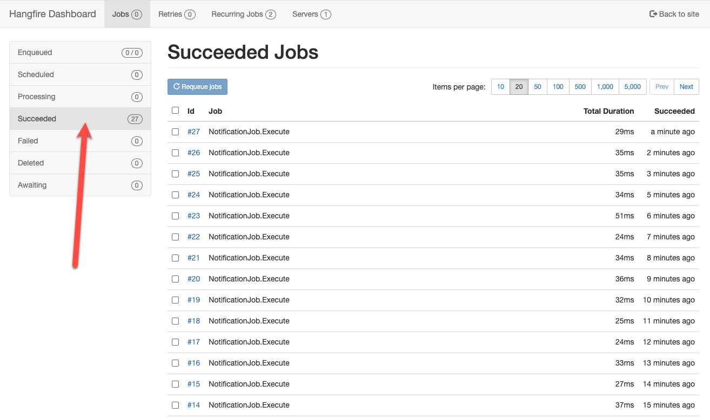
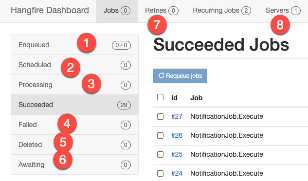
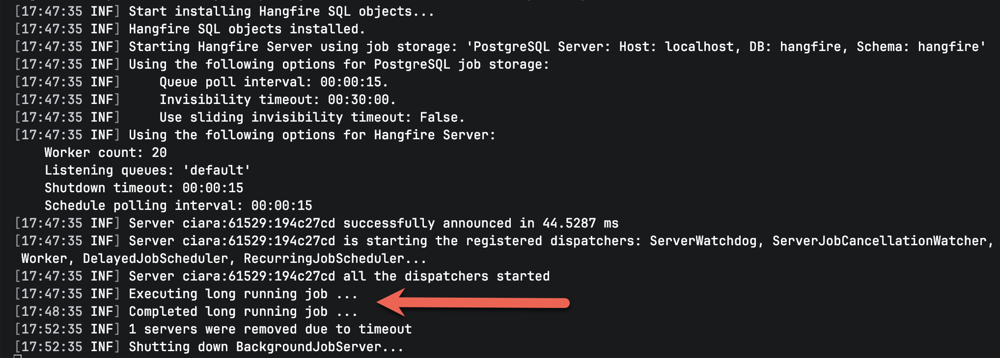

**This is Part 2 of a series on [scheduling libraries]() in C# & .NET.**

In this post, we will look at the [Hangfire](https://www.hangfire.io/) library.

## Configuration & Setup

To demonstrate this, we shall start with a simple **console application**.

```bash
dotnet new console -o HangfireTestRecurring
```

To set up the library, use nuget to install the `Hangfire` package

```bash
dotnet add package Hangfire.Core
```

Hangfire **typically requires a database** because it stores its data and metadata in persistent storage.

The following databases are supported:

- [Microsoft SQL Server](https://www.microsoft.com/en-us/sql-server)
- [PostgreSQL](https://www.postgresql.org/)
- [Redis](https://redis.io/)
- [MongoDB](https://www.mongodb.com/)
- [MySQL](https://www.mysql.com/)
- [SQLite](https://sqlite.org/)
- [Oracle](https://www.oracle.com/)
- [LiteDB](https://www.litedb.org/)

Depending on the datastore you want to use, you must install the **corresponding package**.

| Database   | Package  |
| ---------- | -------- |
| PostgreSQL | Hangfire.PostgreSQL |
| Redis | Hangfire.Redis.StackExchange |
| MongoDB | Hangfire.Mongo |
| MySQL | Hangfire.MySQLStorage |
| SQLite | Hangfire.SQLite |
| Oracle | Hangfire.Oracle |
| LiteDB | Hangfire.LiteDB |

For this example, we will be using `PostgreSQL`. 

You will therefore need to install the corresponding **package**:

```bash
dotnet add package Hangfire.PostgreSQL
```

You will also need to install the `PostgreSQL` Drivers:

```bash
dotnet add package Npgsql
```

You will also need to **explicitly create the database yourself**; one will not be created for you.

```sql
create database hangfire
```

Finally, we configure `Hangfire`.

```c#
using Hangfire;
using Hangfire.PostgreSql;
using Serilog;

// Configure logging
Log.Logger = new LoggerConfiguration()
    .WriteTo.Console()
    .CreateLogger();

GlobalConfiguration.Configuration
    .UseSimpleAssemblyNameTypeSerializer()
    .UseRecommendedSerializerSettings()
    .UsePostgreSqlStorage(x => { x.UseNpgsqlConnection("host=localhost;Database=hangfire;username=myuser;password=mypassword"); });

```

If we run this application, we should see the following:


You will also see in your previously empty database some **new objects**.


## Recurring Events

A recurring event is an event you want to fire **periodically after a defined threshold**.

For example, want to print a message every 10 seconds.

The first step is to define the **architecture that encapsulates our logic**. For this example, we encapsulate our logic in a `NotificationJob`, with the logic executing in the `Execute` method. For this `class`, we will inject the generic `ILogger<NotificationJob>`

```c#
using Microsoft.Extensions.Logging;

public sealed class NotificationJob
{
    private readonly ILogger _logger;

    public NotificationJob(ILogger<NotificationJob> logger)
    {
        _logger = logger;
    }

    public Task Execute()
    {
        _logger.LogInformation("Executing job ...");
        return Task.CompletedTask;
    }
}
```

The next thing is to **schedule** the job.

This is done as follows:

```c#
using Hangfire;
using Hangfire.PostgreSql;
using Serilog;

// Configure logging
Log.Logger = new LoggerConfiguration()
    .WriteTo.Console()
    .CreateLogger();

// Configure hangfire
GlobalConfiguration.Configuration
    .UseSimpleAssemblyNameTypeSerializer()
    .UseRecommendedSerializerSettings()
    .UsePostgreSqlStorage(x =>
    {
        x.UseNpgsqlConnection("host=localhost;Database=hangfire;username=myuser;password=mypassword");
    });

// Start the server
using (var server = new BackgroundJobServer())
{
    // Create / update a recurring job
    RecurringJob.AddOrUpdate<NotificationJob>(
        "Every Minute Job",
        job => job.Execute(),
        Cron.Minutely()
    );

    // Artificial wait
    await Task.Delay(TimeSpan.FromMinutes(5));

    // Shutdown server
    await server.WaitForShutdownAsync(CancellationToken.None);
}
```

The steps are as follows:

1. Create a `BackgroundJobServer` that is responsible for connecting to the `Hangfire` infrastructure
1. Using the generic `RecurringJobObject`, register the `NotificationJob` class, defining a **name**, the **method** to execute, and the **interval**. In this case, we are saying run every minute using the helper `Cron.Minutely()`.

If we run this application, we should see the following:



A couple of things to note:

1. `Hangfire` is **not designed for high-frequency intervals** - the smallest supported interval is one **minute**.
2. Even that interval is not **high fidelity** - there may be a **drift** of a second or two.

## Timed Events

Another problem you might run into is situations when the recurrence is **timed** - e.g., **repeats at a particular time** over a certain period, or f**ires once at a particular time**.

For example, you want a job to run every day at `11:30`.

The code would look like this:

```c#
using Hangfire;
using Hangfire.PostgreSql;
using Serilog;

// Configure logging
Log.Logger = new LoggerConfiguration()
    .WriteTo.Console()
    .CreateLogger();

// Configure hangfire
GlobalConfiguration.Configuration
    .UseSimpleAssemblyNameTypeSerializer()
    .UseRecommendedSerializerSettings()
    .UsePostgreSqlStorage(x =>
    {
        x.UseNpgsqlConnection("host=localhost;Database=hangfire;username=myuser;password=mypassword");
    });

// Start the server
using (var server = new BackgroundJobServer())
{
    // Create / update a recurring job
    RecurringJob.AddOrUpdate<NotificationJob>(
        "Daily Timed At 11:50",
        job => job.Execute(),
        // The time in UTC
        Cron.Daily(8, 50)
    );
    
    Log.Information("Registered ...");

    // Artificial wait
    await Task.Delay(-1);

    Log.Information("Shutting Down");

    // Shutdown server
    await server.WaitForShutdownAsync(CancellationToken.None);
}
```

The code is largely **similar** to the recurrent example, with this difference:

```c#
RecurringJob.AddOrUpdate<NotificationJob>(
      "Daily Timed At 11:50",
      job => job.Execute(),
      // The time in UTC
      Cron.Daily(8, 50)
  );
```

Again, we are using a helper method, `Cron.Daily()` to which we pass the time we want the event to fire - hour `11`, minute `30`. **It is important to note that this time is in UTC**.

If we run this code, we should see the following:



## Features Of Note

### ASP.NET DI Support

ASP.NET is fully supported by `Hangfire`, so you can leverage dependency injection to fully utilize its functionality.

First, **install** the following packages:

```bash
dotnet add package Hangfire.AspNetCore
```

Next, the program startup, where we will configure `Hangfire`.

```c#
using Hangfire;
using Hangfire.PostgreSql;
using Serilog;

Log.Logger = new LoggerConfiguration()
    .WriteTo.Console()
    .CreateLogger();

var builder = WebApplication.CreateBuilder(args);
builder.Services.AddSerilog();

// Add services
builder.Services.AddHangfire(config =>
{
    config.UseSimpleAssemblyNameTypeSerializer();
    config.UseRecommendedSerializerSettings();
    config.UsePostgreSqlStorage(options =>
    {
        options.UseNpgsqlConnection(builder.Configuration.GetConnectionString("Hangfire"));
    });
});

// Add server
builder.Services.AddHangfireServer();

var app = builder.Build();
app.UseHangfireDashboard();

// Now register the jobs

// Get a recurring job manager form DI container
var recurringJobManager = app.Services.GetRequiredService<IRecurringJobManager>();

// Register our job that fires every minute
recurringJobManager.AddOrUpdate<NotificationJob>(
    "ASP.NET Every Minute Job",
    job => job.Execute(),
    Cron.Minutely()
);

app.MapGet("/", () => "OK");

await app.RunAsync();
```

Of interest here is that we fetch the `RecurringJob` manager, which implements the `IRecurringJobManager` interface from the DI container in this line:

```c#
var recurringJobManager = app.Services.GetRequiredService<IRecurringJobManager>();
```

We then use that to **add** or **update** our job.



We can see here that it runs every **minute**.

We can use this for some of the typical tasks that are required in a web application:

1. **Populating a cache** from external sources
2. **Clearing** temporal caches
3. **Periodic** jobs

### HostedService DI Support

For a hosted service, such as a **Windows service** or **Linux system daemon**, the code is similar.

First, add the following package:

```bash
dotnet add package Hangfire.AspNetCore
```

The code itself will look like this:

```c#
using Hangfire;
using Hangfire.PostgreSql;
using Logic;
using Serilog;


try
{
    Log.Logger = new LoggerConfiguration()
        .WriteTo.Console()
        .CreateLogger();

    var builder = Host.CreateApplicationBuilder(args);

    // Add services
    builder.Services.AddSerilog();
    // Add job to the DI container!
    builder.Services.AddTransient<NotificationJob>();
    builder.Services.AddHangfire(config =>
    {
        config.UseSimpleAssemblyNameTypeSerializer();
        config.UseRecommendedSerializerSettings();
        config.UsePostgreSqlStorage(options =>
        {
            options.UseNpgsqlConnection(builder.Configuration.GetConnectionString("Hangfire"));
        });
    });


    // Add server
    builder.Services.AddHangfireServer();

    var app = builder.Build();

    // Now register the jobs

    // Get a recurring job manager form DI container
    var recurringJobManager = app.Services.GetRequiredService<IRecurringJobManager>();

    // Register our job that fires every minute
    recurringJobManager.AddOrUpdate<NotificationJob>(
        "Worker Service Every Minute Job",
        job => job.Execute(),
        Cron.Minutely()
    );
    
    await app.RunAsync();
}
catch (Exception ex)
{
    Log.Fatal(ex, "Application terminated");
}
finally
{
    Log.CloseAndFlush();
}
```

If we run this app, everything should work as expected:



### Hangfire Dashboard Support

Hangfire exposes a **dashboard** you can use to **view** a lot of **information** about the `Hangfire` services running.

For web applications, you **register** the dashboard as follows:

```c#
var app = builder.Build();

// Configure the hangfire dashboard
app.UseHangfireDashboard();
```

You can then **navigate** to the dashboard by visiting the  `/hangfire` route:



You can navigate to view the **recurring** jobs:



You can also view the **successful** jobs:



You can also view a lot of other details:



1. Queued jobs
2. Scheduled jobs
3. Jobs being processed
4. Failed jobs
5. Deleted jobs
6. Awaiting jobs
7. Retries
8. Servers

### Background Jobs

`Hangfire` also supports **background jobs**, which are jobs that are **queued** to run in a **different thread**, which is to say, **not the main thread**.

The code is as follows:

```c#
using Hangfire;
using Hangfire.AspNetCore;
using Hangfire.PostgreSql;
using Logic;
using Microsoft.Extensions.DependencyInjection;
using Serilog;

// Configure logging
Log.Logger = new LoggerConfiguration()
    .WriteTo.Console()
    .CreateLogger();

var services = new ServiceCollection();
services.AddLogging(builder => builder.AddSerilog());
// Register the job for DI
services.AddTransient<NotificationJob>();

var serviceProvider = services.BuildServiceProvider();

// Configure hangfire
GlobalConfiguration.Configuration
    .UseSimpleAssemblyNameTypeSerializer()
    .UseRecommendedSerializerSettings()
    .UsePostgreSqlStorage(x =>
    {
        x.UseNpgsqlConnection("host=localhost;Database=hangfire;username=myuser;password=mypassword");
    })
    // Configure how to resolve DI object activation
    .UseActivator(new AspNetCoreJobActivator(serviceProvider.GetRequiredService<IServiceScopeFactory>()));

// Start the server
using (var server = new BackgroundJobServer())
{
    BackgroundJob.Enqueue<NotificationJob>(x => x.ExecuteLengthy());

    // Artificial wait
    await Task.Delay(TimeSpan.FromMinutes(5));

    // Shutdown server
    Log.Information("Shutting down BackgroundJobServer...");
    await server.WaitForShutdownAsync(CancellationToken.None);
}
```

The example here is for a **console** application, where we **register** and **manually construct** our own **DI container**.

The process is much simpler with **worker services** and **ASP.NET** applications that **natively support** this.

The magic is happening here:

```c#
 BackgroundJob.Enqueue<NotificationJob>(x => x.ExecuteLengthy());
```

This is where we **register** our background job via the `BackgroundJob` class.

If we run this code, we should see the following:



We can see here that the long-running task took `1` minute to run.

### TLDR

**In this post, we have looked at how to use the `Hangfire` library for *recurrent* and *timed* schedules, as well as how to use it in a ASP.NET project, a worker service, and also how to implement background jobs**

The code is in my [GitHub](https://github.com/conradakunga/BlogCode/tree/master/2025-12-30%20-%20Quartz).

Happy hacking!
