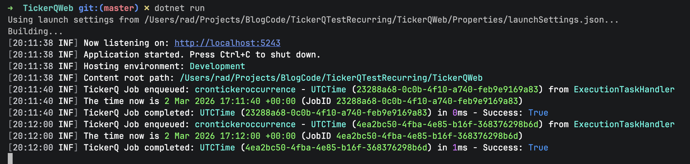
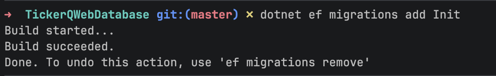
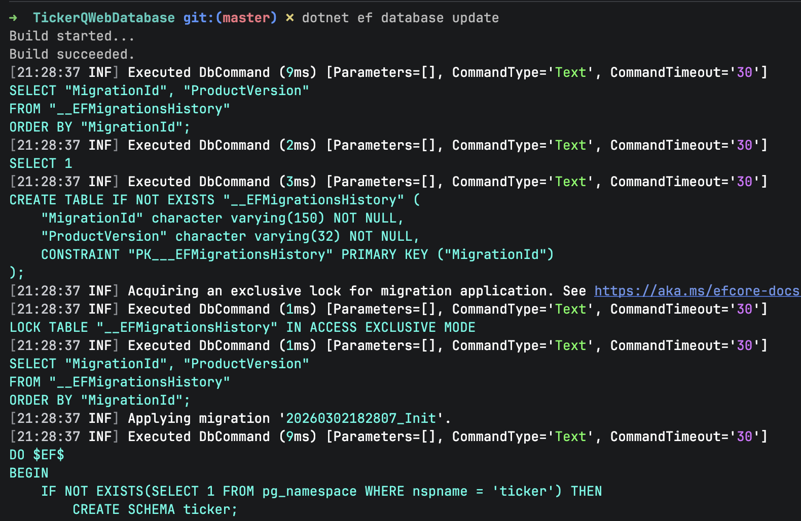
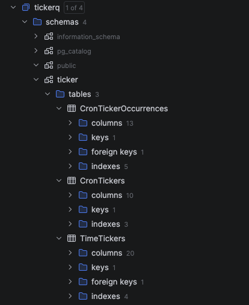
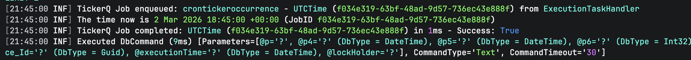
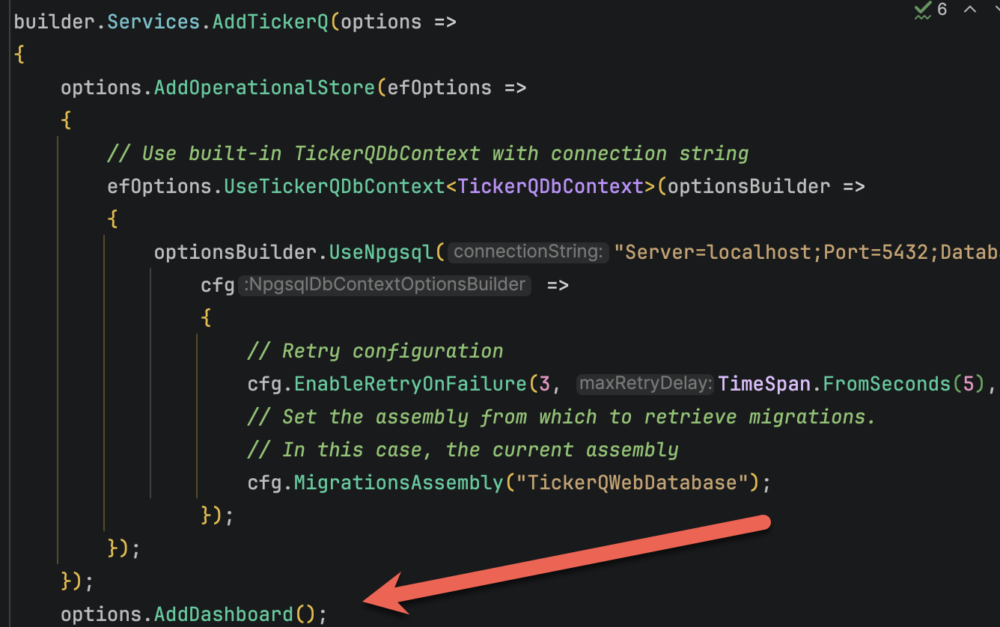
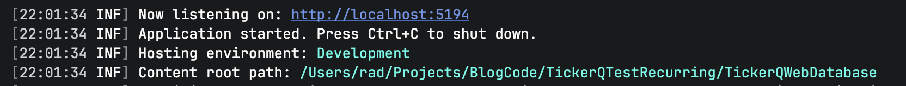
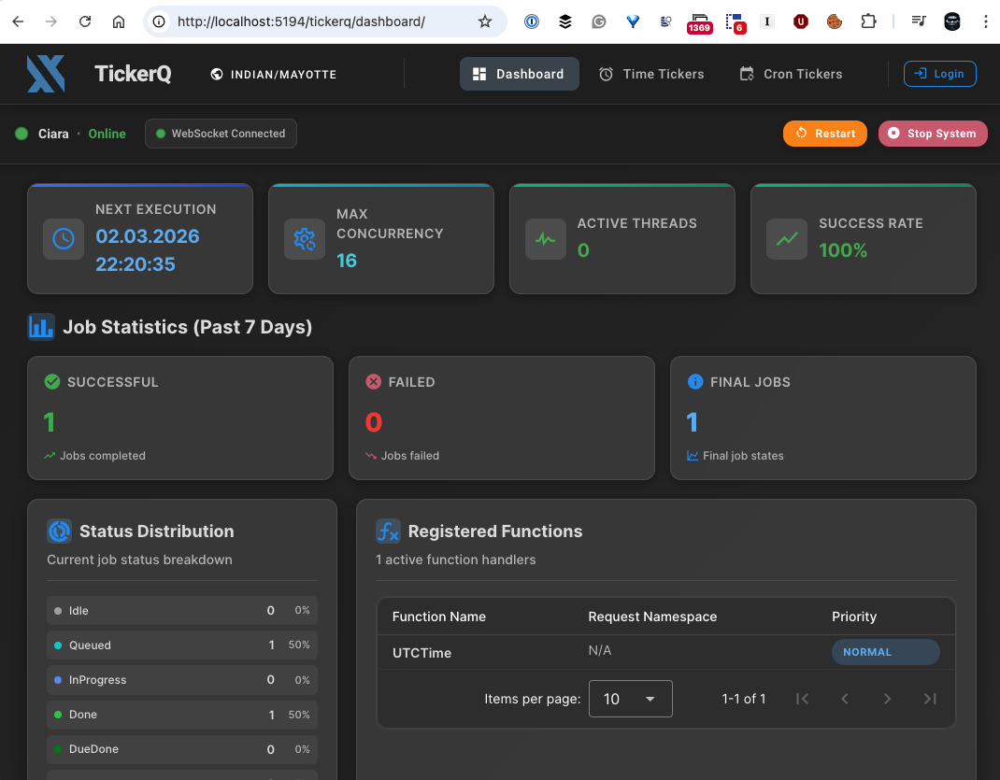
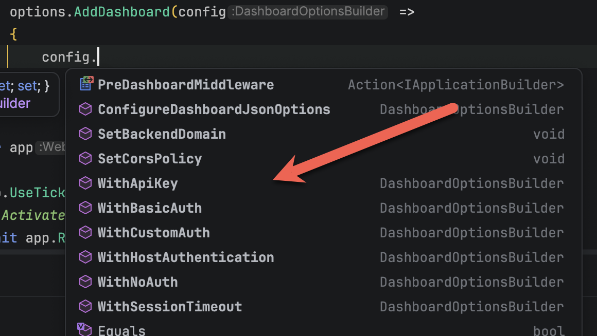
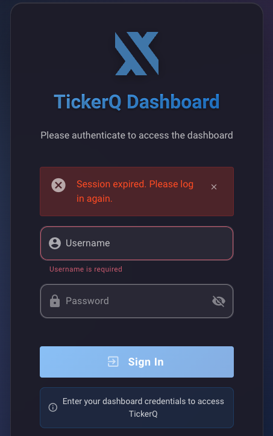

**This is Part 3 of a series on [scheduling libraries]() in C# & .NET.**

In this post, we will look at the [TickerQ](https://tickerq.net/) library.

## Configuration & Setup

To demonstrate this, we shall start with a simple **web application**.

```bash
dotnet new web -o TickerQWeb
```

To set up the library, use [nuget](https://www.nuget.org/) to install the `TickerQ` package.

```bash
dotnet add package TickerQ
```

We also add our [Serilog](https://serilog.net/) packages for logging.

`````
dotnet add package Serilog.AspNetCore
dotnet add package Serilog.Sinks.Console
`````

We then set up our web application in the `Program.cs` file as follows:

```c#
using Serilog;
using TickerQ.DependencyInjection;

Log.Logger = new LoggerConfiguration()
    .WriteTo.Console()
    .CreateLogger();

var builder = WebApplication.CreateBuilder(args);
builder.Services.AddSerilog();
// Register TickerQ services
builder.Services.AddTickerQ();

var app = builder.Build();
app.UseTickerQ();
// Activate the processor
await app.RunAsync();
```

With this in place, the next order of business is to set up our **jobs**.

Jobs are implemented as **functions** decorated with the `TickerFunction` attribute.

Let us implement a simple job that will print the **current UTC time**.

```c#
using TickerQ.Utilities.Base;

public sealed class TimeJob
{
    private readonly ILogger<Program> _logger;

    public TimeJob(ILogger<Program> logger)
    {
        _logger = logger;
    }

    [TickerFunction("UTCTime")]
    public void PrintUTCTime(TickerFunctionContext ctx, CancellationToken ct)
    {
        _logger.LogInformation("The time now is {CurrentTime:d MMM yyyy HH:mm:ss zzz} (JobID {JobID})",
            DateTime.UtcNow, ctx.Id);
    }
}
```

We want this job to run every `20` seconds. We can achieve this by setting the `CronExpression` property of the `TickerFunction` attribute.

You can get a primer on using [cron](https://en.wikipedia.org/wiki/Cron) expressions [here](https://crontab.guru/examples.html).

The updated function now looks like this:

```c#
public sealed class TimeJob
{
    private readonly ILogger<Program> _logger;

    public TimeJob(ILogger<Program> logger)
    {
        _logger = logger;
    }

    [TickerFunction("UTCTime", cronExpression: "*/20 * * * * *")]
    public void PrintUTCTime(TickerFunctionContext ctx, CancellationToken ct)
    {
        _logger.LogInformation("The time now is {CurrentTime:d MMM yyyy HH:mm:ss zzz} (JobID {JobID})",
            DateTime.UtcNow, ctx.Id);
    }
}
```

If we run the application, we should see something like this:



You can see here that every `20` seconds, the current UTC time is being printed.

Like `Hangfire`, and `Quartz`, `TickerQ` (optionally) supports storage to a **database**. You will first need to add the following package for [Entity Framework Core](https://learn.microsoft.com/en-us/ef/core/) support:

```c#
dotnet add package TickerQ.EntityFrameworkCore
```

The following databases are supported:

- [Microsoft SQL Server](https://www.microsoft.com/en-us/sql-server)
- [PostgreSQL](https://www.postgresql.org/)
- [SQLite](https://sqlite.org/)
- [MySQL](https://www.mysql.com/)

Depending on the datastore you want to use, you must install the **corresponding package**.

| Database   | Package                                   |
| ---------- | ----------------------------------------- |
| SQL Server | `Microsoft.EntityFrameworkCore.SqlServer` |
| PostgreSQL | `Npgsql.EntityFrameworkCore.PostgreSQL`   |
| SQLite     | `Microsoft.EntityFrameworkCore.Sqlite`    |
| MySQL      | `Pomelo.EntityFrameworkCore.MySql`        |

For this example, we will be using `PostgreSQL`. 

You will therefore need to install the corresponding **package**:

```bash
dotnet add package Npgsql.EntityFrameworkCore.PostgreSQL
```

Finally, we configure `TickerQ`.

The first order of business is configuring the `TickerQ` **database access**.

This is done as follows:

```c#
// Register TickerQ services
builder.Services.AddTickerQ(options =>
{
    options.AddOperationalStore(efOptions =>
    {
        // Use built-in TickerQDbContext with connection string
        efOptions.UseTickerQDbContext<TickerQDbContext>(optionsBuilder =>
        {
            optionsBuilder.UseNpgsql("Server=localhost;Port=5432;Database=tickerq;User Id=myuser;Password=mypassword;",
                cfg =>
                {
                    // Retry configuration
                    cfg.EnableRetryOnFailure(3, TimeSpan.FromSeconds(5), ["40P01"]);
                    // Set the assembly from which to retrieve migrations.
                    // In this case, the current assembly
                    cfg.MigrationsAssembly("TickerQWebDatabase");
                });
        });
    });
});
```

The [40P01](https://www.bytebase.com/reference/postgres/error/40p01-deadlock-detected/) is a reference to a PostgreSQL error that we intend to ignore for this purpose.

Next, we use [Entity Framework migrations](https://learn.microsoft.com/en-us/ef/core/managing-schemas/migrations/?tabs=dotnet-core-cli) to set up the database objects.

```bash
dotnet ef migrations add Init
```

Here we are naming our initial migration `Init`.

You should see the following:



With the migrations generated, we now **apply** them.

```bash
dotnet ef database update
```

You should see output like this:



Here we can see the various database objects are being set up.



Finally, we set up our **job**.

In this example, we want to print the UTC time **daily at 9:45 PM**.

```c#
using TickerQ.Utilities.Base;

public sealed class TimeJob
{
    private readonly ILogger<Program> _logger;

    public TimeJob(ILogger<Program> logger)
    {
        _logger = logger;
    }

    // Set function to run daily at 9:45 PM
    [TickerFunction("UTCTime", cronExpression: "0 45 21 * * *")]
    public void PrintUTCTime(TickerFunctionContext ctx, CancellationToken ct)
    {
        _logger.LogInformation("The time now is {CurrentTime:d MMM yyyy HH:mm:ss zzz} (JobID {JobID})",
            DateTime.UtcNow, ctx.Id);
    }
}
```

When we run our application, we should see the following at the appointed time:



## Features Of Note

### Dashboard Support

`TickerQ` supports an admin **dashboard**.

We start off by adding the appropriate package:

```bash
dotnet add package TickerQ.Dashboard
```

Next, we configure the services to add the dashboard.



The dashboard is now visible at this URL: `http://localhost:5000/tickerq/dashboard`

Replace `5001` with the port of your application.

You can check what it is at startup:



The dashboard looks like this:



You can also configure the dashboard to set various options:



For example, we can set a **username** and **password** like so:

```c#
options.AddDashboard(config =>
{
    // configure security
    config.WithBasicAuth("admin", "admin");
});
```

Upon restarting, you will get the following screen:



### TLDR

**In this post, we have looked at how to use the `TickerQ` library for *recurrent* and *timed* schedules, as well as how to use it in a traditional .NET application with an application host (Web, API, or WorkerService)****

The code is in my [GitHub](https://github.com/conradakunga/BlogCode/tree/master/2026-01-02%20-%20TickerQ).

Happy hacking!
