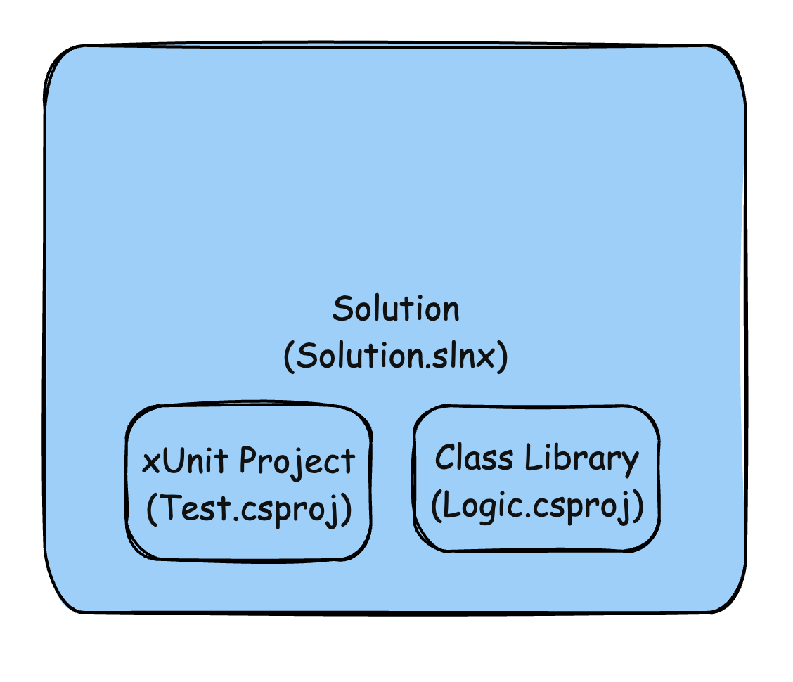
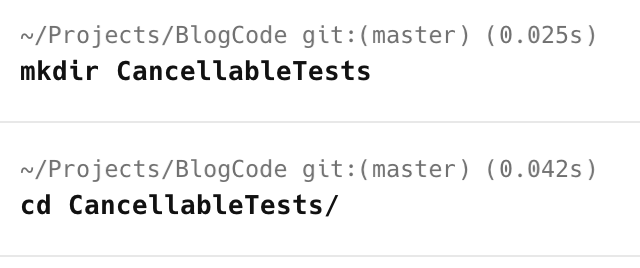
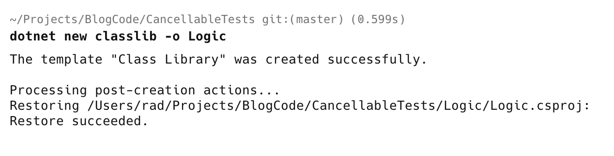
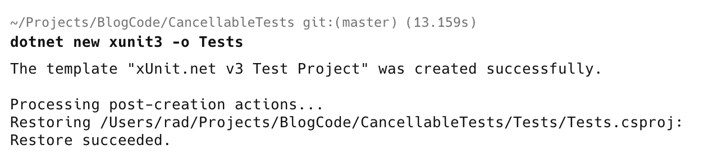
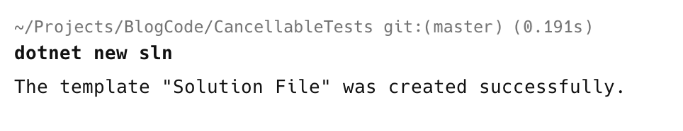
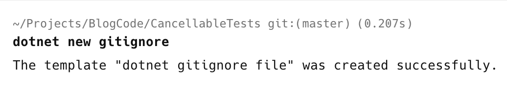
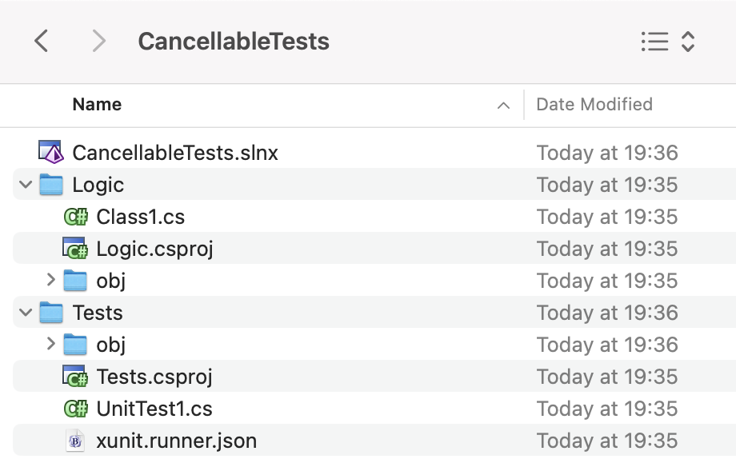
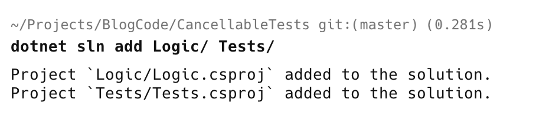
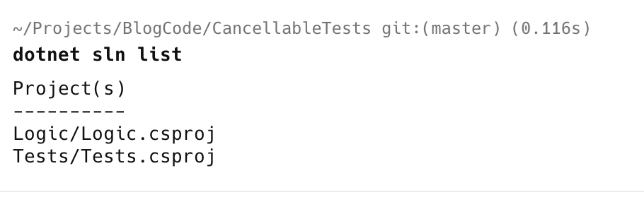

The [.NET CLI](https://learn.microsoft.com/en-us/dotnet/core/tools/), you might be surprised to learn, is so **fully featured** and **flexible** that I find it orders of magnitude **faster to use than an IDE** for creating, manipulating, and setting up .NET projects and solutions.

Suppose we want to set up a project as follows:



The first order of business is to create a **directory** to hold the **solution** and **project** files.

```bash
mkdir CancellableTests
```

This will create an **empty directory**, which we immediately switch to.

```bash
cd CancellableTests
```



From here, we create a [class library](https://learn.microsoft.com/en-us/dotnet/standard/class-libraries) project to store our logic.

```bash
dotnet new classlib -o Logic
```



We then want a [xUnit3](https://xunit.net/docs/getting-started/v3/whats-new) test project. Note that this is [xUnit](https://xunit.net/) version `3`, which is an overhaul of version `2`.

```bash
dotnet new xunit3 -o Tests
```



If you get an error about missing templates, install them as follows:

```bash
dotnet new install xunit.v3.templates::3.2.2
```

Next, we create a **blank solution**.

```bash
dotnet new sln
```



To reduce **noise** when it comes to source control, we typically want a `.gitignore` in the root directory.

```bash
dotnet new gitignore
```



The directory structure should look like this:



Finally, we **add our projects** to our solution.

Typically, you'd do it like this:

```bash
dotnet sln add Logic/
```

And then immediately:

```bash
dotnet sln add Tests/
```

You can do this in  a **single command**:

```bash
dotnet sln add Logic/ Tests/
```



You can verify all is well by **listing the projects** in the solution.

```bash
dotnet sln list
```



This, undoubtedly, will also work for [F#](https://fsharp.org/) and [VB.NET](https://learn.microsoft.com/en-us/dotnet/visual-basic/) projects.

### TLDR

**You can add multiple projects to a solution in a single command.**

Happy hacking!
