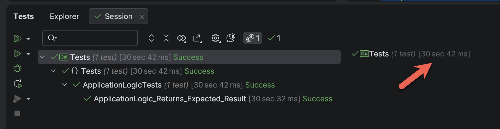
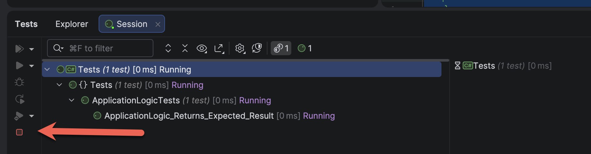
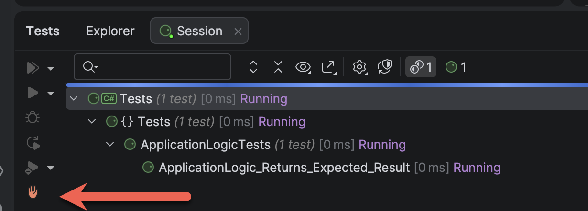
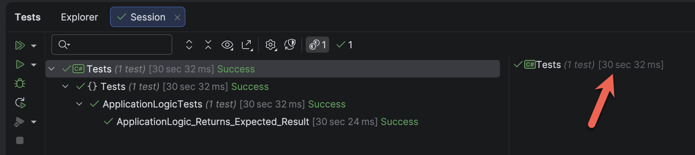
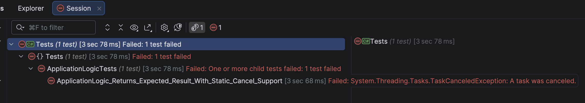

When testing, especially [integration tests](https://en.wikipedia.org/wiki/Integration_testing), you may find some tests that **take a long time to run**. Perhaps the logic is **elaborate**, or it depends on other, **slower systems and subsystems**.

You may also find that occasionally you might want to **terminate a test early**, for a number of reasons:

1. You **no longer want to wait** for the test run to complete
2. You **know** that the test is going to **fail**
3. The dependent **external systems**, you know for a fact, are **down**.

Take, for example, this simple `class`.

```c#
namespace Logic;

public class ApplicationLogic
{
    public async Task<string> LongRunningOperation(CancellationToken ct)
    {
        await Task.Delay(TimeSpan.FromSeconds(30), ct);
        return "Success";
    }
}
```

This logic simulates a long-running operation that takes 30 seconds to run.

We then write a test for this `ApplicationLogic` class.

```c#
using AwesomeAssertions;
using Logic;

namespace Tests;

public class ApplicationLogicTests
{
    [Fact]
    public async Task ApplicationLogic_Returns_Expected_Result()
    {
        var sut = new ApplicationLogic();
        var result = await sut.LongRunningOperation(CancellationToken.None);
        result.Should().Be("Success");
    }
}
```

Here I am using [xUnit3](https://xunit.net/docs/getting-started/v3/whats-new) as the test framework, and [AwesomeAssertions](https://awesomeassertions.org/) to write assertions that are **easy to read**.

We can then run the test to make sure everything is ok.



We can see here that the test successfully ran after `30` seconds.

Which is as expected.

Now, `30` seconds is a long time. Suppose we wanted to cancel a test mid-run?

The rest runner has a **cancel** button that looks like it should do what we expect.



The IDE I am using is [JetBrains](https://www.jetbrains.com/) [Rider](https://www.jetbrains.com/rider/), but the same principles will apply with [Visual Studio](https://visualstudio.microsoft.com/), [Visual Studio Code](https://code.visualstudio.com/), or any other .NET IDE that supports running tests.

You would be surprised to learn that this **does not actually do anything**.

The icon changes, but the test **runs to completion**.



The hand icon there suggests something is happening, but no.



The test not only ran for the full `30` seconds, but it also reported as a **success**.

So how do we resolve this?

`xUnit3` has **two** solutions to this problem.

The simplest is to use the built-in static `TestContext.Current.CancellationToken` that can be **signalled from the test runner**.

You simply change your test from this:

```c#
var sut = new ApplicationLogic();
var result = await sut.LongRunningOperation(CancellationToken.None);
result.Should().Be("Success");
```

To this:

```c#
var sut = new ApplicationLogic();
var result = await sut.LongRunningOperation(TestContext.Current.CancellationToken);
result.Should().Be("Success");
```

If we now run the test and then **cancel** it, it **aborts immediately**.



The second, and more flexible (and safer) is to inject a `ITestContextAccessor` into your test `class`, and access your [CancellatonToken](https://learn.microsoft.com/en-us/dotnet/api/system.threading.cancellationtoken?view=net-10.0) from there.

We do this by creating a `class` into which we inject the `ITestContextAccessor` in the constructor.

```c#
public class ApplicationLogicTestsSophisticated
{
    private readonly ITestContextAccessor _accessor;

    public ApplicationLogicTestsSophisticated(ITestContextAccessor accessor)
    {
        _accessor = accessor;
    }

    [Fact]
    public async Task ApplicationLogic_Returns_Expected_Result_With_Static_Cancel_Support()
    {
        var sut = new ApplicationLogic();
        var result = await sut.LongRunningOperation(_accessor.Current.CancellationToken);

        result.Should().Be("Success");
    }
}
```

This technique is **safer** and more **testable** than using the first approach.

### TLDR

**In `xUnit3`, you can write proper cancellation support for your test and test runners using either the static `TestContext.Current.CancellationToken` or injecting an `ITestContextAccessor` into your test constructor, through which you can access the `CancellationToken`.**

The code is in my GitHub,

Happy hacking!
