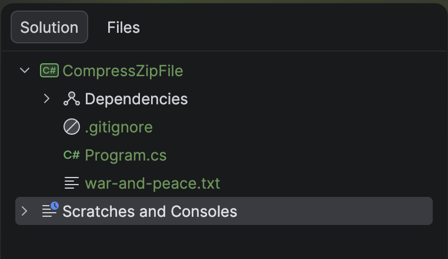
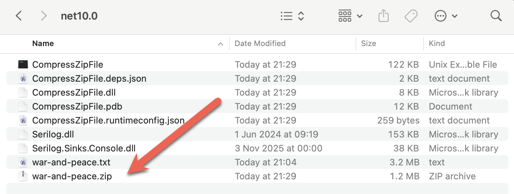

Thanks to the wonders of [compression algorithms](https://en.wikipedia.org/wiki/Data_compression), we can now store much **more of our data in the same amount of storage**.

A **ubiquitous** compression format in use today is the [Zip](https://en.wikipedia.org/wiki/ZIP_(file_format)) format, which builds on the [ARC](https://en.wikipedia.org/wiki/ARC_(file_format)) format.

We can leverage this in .NET without using third-party libraries, as what we need is available in the `System.IO` and `System.IO.Compression` namespaces.

For this, we use the [ZipFile](https://learn.microsoft.com/en-us/dotnet/api/system.io.compression.zipfile?view=net-10.0) class for the heavy lifting.

The project structure is as follows:



The code is as follows:

```c#
using System.IO.Compression;
using System.Reflection;
using Serilog;

Log.Logger = new LoggerConfiguration()
    .WriteTo.Console().CreateLogger();

const string sourceFile = "war-and-peace.txt";

// Extract the current folder where the executable is running
var currentFolder = Path.GetDirectoryName(Assembly.GetExecutingAssembly().Location);
// Construct the full path to the zip file
var targetZipFile = Path.Combine(currentFolder!, "war-and-peace.zip");

// Check if zip file exists. If so, delete it
if (File.Exists(targetZipFile))
    File.Delete(targetZipFile);

// Create a zip file with the maximum compression
await using (var archive = await ZipFile.OpenAsync(targetZipFile, ZipArchiveMode.Create))
{
    await archive.CreateEntryFromFileAsync(sourceFile, Path.GetFileName(sourceFile), CompressionLevel.SmallestSize);
}

Log.Information("Written {SourceFile} to {TargetZipFile}", sourceFile, targetZipFile, targetZipFile);
```

For this, I am using the novel [War and Peace](https://en.wikipedia.org/wiki/War_and_Peace) by [Leo Tolstoy](https://en.wikipedia.org/wiki/Leo_Tolstoy), available legally as a text file [here](https://github.com/mmcky/nyu-econ-370/blob/master/notebooks/data/book-war-and-peace.txt).

To ensure the **text** file is **copied to the output folder**, update the `.csproj` to add the following:

```xml
<ItemGroup>
  <None Include="war-and-peace.txt">
  	<CopyToOutputDirectory>PreserveNewest</CopyToOutputDirectory>
  </None>
</ItemGroup>
```

If we run this code, it will print the following:




You can verify that it is the same by **extracting it using your favourite tool**.

### TLDR

**`System.IO` and `System.IO.Compression` contain the `ZipFile` class that you can use to create Zip files.**

The code is in my [GitHub](https://github.com/conradakunga/BlogCode/tree/master/2026-01-05%20-%20CompressZipFile).

Happy hacking!
