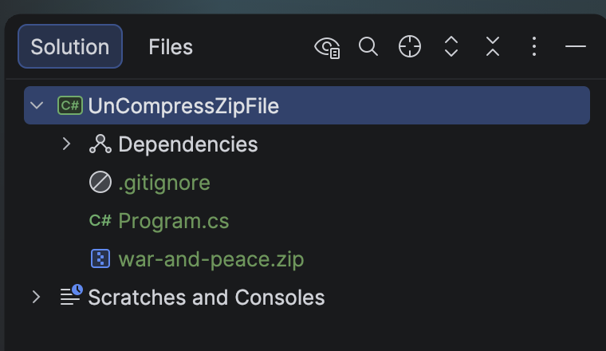
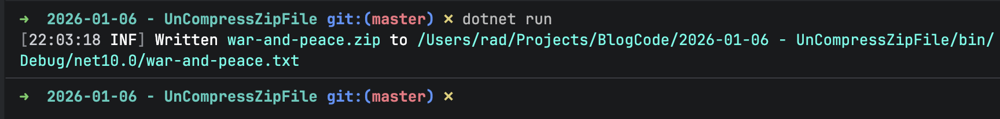
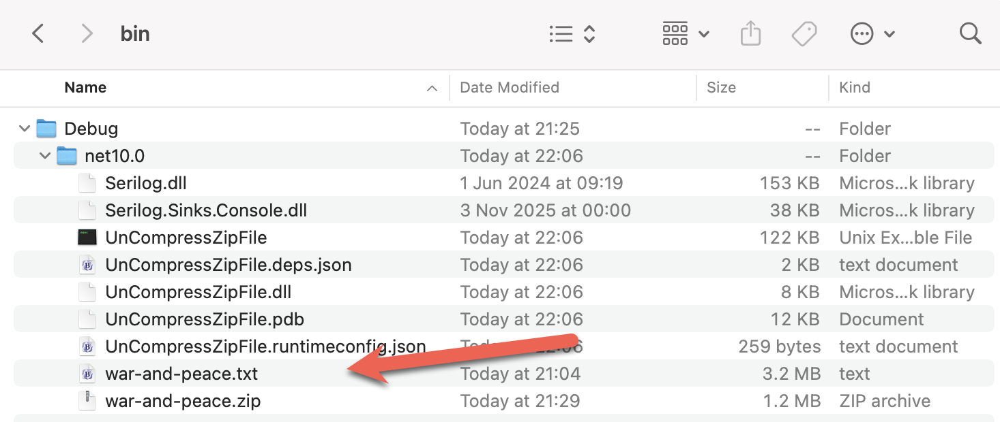
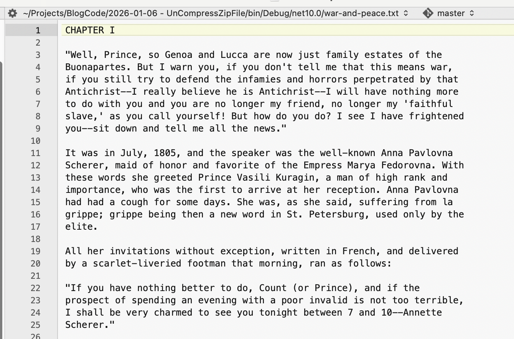

In yesterday's post, [How To Zip A Single File In C# & .NET](), we looked at how to zip a single text file  ([Leo Tolstoy's](https://en.wikipedia.org/wiki/Leo_Tolstoy) [War and Peace](https://en.wikipedia.org/wiki/War_and_Peace)) into a [zip](https://en.wikipedia.org/wiki/ZIP_(file_format)) file.

In today's post, we will look at the **opposite**: how to **extract** a file from a **Zip** archive.

Just as with **compression**, what we need for **decompression** is available in the `System.IO` and `System.IO.Compression` namespaces.

We will also use the [ZipFile](https://learn.microsoft.com/en-us/dotnet/api/system.io.compression.zipfile?view=net-10.0) class for the heavy lifting.

The code is as follows:

```c#
using System.IO.Compression;
using System.Reflection;
using Serilog;

Log.Logger = new LoggerConfiguration()
    .WriteTo.Console().CreateLogger();

const string sourceZipFile = "war-and-peace.zip";
const string textFileName = "war-and-peace.txt";

// Extract the current folder where the executable is running
var currentFolder = Path.GetDirectoryName(Assembly.GetExecutingAssembly().Location);
// Construct the full path to the extracted text file
var targetTextFile = Path.Combine(currentFolder!, textFileName);


// Open the zip file and extract file 
await using (var archive = await ZipFile.OpenReadAsync(sourceZipFile))
{
    // Find our entry
    var entry = archive.GetEntry(textFileName);
    // If not null, extract. Overwrite if it exists
    entry?.ExtractToFile(targetTextFile, overwrite: true);
}

Log.Information("Written {SourceZipFile} to {TargetTextFile}", sourceZipFile, targetTextFile, targetTextFile);
```

The project structure is as follows:



To ensure the **zip** file is **copied to the output folder**, update the `.csproj` to add the following:

```xml
<ItemGroup>
  <None Include="war-and-peace.zip">
  	<CopyToOutputDirectory>PreserveNewest</CopyToOutputDirectory>
  </None>
</ItemGroup>
```

If we run this code, it will print the following:



The folder will look like this:



You can verify that it was successfully extracted by **opening it in your favourite text editor**.



### TLDR

**`System.IO` and `System.IO.Compression` contain the `ZipFile` class that you can use to extract files from Zip files.**

The code is in my [GitHub](https://github.com/conradakunga/BlogCode/tree/master/2026-01-06%20-%20UnCompressZipFile).

Happy hacking!
