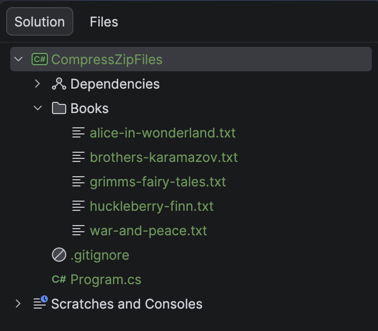
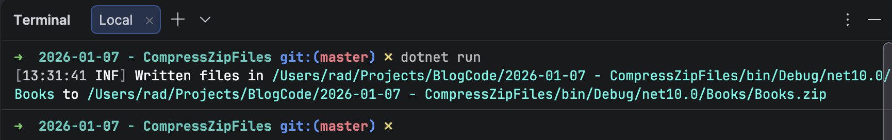

In an earlier post, [How To Zip A Single File In C# & .NET](), we looked at how to use the [ZipFile](https://learn.microsoft.com/en-us/dotnet/api/system.io.compression.zipfile?view=net-10.0) class in the [System.IO.Compression](https://learn.microsoft.com/en-us/dotnet/api/system.io.compression?view=net-10.0) namespace to create a [zip](https://en.wikipedia.org/wiki/ZIP_(file_format)) file from a single file.

In this post, we will look at how to zip **multiple** files into a **single zip** file. 

For our example, we have a bunch of **classic** books in **text file format**.


We will include this folder in the top level of our project, like so:



To make sure we copy the directory `Books` to the **output directory**, as well as its **files**, we amend the `.csproj` to add the following entry:

```xml
<ItemGroup>
  <None Include="Books\**\*">
  	<CopyToOutputDirectory>PreserveNewest</CopyToOutputDirectory>
  </None>
</ItemGroup>
```

Next, we write the code.

```c#
using System.IO.Compression;
using System.Reflection;
using Serilog;

Log.Logger = new LoggerConfiguration()
    .WriteTo.Console().CreateLogger();

// Extract the current folder where the executable is running
var currentFolder = Path.GetDirectoryName(Assembly.GetExecutingAssembly().Location);

// Construct the full path to the source files
var folderWithBooks = Path.Combine(currentFolder!, "Books");

// Construct the full path to the zip file
var targetZipFile = Path.Combine(folderWithBooks, "Books.zip");

// Retrieve the files
var filesToZip = Directory.GetFiles(folderWithBooks);

// Create the zip file on disk
await using (var archive = ZipFile.Open(targetZipFile, ZipArchiveMode.Create))
{
    foreach (var file in filesToZip)
    {
        // Add each file to the zip file as an entry, with max compression
        await archive.CreateEntryFromFileAsync(file, Path.GetFileName(file), CompressionLevel.Optimal);
    }
}

Log.Information("Written files in {SourceFiles} to {TargetZipFile}", folderWithBooks, targetZipFile);
```

Here, we are doing the following:

1. Construct a **path** to where the **zip file will be written**.
2. **Retrieve all the files** that we want to add to the zip files and place them in a collection.
3. **Create** the zip file.
4. **Iterate** through the collection, **adding each file** to the zip file.

Note here, as with all our other examples, we are favouring the [async](https://learn.microsoft.com/en-us/dotnet/csharp/language-reference/keywords/async) methods.

If we run this code, we should see the following:



If we navigate to the `Books` folder:


In this manner, we can create a **single zip** file from **many source files**.

The code for a **single file** is almost **identical**, and you can read about it in the post [How To Zip A Single File In C# & .NET]().

### TLDR

**The `ZipFile` class in `System.IO.Compression` can be used to create a single zip file from multiple source files.**

The code is in my [GitHub](https://github.com/conradakunga/BlogCode/tree/master/2026-01-07%20-%20CompressZipFiles).

Happy hacking!
