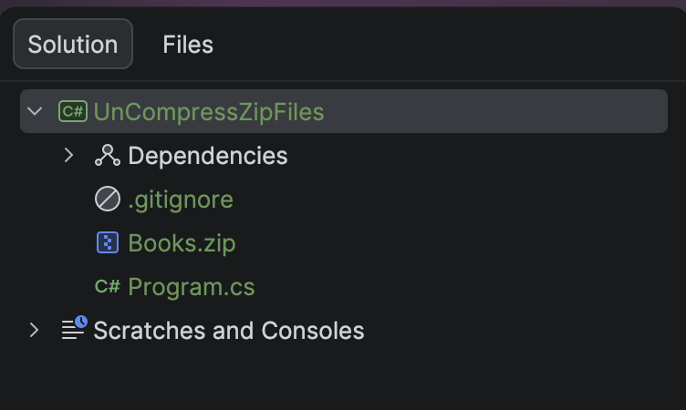
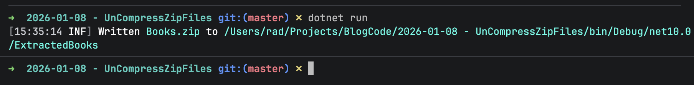
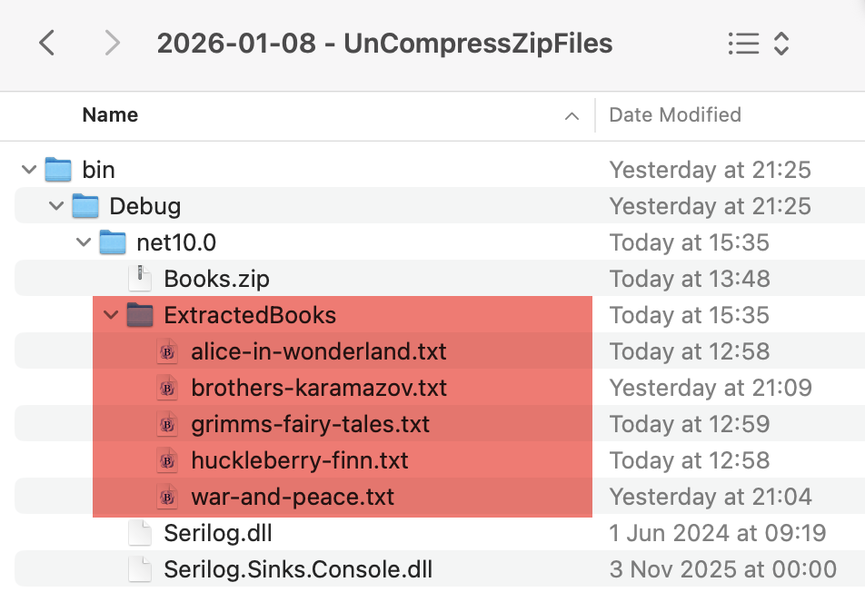

In yesterday's post, [How To Zip Multiple Files In C# & .NET](), we looked at how zip **multiple** files into a **single** [zip](https://en.wikipedia.org/wiki/ZIP_(file_format)) file.

Previously, in another post, [How To UnZip A Single File In C# & .NET](), we looked at how to **unzip** a **single** zip file.

In today's post, we will look at the **opposite**: how to extract the contents of a zip file that contains multiple files.

The project structure is as follows:



The **source** zip file, `Books.zip`, is in the root folder.

To ensure it is copied to the output folder, insert the following into the `.csproj` file.

```xml
<ItemGroup>
  <None Include="Books.zip">
  	<CopyToOutputDirectory>PreserveNewest</CopyToOutputDirectory>
  </None>
</ItemGroup>
```

As expected, we will use the [ZipFile](https://learn.microsoft.com/en-us/dotnet/api/system.io.compression.zipfile?view=net-10.0) class for the heavy lifting.

The code is as follows:

```c#
using System.IO.Compression;
using System.Reflection;
using Serilog;

Log.Logger = new LoggerConfiguration()
    .WriteTo.Console().CreateLogger();

const string sourceZipFileName = "Books.zip";
const string targetFolderName = "ExtractedBooks";

// Extract the current folder where the executable is running
var currentFolder = Path.GetDirectoryName(Assembly.GetExecutingAssembly().Location);
// Construct path to the source zip file
var sourceZipFile = Path.Combine(currentFolder!, sourceZipFileName);
// Construct target path for extraction
var targetFolder = Path.Combine(currentFolder!, targetFolderName);
// Open the zip file and extract file to the target directory 
await ZipFile.ExtractToDirectoryAsync(sourceZipFile, targetFolder);

Log.Information("Written {SourceZipFile} to {TargetTextFile}", sourceZipFileName, targetFolderName);
```

The magic is happening here in the [ExtractToDirectoryAsync](https://learn.microsoft.com/en-us/dotnet/api/system.io.compression.zipfile.extracttodirectoryasync?view=net-10.0) method of the [ZipFile](https://learn.microsoft.com/en-us/dotnet/api/system.io.compression.zipfile?view=net-10.0) class.

It extracts all files from the zip file and places them in a **specified folder**.

If we run this code, we get the following output:



If we look at the folder, we should see the following:



We can see our books have been placed in the new `ExtractedBooks` folder.

### TLDR

**The `ZipFileClass` has an `ExtractToDirectoryAsync` that you can use to extract multiple files from a zip file into a single, specified folder.**

The code is in my [GitHub](https://github.com/conradakunga/BlogCode/tree/master/2026-01-08%20-%20UnCompressZipFiles).

Happy hacking!
