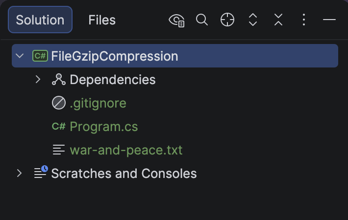
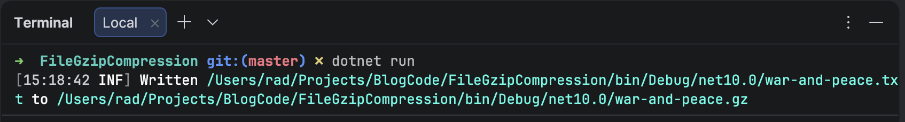
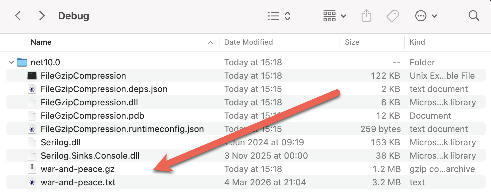

A few recent posts,  [How To Zip A Single File In C# & .NET](), [How To UnZip A Single File In C# & .NET](), [How To Zip Multiple Files In C# & .NET](), [How To UnZip Multiple Files In C# & .NET](), looked at how to **compress** and **decompress** [zip](https://en.wikipedia.org/wiki/ZIP_(file_format)) files.

Another compression format you will run into, especially in the **Linux**, **Unix**, and **MacOS** worlds, is the [gzip](https://en.wikipedia.org/wiki/Gzip) format.

The [System.IO.Compression](https://learn.microsoft.com/en-us/dotnet/api/system.io.compression?view=net-10.0) namespace contains classes that enable working with the **gzip** format.

Our project structure is as follows:



The file we will be working with is `war-and-peace.txt`.

To ensure the file is copied to the output folder, we add the following to the .csproj file.

```xml
<ItemGroup>
  <None Include="war-and-peace.txt">
  	<CopyToOutputDirectory>PreserveNewest</CopyToOutputDirectory>
  </None>
</ItemGroup>
```

The code is as follows:

```c#
using System.IO.Compression;
using System.Reflection;
using Serilog;

Log.Logger = new LoggerConfiguration()
    .WriteTo.Console()
    .CreateLogger();

const string fileName = "war-and-peace";

// Extract the current folder where the executable is running
var currentFolder = Path.GetDirectoryName(Assembly.GetExecutingAssembly().Location)!;
var sourceFile = Path.Combine(currentFolder, $"{fileName}.txt");
var targetFile = Path.Combine(currentFolder, $"{fileName}.gz");

// Create a gzip stream for the target
using (var gzip = new GZipStream(File.Create(targetFile), CompressionLevel.Optimal))
{
    // Read the source file and copy into the gzip stream
    using (var input = File.OpenRead(sourceFile))
    {
        input.CopyTo(gzip);
    }
}

Log.Information("Written {SourceFile} to {TargetFile}", sourceFile, targetFile);
```

If we run the code, we will see the following output:



And if we examine the folder:



### TLDR

**`System.IO.Compression` contains the `GzipStream` class that allows you to write files compressed with `gzip`.**

The code is in my [GitHub](https://github.com/conradakunga/BlogCode/tree/master/2026-01-10%20-%20FileGzipCompression).

Happy hacking!
