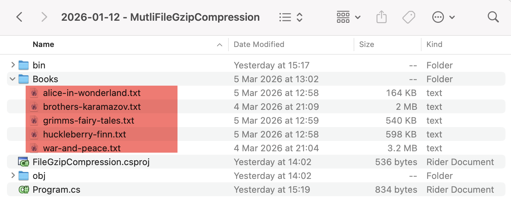
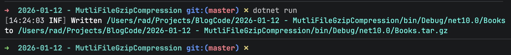
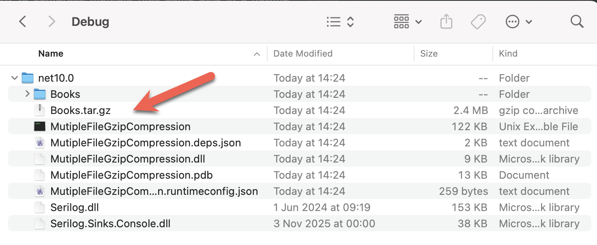

In a prior post, [How To Compress A File Using GZip In C# & .NET](), we looked at how to **compress** a file with the [gzip](https://en.wikipedia.org/wiki/Gzip) format using the [System.IO.Compression](https://learn.microsoft.com/en-us/dotnet/api/system.io.compression?view=net-10.0) [GZipStream](https://learn.microsoft.com/en-us/dotnet/api/system.io.compression.gzipstream?view=net-10.0)

In this post, we will look at how to **compress multiple files** using [gzip](https://en.wikipedia.org/wiki/Gzip).

I will start off by saying that **you cannot, in fact, compress multiple files into a single gzip file**. 

At least, not **directly**.

You must first **gather all the files you want to compress into a single file**, then **compress that** file with gzip.

In the **Linux**, **Unix,** and **macOS** worlds, this problem is solved using the [tar](https://en.wikipedia.org/wiki/Tar_(computing)) utility.

We can achieve the same thing using C# & .NET.

Let us take, as an example, our collection of **classic books.**



We will tackle the problem as follows:

1. Create a `Tar` file from the source files.
2. `Gzip` the `Tar` file into a file.

The code is as follows:

```c#
using System.Formats.Tar;
using System.IO.Compression;
using System.Reflection;
using Serilog;

Log.Logger = new LoggerConfiguration()
    .WriteTo.Console()
    .CreateLogger();

const string sourceFilesDirectoryName = "Books";

// Extract the current folder where the executable is running
var currentFolder = Path.GetDirectoryName(Assembly.GetExecutingAssembly().Location)!;

// Build the intermediate paths
var sourceFilesDirectory = Path.Combine(currentFolder, sourceFilesDirectoryName);
var targetTarFile = Path.Combine(currentFolder, $"{sourceFilesDirectoryName}.tar");
var targetGzipFile = Path.Combine(currentFolder, $"{sourceFilesDirectoryName}.tar.gz");

// Get the files for compression
var filesToCompress = Directory.GetFiles(sourceFilesDirectory);

 // Create a stream, and use a TarWriter to write files to this stream
await using (var stream = File.Create(targetTarFile))
{
    await using (var writer = new TarWriter(stream))
    {
        foreach (var file in filesToCompress)
        {
            await writer.WriteEntryAsync(file, Path.GetFileName(file));
        }
    }
}

// Create a gzip stream for the target
await using (var gzip = new GZipStream(File.Create(targetGzipFile), CompressionLevel.Optimal))
{
    // Read the source file and copy into the gzip stream
    await using (var input = File.OpenRead(targetTarFile))
    {
        await input.CopyToAsync(gzip);
    }
}

Log.Information("Written {SourceFile} to {TargetFile}", sourceFilesDirectory, targetGzipFile);
```

Support for `Tar` is from the [TarWriter](https://learn.microsoft.com/en-us/dotnet/api/system.formats.tar.tarwriter?view=net-10.0) class in the [System.Formats.Tar](https://learn.microsoft.com/en-us/dotnet/api/system.formats.tar?view=net-10.0) namespace.

Rather than using a stream, the `TarWriter` also exposes a helper method - [CreateFromDirectoryAsync](https://learn.microsoft.com/en-us/dotnet/api/system.formats.tar.tarfile.createfromdirectoryasync?view=net-10.0#system-formats-tar-tarfile-createfromdirectoryasync(system-string-system-string-system-boolean-system-threading-cancellationtoken)), that allows you to **directly** create a `Tar` file from a folder. (There is also a **synchronous** version, [CreateFromDirectory](https://learn.microsoft.com/en-us/dotnet/api/system.formats.tar.tarfile.createfromdirectory?view=net-10.0))

We can achieve the **same result** of a new `Tar` file as follows:

```c#
// Create the target tar file, with the folder as the root
await TarFile.CreateFromDirectoryAsync(sourceFilesDirectory, targetGzipFile, true);
```

There is **no particular reason for using the current** path. You can use a temporary directory as a staging area, using the [Path.GetTempPath()](https://learn.microsoft.com/en-us/dotnet/api/system.io.path.gettemppath?view=net-10.0) method.

A third and more **elegant** solution is the following:

1. Create a [FileStream](https://learn.microsoft.com/en-us/dotnet/api/system.io.filestream?view=net-10.0) for the final gzip file
2. Create a [GzipStream](https://learn.microsoft.com/en-us/dotnet/api/system.io.compression.gzipstream?view=net-10.0) from this `FileStream`
3. Use a `TarWriter` to write entries to this `GzipStream`

This solution has the benefit of **avoiding intermediate file generation**.

The code is as follows:

```c#
// Create a stream for the target gzip file
await using (var fileStream = File.Create(targetGzipFile))
{
    // Create a GzipStream from the previous steam
    await using (var gzip = new GZipStream(fileStream, CompressionLevel.Optimal))
    {
        // Create a TarWriter with the GzipStrea,
        await using (var writer = new TarWriter(gzip))
        {
            // Write the files to the stream
            foreach (var file in filesToCompress)
            {
                await writer.WriteEntryAsync(file, Path.GetFileName(file));
            }
        }
    }
}
```

If we run this code, it should print the following:



And in our directory, we should be able to see the `gzip` file.



### TLDR

**You can create a `gzip` file from multiple source files by `Tar`-ing the files first using a `TarWriter` and then `gzip`-ing them using a `GzipStream`**

The code is in my [GitHub](https://github.com/conradakunga/BlogCode/tree/master/2026-01-12%20-%20MutliFileGzipCompression).

Happy hacking!
