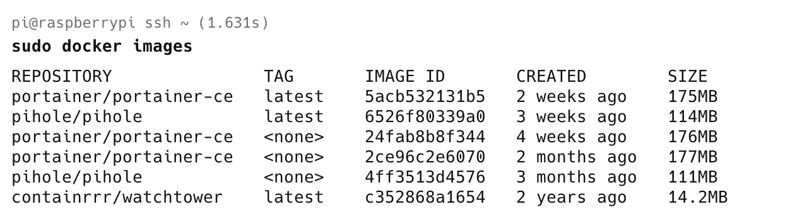
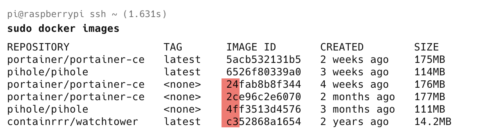

When it comes to [Docker](https://www.docker.com/) (and you ARE using **Docker**, aren't you?), **housekeeping** is something you will find yourself doing fairly often. 

This is generally due to:

1. **Outdated** images
2. **Better** images e.g. **smaller** images based on [Alpine](https://www.alpinelinux.org/) Linux, rather than [Ubuntu](https://ubuntu.com/) or [Debian](https://www.debian.org/)
3. **Unused** images

You can **list** the images you have using the `docker images` [command](https://docs.docker.com/reference/cli/docker/image/ls/), like so:

```bash
docker images
```

This will list the images you currently have.

You will get a response like this:



Here, it is clear that there are two **outdated** images of the container [portainer-ce](https://docs.portainer.io/start/install-ce).

There are multiple ways to deal with this.

The first is to remove them **one by one**, using their tags, with the [command](https://docs.docker.com/reference/cli/docker/image/rm/) `docker rm,` like this:

```bash
docker rm 24fab8b8f344
docker rm 2ce96c2e6070
docker rm 4ff3513d4576
```

Alternatively, you can remove them with a **single command**.

```bash
docker rm 24fab8b8f344 2ce96c2e6070 4ff3513d4576
```

You can also make use of the fact that you only need to provide **enough of the leading tag to be unique**.



In other words, you can do it this way:

```bash
docker rmi 24 2c 4f
```

These commands will all achieve the same thing: removing images you no longer want.

### TLDR

**You can remove multiple `docker` images with a single command.**

Happy hacking!
