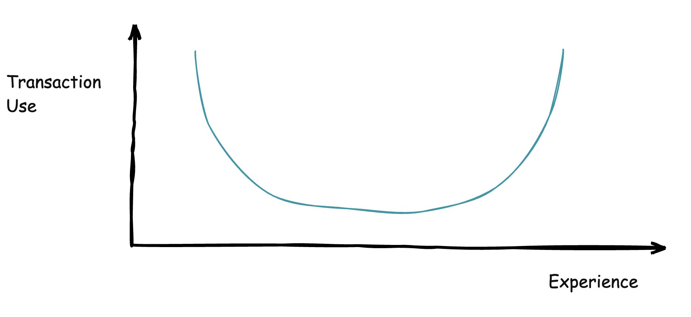

[Database transactions](https://cybernerdie.medium.com/database-transactions-explained-a-deep-dive-into-reliability-17ab4e17117a) are one of those **very simple**, yet very **complex** concepts that you run into in the course of developing database applications.

My use of transactions over my career has followed this graph:



We shall get into this in more detail in a subsequent post.

Recently, I was refactoring a class that looked like this:

```c#
using System.Data.Common;
using Dapper;
using Microsoft.Data.SqlClient;

namespace TransactionWork;

public class TransactionProcessor
{
    public async Task<DateTime> DoThisThing(SqlConnection cn, DbTransaction trans)
    {
        var result = await cn.QuerySingleAsync<DateTime>("SELECT GETDATE()", transaction: trans);
        return result;
    }

    public async Task<DateTime> DoTheOtherThing(SqlConnection cn, SqlTransaction trans)
    {
        var result = await cn.QuerySingleAsync<DateTime>("SELECT GETDATE()", transaction: trans);
        return result;
    }
}
```

The logic here is immaterial -  the flow is that there are **two methods** interacting with the database, and I wish to have a database transaction to ensure **both operations complete or fail atomically**.

This code is invoked as follows:

```c#
using Microsoft.Data.SqlClient;
using Serilog;
using TransactionWork;

Log.Logger = new LoggerConfiguration()
    .WriteTo.Console()
    .CreateLogger();

await using (var cn = new SqlConnection("Data Source=.;uid=sa;pwd=YourStrongPassword123;TrustServerCertificate=true"))
{
    // Open the connection
    await cn.OpenAsync();
    // Create a transaction
    await using (var trans = await cn.BeginTransactionAsync())
    {
        // Create the processor
        var processor = new TransactionProcessor();
        // Do the first bit of work
        var firstResult = await processor.DoThisThing(cn, trans);
        // Do the next bit of work
        var secondResult = await processor.DoThisThing(cn, trans);
        trans.Commit();
        Log.Information("Success!");
    }
}
```

At the surface level, this is fine, and this code in fact works perfectly.

The potential problem is that you are passing the **transactions** and the **connection** **separately**.

This means that a user can do this:

```c#
var cn1 = new SqlConnection(
    "Data Source=.;uid=sa;pwd=YourStrongPassword123;TrustServerCertificate=true");
await cn1.OpenAsync();

var cn2 = new SqlConnection(
    "Data Source=.;uid=sa;pwd=YourStrongPassword123;TrustServerCertificate=true");
await cn2.OpenAsync();

var trans1 = await cn1.BeginTransactionAsync();
var trans2 = await cn2.BeginTransactionAsync();
// Create the processor
var processor = new TransactionProcessor();
// Do the first bit of work
var firstResult = await processor.DoThisThing(cn1, trans1);
// Do the next bit of work
var secondResult = await processor.DoThisThing(cn1, trans2);
trans1.Commit();
trans2.Commit();
Log.Information("Success!");
```

Here we are passing **two different** [DBTransaction](https://learn.microsoft.com/en-us/dotnet/api/system.data.common.dbtransaction?view=net-10.0) objects and two different [SqlConnection](https://learn.microsoft.com/en-us/dotnet/api/system.data.sqlclient.sqlconnection?view=netframework-4.8.1) objects to the `TransactionProcessor`.

This code will also run, but it is not doing what you think it is doing.

Here, we have two transactions running **independently**. So, **one failing** will **not affect the other**.

This probably isn't what you intended.

To prevent this, we refactor the `TransactionProcessor` as follows:

```c#
namespace TransactionWork.v2
{
    public class TransactionProcessor
    {
        public async Task<DateTime> DoThisThing(DbTransaction trans)
        {
            var result = await trans.Connection!.QuerySingleAsync<DateTime>("SELECT GETDATE()", transaction: trans);
            return result;
        }

        public async Task<DateTime> DoTheOtherThing(DbTransaction trans)
        {
            var result = await trans.Connection!.QuerySingleAsync<DateTime>("SELECT GETDATE()", transaction: trans);
            return result;
        }
    }
}
```

Here, we are passing the `DbTransaction` only to the methods, obtaining its `SqlConnection` via the Connection property, on which we then leverage Dapper to execute the query.

Again, **pay no attention to the fact that the work is a SELECT statement** - in a production use case, there would, naturally, be some database **writes**.

The final code is thus invoked like this:

```c#
await using (var cn = new SqlConnection(
                 "Data Source=.;uid=sa;pwd=YourStrongPassword123;TrustServerCertificate=true"))
{
    // Open the connection
    await cn.OpenAsync();
    // Create a transaction
    await using (var trans = await cn.BeginTransactionAsync())
    {
        // Create the processor
        var processor = new TransactionWork.v2.TransactionProcessor();
        // Do the first bit of work
        var firstResult = await processor.DoThisThing(trans);
        // Do the next bit of work
        var secondResult = await processor.DoTheOtherThing(trans);
        trans.Commit();
        Log.Information("Success!");
    }
}
```

In this way, we can be **unambiguous about the coupling** of the `SqlTransaction` and the `DbConnection`.

### TLDR

**Rather than pass around a `DbTransaction` and associated `SqlConnecton`, we only need to pass the DbTransaction.** 

**We can fetch its associated connection from the `Connection` property.**

The code is in my [GitHub](https://github.com/conradakunga/BlogCode/tree/master/2026-01-15%20-%20Transactions).

Happy hacking!
