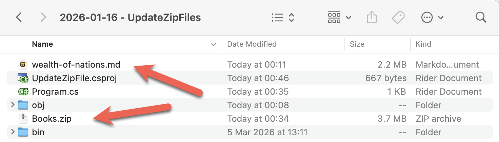

In a previous post, [How To Compress Multiple Files Using GZip In C# & .NET](), we looked at how to add multiple files to a [Zip](https://en.wikipedia.org/wiki/ZIP_(file_format)) file.

In this post, we will look at how to **add a file to an existing `Zip` file**.

We will use the `Books.zip` file we generated in the previous post, and add a new file, `wealth-of-nations.md` by [Adam Smith](https://en.wikipedia.org/wiki/Adam_Smith), to our project.

This is the file we want to **add** to the zip file.

Our project folder will look like this:



To ensure the file `wealth-of-nations.md` as well as the Zip file are copied to the build folder, we update our `.csproj` by adding a new element as follows:

```xml
<ItemGroup>
  <None Include="wealth-of-nations.md">
  	<CopyToOutputDirectory>PreserveNewest</CopyToOutputDirectory>
  </None>
  <None Include="Books\**\*">
  	<CopyToOutputDirectory>PreserveNewest</CopyToOutputDirectory>
  </None>
</ItemGroup>
```

Our code to add the file will be as follows:

```c#
using System.IO.Compression;
using System.Reflection;
using Serilog;

Log.Logger = new LoggerConfiguration()
    .WriteTo.Console().CreateLogger();

// Extract the current folder where the executable is running
var currentFolder = Path.GetDirectoryName(Assembly.GetExecutingAssembly().Location)!;

// Construct the full path to the zip file
var targetZipFile = Path.Combine(currentFolder, "Books.zip");

// Set the filename
const string fileName = "wealth-of-nations.md";

// Construct the full path to the file to add
var fileToAdd = Path.Combine(currentFolder, fileName);

// Open the zip file on disk for update
await using (var archive = ZipFile.Open(targetZipFile, ZipArchiveMode.Update))
{
    // Ensure the file does not already exist. Return if it does
    if (archive.GetEntry(fileToAdd) != null)
    {
        Log.Warning("The file {File} already exists in the zip file", fileToAdd);
        return;
    }

    // Add the file to the archive
    archive.CreateEntryFromFile(fileToAdd, fileName, CompressionLevel.Optimal);
}

Log.Information("Updated {TargetZipFile}", targetZipFile);
```

The heavy lifting is done by the [CreateEntryFromFile](https://learn.microsoft.com/en-us/dotnet/api/system.io.compression.zipfileextensions.createentryfromfile?view=net-10.0) method of an extension of the [ZipArchive](https://learn.microsoft.com/en-us/dotnet/api/system.io.compression.zipfileextensions?view=net-10.0) class.

If we run this program, we should see the following.


If we extract the contents of the `Zip` file, we should see our book within.


If we run the program again, it will terminate early, as the file already exists now.


### TLDR

**The `CreateEntryFromFile` extension method of the `ZipArchive` class allows adding a file to a `Zip` archive.**

The code is in my [GitHub](https://github.com/conradakunga/BlogCode/tree/master/2026-01-16%20-%20UpdateZipFiles).

Happy hacking!
