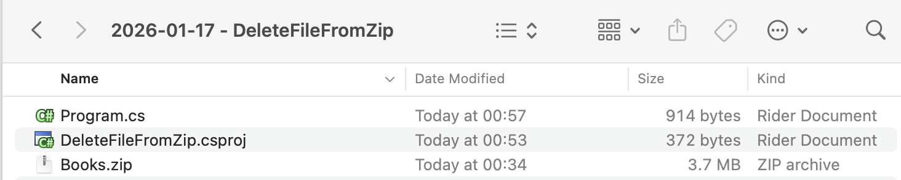
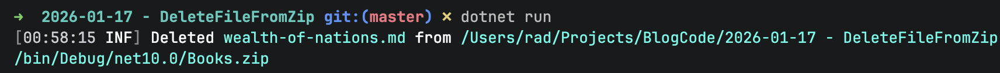

In our previous post, [Adding A File To A Zip File in C# & .NET](), we looked at how to add a new file to an existing `Zip` file archive.

In this post, we will look at how to **delete** a file from a `Zip` file archive.

In this project, we will use the `Zip` file generated in the **previous** post that has the file `wealth-of-nations.md` added.

The project looks like this:



To ensure the `Books.zip` file is always copied to the output, we update the `.csproj` as follows:

```xml
<ItemGroup>
  <None Include="Books\**\*">
  	<CopyToOutputDirectory>PreserveNewest</CopyToOutputDirectory>
  </None>
</ItemGroup>
```

The code to delete the file is as follows:

```c#
using System.IO;
using System.IO.Compression;
using System.Reflection;
using Serilog;

Log.Logger = new LoggerConfiguration()
    .WriteTo.Console().CreateLogger();

// Extract the current folder where the executable is running
var currentFolder = Path.GetDirectoryName(Assembly.GetExecutingAssembly().Location)!;

// Construct the full path to the zip file
var targetZipFile = Path.Combine(currentFolder, "Books.zip");

// Set the filename
const string fileName = "wealth-of-nations.md";

// Open the zip file on disk for update
await using (var archive = ZipFile.Open(targetZipFile, ZipArchiveMode.Update))
{
    // If the entry exists, delete it 
    var entry = archive.GetEntry(fileName);
    if (entry is not null)
    {
        entry.Delete();
        Log.Information("Deleted {File} from {Target}", fileName, targetZipFile);
    }
    else
    {
        Log.Warning("Could not file {File} in archive", fileName);
    }
}
```

The heavy lifting here is handled by the [Delete](https://learn.microsoft.com/en-us/dotnet/api/system.io.compression.ziparchiveentry.delete?view=net-10.0) method of the [ZipArchiveEntry](https://learn.microsoft.com/en-us/dotnet/api/system.io.compression.ziparchiveentry?view=net-10.0) class.

We make use of the fact that the [GetEntry](https://learn.microsoft.com/en-us/dotnet/api/system.io.compression.ziparchive.getentry?view=net-10.0) method of the [ZipArchive](https://learn.microsoft.com/en-us/dotnet/api/system.io.compression.ziparchive?view=net-10.0) class will return a `ZipArchiveEntry` if the file you are looking for **exists**. Otherwise, it returns `null`.

Once we have it, we call the `Delete` method.

The program will print the following if it is successful.



### TLDR

**To delete a file from a Zip archive, use the [Delete](https://learn.microsoft.com/en-us/dotnet/api/system.io.compression.ziparchiveentry.delete?view=net-10.0) method of the [ZipArchiveEntry](https://learn.microsoft.com/en-us/dotnet/api/system.io.compression.ziparchiveentry?view=net-10.0) class.**

The code is in my [GitHub](https://github.com/conradakunga/BlogCode/tree/master/2026-01-17%20-%20DeleteFileFromZip).

Happy hacking!
