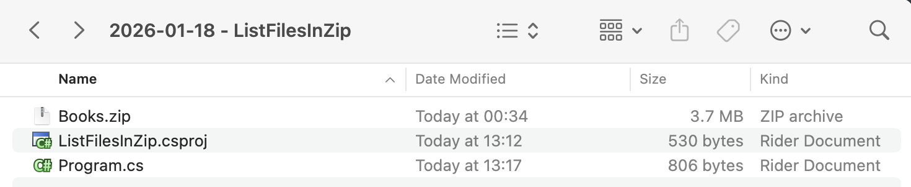

In past posts, we have looked at [How To Zip A Single File In C# & .NET]() and [How To Zip Multiple Files In C# & .NET]().

In this post, we will look at how to list the files contained in a [Zip](https://en.wikipedia.org/wiki/ZIP_(file_format)) file.

We will use the zip file we created in a previous post, `Books.zip`.

Our project structure will look like this:



The code will look like this:

```c#
using System.IO.Compression;
using System.Reflection;
using Serilog;

Log.Logger = new LoggerConfiguration()
    .WriteTo.Console().CreateLogger();

// Extract the current folder where the executable is running
var currentFolder = Path.GetDirectoryName(Assembly.GetExecutingAssembly().Location)!;

// Construct the full path to the zip file
var zilFile = Path.Combine(currentFolder, "Books.zip");

// Open the zip file on disk for update
await using (var archive = await ZipFile.OpenAsync(zilFile, ZipArchiveMode.Read))
{
    // Loop through all the entries
    for (var i = 0; i < archive.Entries.Count; i++)
    {
        // Get the file name
        var file = archive.Entries[i];
        // Print the count and name
        Log.Information("File {Count} - {FileMame}", i + 1, file.FullName);
    }
}
```

Here, we are accessing the [Entries](https://learn.microsoft.com/en-us/dotnet/api/system.io.compression.ziparchive.entries?view=net-10.0) collection of the [ZipArchive](https://learn.microsoft.com/en-us/dotnet/api/system.io.compression.ziparchive?view=net-10.0) class, from which we extract the [Fullname](https://learn.microsoft.com/en-us/dotnet/api/system.io.compression.ziparchiveentry.fullname?view=net-10.0).

This will print the following:


### TLDR

**You can iterate over the `Entries` collection of the `ZipArchive` class to list the files contained in the `Zip` file.**

The code is in my GitHub.

Happy hacking!
