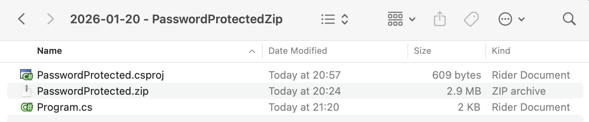
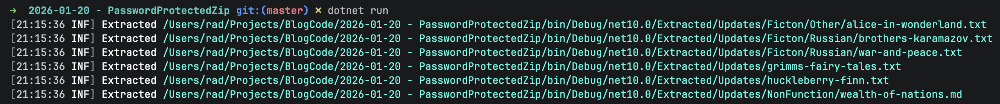

We have covered how to extract files from a [Zip](https://en.wikipedia.org/wiki/ZIP_(file_format)) file in two prior posts, [How To UnZip A Single File In C# & .NET]() and [How To UnZip Multiple Files In C# & .NET]().

Occasionally, you will find situations where the `Zip` file is protected by a [password](https://en.wikipedia.org/wiki/ZIP_(file_format)#Encryption).

Unfortunately, the classes in [System.IO.Compression](https://learn.microsoft.com/en-us/dotnet/api/system.io.compression?view=net-10.0) cannot handle this type of `Zip` file at all.

We therefore have to use another library for this purpose - [SharpZipLib](https://github.com/icsharpcode/sharpziplib).

We start by adding the package to our project using [Nuget](https://nuget.org).

```bash
dotnet add package SharpZipLib
```

For this sample, we will use a `Zip` file I earlier prepared that is **password-protected.**

The project folder structure is as follows:



As usual, to ensure the `Zip` file is copied, we add the following entry to the `.csproj`.

```xml
<ItemGroup>
  <None Include="PasswordProtected.zip">
  	<CopyToOutputDirectory>PreserveNewest</CopyToOutputDirectory>
  </None>
</ItemGroup>
```

The code to extract the files is as follows:

```c#
using System.IO;
using System.Reflection;
using ICSharpCode.SharpZipLib.Zip;
using Serilog;

Log.Logger = new LoggerConfiguration()
    .WriteTo.Console().CreateLogger();

// Extract the current folder where the executable is running
var currentFolder = Path.GetDirectoryName(Assembly.GetExecutingAssembly().Location)!;

// Set the folder for outputting the files

var outputFolder = Path.Combine(currentFolder, "Extracted");

// Construct the full path to the zip file
var zipFile = Path.Combine(currentFolder, "PasswordProtected.zip");

// Set the password (typically this would come from the user)
const string password = "A$tr0nGpA$$w)rD";

// Get a stream to the zip file
await using (var fs = File.OpenRead(zipFile))
{
    // Open the zip file
    using (var zippedFile = new ZipFile(fs))
    {
        // Set the zip file password
        zippedFile.Password = password;

        // Loop through each entry and extract
        foreach (ZipEntry entry in zippedFile)
        {
            // Skip directories & non-files
            if (!entry.IsFile) continue;

            // Get a stream to the file
            await using (var zipStream = zippedFile.GetInputStream(entry))
            {
                // Combine the paths of where we want the file to go and what the file path currently is
                string completeFilePath = Path.GetFullPath(Path.Combine(outputFolder, entry.Name));

                // Ensure the path is valid
                if (!completeFilePath.StartsWith(Path.GetFullPath(outputFolder)))
                {
                    Log.Error("Invalid file path {Path}", completeFilePath);
                    return;
                }

                // Ensure directory exists
                string directory = Path.GetDirectoryName(completeFilePath)!;
                Directory.CreateDirectory(directory);

                // Create a filestream for writing
                await using (var output = File.Create(completeFilePath))
                {
                    // Write to disk
                    await zipStream.CopyToAsync(output);
                    Log.Information("Extracted {File}", completeFilePath);
                }
            }
        }
    }
}
```

The key bits of this code are:

1. **Opening** the file
2. Setting the **password**
3. **Iterating** over each `ZipEntry` in the file
4. **Extracting** the file to a constructed path

If we run this program, we should see the following output:



### TLDR

**You can open password-protected `Zip` files using the `SharpZipLib` library.**

The code is in my GitHub.

Happy hacking!
