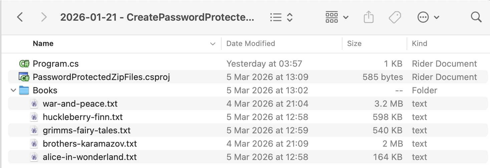
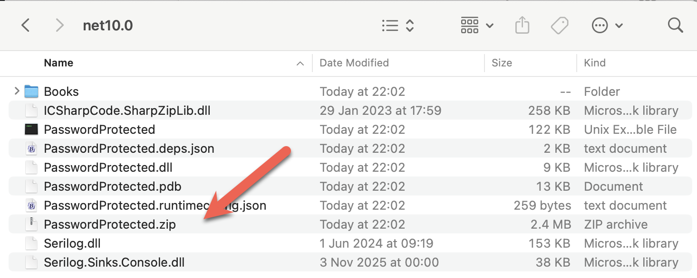
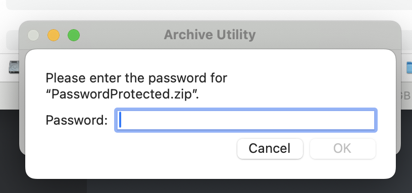

Our previous post, [Opening Password-Protected Zip Files in C# & .NET](), looked at how to open a password-protected [Zip](https://en.wikipedia.org/wiki/ZIP_(file_format)) file using the [SharpZipLib](https://github.com/icsharpcode/sharpziplib) library.

In this post, we will look at the **reverse** - how to **create** a [password-protected](https://en.wikipedia.org/wiki/ZIP_(file_format)#Encryption) `Zip` file.



We start by adding the package to our project using [Nuget](https://nuget.org).

```bash
dotnet add package SharpZipLib
```

The files to add are in the `Books` folder.

To ensure the folder is always copied to the output, we add the following entry to our `.csproj`.

```xml
<ItemGroup>
  <None Include="Books\**\*">
  	<CopyToOutputDirectory>PreserveNewest</CopyToOutputDirectory>
  </None>
</ItemGroup>
```

The code is as follows:

```c#
using System;
using System.IO;
using System.Reflection;
using ICSharpCode.SharpZipLib.Zip;
using Serilog;

Log.Logger = new LoggerConfiguration()
    .WriteTo.Console().CreateLogger();

// Extract the current folder where the executable is running
var currentFolder = Path.GetDirectoryName(Assembly.GetExecutingAssembly().Location)!;

// Set the folder with the input files
var folderWithFiles = Path.Combine(currentFolder, "Books");

// Construct the full path to the zip file
var zipFile = Path.Combine(currentFolder, "PasswordProtected.zip");

// Set the password (typically this would come from the user)
const string password = "A$tr0nGpA$$w)rD";

await using (var fs = File.Create(zipFile))
{
    await using (var zipStream = new ZipOutputStream(fs))
    {
        // Set the desired compression level
        zipStream.SetLevel(9);

        // Set the password
        zipStream.Password = password;

        // Loop through the files to be added
        foreach (var file in Directory.GetFiles(folderWithFiles))
        {
            string entryName = Path.GetRelativePath(currentFolder, file);

            Log.Information("Adding {File} to archive", entryName);

            // Create a ZipEntry
            var entry = new ZipEntry(entryName)
            {
                // Set the date of last modification
                DateTime = DateTime.Now
            };

            // Add the entry to the stream
            zipStream.PutNextEntry(entry);

            // Get the bytes from the file
            byte[] buffer = await File.ReadAllBytesAsync(file);

            // Write to the stream
            zipStream.Write(buffer, 0, buffer.Length);

            // Close the entry stream
            zipStream.CloseEntry();
        }
    }
}

Log.Information("Completed adding files to {TargetFile}", zipFile);
```

The main logic is as follows:

1. Create a [FileStream](https://learn.microsoft.com/en-us/dotnet/api/system.io.filestream?view=net-10.0)
2. Open a `ZipOutputStream` from the `FileStream`
3. Set the **compression** level (`1`- `9`), `9` being the **smallest**, on the `FileStream`
4. Set the **password** on the `FileStream`
5. For **each file to add**, create a `ZipEntry` using the **relative path** of the file, and set the **last modified date** of the `ZipEntry`.
6. Put this entry into the `ZipOutputStream`
7. Repeat

On completion, your `Zip` file should be ready.



If we try to **open** the `Zip` file:



### TLDR

**You can use `SharpZipLib` to create password-protected `Zip` files.**

The code is in my [GitHub](https://github.com/conradakunga/BlogCode/tree/master/2026-01-21%20-%20CreatePasswordProtectedZip).

Happy hacking!
