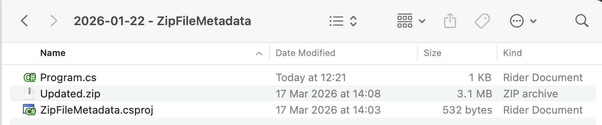
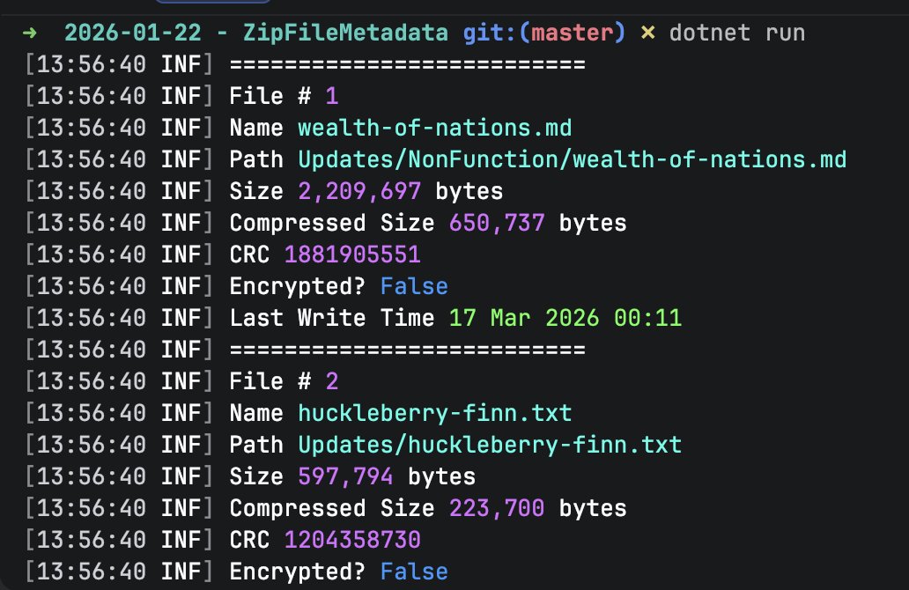

Recently, we have been posting about how to [create]() zip files and [extract]() their contents.

In this post, we will address the case where you **don't actually want to extract** the files (yet) but just want to **view the contents** of the `Zip` file.

There are several attributes we can access when using classes in the [System.IO.Compression](https://learn.microsoft.com/en-us/dotnet/api/system.io.compression?view=net-10.0) namespace.

Our project structure is as follows:



To ensure the `Zip` file is copied to the output folder, we add the following `XML` tag to the `.csproj`.

```xml
<ItemGroup>
  <None Include="Updated.zip">
  	<CopyToOutputDirectory>PreserveNewest</CopyToOutputDirectory>
  </None>
</ItemGroup>
```

The code to extract and view the file contents is as follows:

```c#
using System.IO;
using System.IO.Compression;
using System.Reflection;
using Serilog;

Log.Logger = new LoggerConfiguration()
    .WriteTo.Console().CreateLogger();

// Extract the current folder where the executable is running
var currentFolder = Path.GetDirectoryName(Assembly.GetExecutingAssembly().Location)!;

// Construct the full path to the zip file
var zipFile = Path.Combine(currentFolder, "Updated.zip");

// Open the zip file on disk for update
await using (var archive = await ZipFile.OpenAsync(zipFile, ZipArchiveMode.Read))
{
    var counter = 1;
    // Loop through all the entries
    foreach (var file in archive.Entries)
    {
        // Get the file name, and skip if it is a directory
        if (file.Name == string.Empty) continue;
        Log.Information("==========================");
        Log.Information("File # {Index}", counter++);
        Log.Information("Name {FileName}", file.Name);
        Log.Information("Path {FullName}", file.FullName);
        Log.Information("Size {OriginalSize:#,0} bytes", file.Length);
        Log.Information("Compressed Size {CompressedSize:#,0} bytes", file.CompressedLength);
        Log.Information("CRC {CRC}", file.Crc32);
        Log.Information("Encrypted? {Encrypted}", file.IsEncrypted);
        Log.Information("Last Write Time {LastWriteTime:d MMM yyyy HH:mm}", file.LastWriteTime);
    }
}
```

A couple of things to note:

1. When we open the Zip file, we specify that it is for **reading** purposes.
2. We iterate through the [Entries](https://learn.microsoft.com/en-us/dotnet/api/system.io.compression.ziparchive.entries?view=net-10.0) property, which is a collection of [ZipArchiveEntry](https://learn.microsoft.com/en-us/dotnet/api/system.io.compression.ziparchiveentry?view=net-10.0) items.
3. If the `ZipArchiveEntry` name is **blank**, it is a **folder**. **Skip** and proceed to the next item.
4. Otherwise, extract and print the properties.

The properties available are as follows:

1. Name
2. FullName
3. Length
4. CompressedLength
5. Crc32
6. IsEncrypted
7. LastWriteTime

If you are wondering what the **difference** between `Name` and `FullName` is, you can read about it [here]().

If we run this code, we should see the following:



The complete output is as follows:

```plaintext
[13:56:40 INF] ==========================
[13:56:40 INF] File # 1
[13:56:40 INF] Name wealth-of-nations.md
[13:56:40 INF] Path Updates/NonFunction/wealth-of-nations.md
[13:56:40 INF] Size 2,209,697 bytes
[13:56:40 INF] Compressed Size 650,737 bytes
[13:56:40 INF] CRC 1881905551
[13:56:40 INF] Encrypted? False
[13:56:40 INF] Last Write Time 17 Mar 2026 00:11
[13:56:40 INF] ==========================
[13:56:40 INF] File # 2
[13:56:40 INF] Name huckleberry-finn.txt
[13:56:40 INF] Path Updates/huckleberry-finn.txt
[13:56:40 INF] Size 597,794 bytes
[13:56:40 INF] Compressed Size 223,700 bytes
[13:56:40 INF] CRC 1204358730
[13:56:40 INF] Encrypted? False
[13:56:40 INF] Last Write Time 5 Mar 2026 12:58
[13:56:40 INF] ==========================
[13:56:40 INF] File # 3
[13:56:40 INF] Name grimms-fairy-tales.txt
[13:56:40 INF] Path Updates/grimms-fairy-tales.txt
[13:56:40 INF] Size 540,174 bytes
[13:56:40 INF] Compressed Size 190,963 bytes
[13:56:40 INF] CRC 2798931834
[13:56:40 INF] Encrypted? False
[13:56:40 INF] Last Write Time 5 Mar 2026 12:59
[13:56:40 INF] ==========================
[13:56:40 INF] File # 4
[13:56:40 INF] Name alice-in-wonderland.txt
[13:56:40 INF] Path Updates/Ficton/Other/alice-in-wonderland.txt
[13:56:40 INF] Size 163,779 bytes
[13:56:40 INF] Compressed Size 59,725 bytes
[13:56:40 INF] CRC 3847061786
[13:56:40 INF] Encrypted? False
[13:56:40 INF] Last Write Time 5 Mar 2026 12:58
[13:56:40 INF] ==========================
[13:56:40 INF] File # 5
[13:56:40 INF] Name war-and-peace.txt
[13:56:40 INF] Path Updates/Ficton/Russian/war-and-peace.txt
[13:56:40 INF] Size 3,202,320 bytes
[13:56:40 INF] Compressed Size 1,193,840 bytes
[13:56:40 INF] CRC 620155665
[13:56:40 INF] Encrypted? False
[13:56:40 INF] Last Write Time 4 Mar 2026 21:04
[13:56:40 INF] ==========================
[13:56:40 INF] File # 6
[13:56:40 INF] Name brothers-karamazov.txt
[13:56:40 INF] Path Updates/Ficton/Russian/brothers-karamazov.txt
[13:56:40 INF] Size 1,995,783 bytes
[13:56:40 INF] Compressed Size 738,362 bytes
[13:56:40 INF] CRC 2615286772
[13:56:40 INF] Encrypted? False
[13:56:40 INF] Last Write Time 4 Mar 2026 21:09
```

### TLDR

**The `ZipArchive` class in `System.IO.Compression` allows you to access details of `Zip` files that have been added to a `Zip` archive.**

The code is in my [GitHub](https://github.com/conradakunga/BlogCode/tree/master/2026-01-22%20-%20ZipFileMetadata).

Happy hacking!
