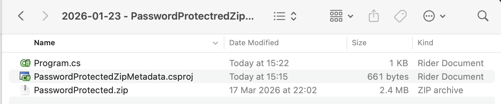
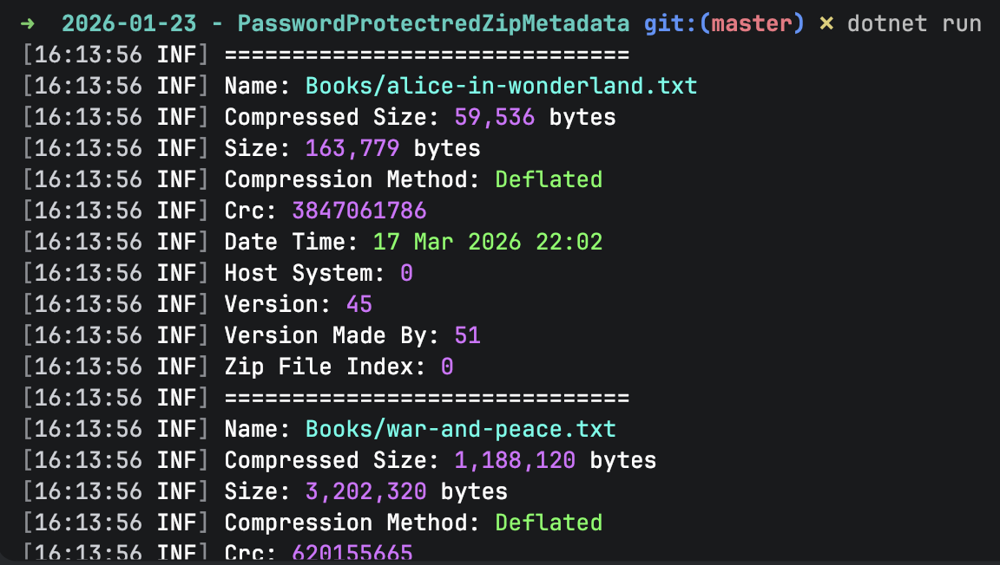

Our previous post, [Accessing Zip File Metadata Using System.IO.Compression In C# & .NET](), looked at how to access file metadata from files in a [Zip](https://en.wikipedia.org/wiki/ZIP_(file_format)) file using classes in the [System.IO.Compression](https://learn.microsoft.com/en-us/dotnet/api/system.io.compression?view=net-10.0), specifically the [ZipArchive](https://learn.microsoft.com/en-us/dotnet/api/system.io.compression.ziparchive?view=net-10.0) and the [ZipArchive](https://learn.microsoft.com/en-us/dotnet/api/system.io.compression.ziparchiveentry?view=net-10.0) entry.

In this post, we will look at how to do the same when our `Zip` file is **password-protected**.

As pointed out earlier, [System.IO.Compression](https://learn.microsoft.com/en-us/dotnet/api/system.io.compression?view=net-10.0) classes **do not support password-protected `Zip` files** at all. 

We will need to use the [SharpZipLib](https://www.nuget.org/packages/sharpziplib/) nuget package.

```bash
dotnet add package SharpZipLib
```

Our project structure is as follows:



To **copy the password-protected zip file** to the **output** folder, add the following tag to the `.csproj`.

```xml
<ItemGroup>
  <None Include="PasswordProtected.zip">
  	<CopyToOutputDirectory>PreserveNewest</CopyToOutputDirectory>
  </None>
</ItemGroup>
```

The code that lists the files is as follows:

```c#
using System.IO;
using System.Reflection;
using ICSharpCode.SharpZipLib.Zip;
using Serilog;

Log.Logger = new LoggerConfiguration()
    .WriteTo.Console().CreateLogger();

// Extract the current folder where the executable is running
var currentFolder = Path.GetDirectoryName(Assembly.GetExecutingAssembly().Location)!;

// Set the password (typically this would come from the user)
const string password = "A$tr0nGpA$$w)rDf";

// Construct the full path to the zip file
var targetZipFile = Path.Combine(currentFolder, "PasswordProtected.zip");

using (var fs = File.OpenRead(targetZipFile))
{
    using (var zip = new ZipFile(fs))
    {
        // Set the password
        zip.Password = password;

        // Loop through all the files
        foreach (ZipEntry entry in zip)
        {
            if (entry.IsFile)
            {
                Log.Information("==============================");
                Log.Information("Name: {Name}", entry.Name);
                Log.Information("Compressed Size: {CompressedSize:#,0} bytes", entry.CompressedSize);
                Log.Information("Size: {Size:#,0} bytes", entry.Size);
                Log.Information("Compression Method: {CompressionMethod}", entry.CompressionMethod);
                Log.Information("Crc: {Crc}", entry.Crc);
                Log.Information("Date Time: {DateTime:d MMM yyyy HH:mm}", entry.DateTime);
                Log.Information("Host System: {HostSystem}", entry.HostSystem);
                Log.Information("Version: {Version}", entry.Version);
                Log.Information("Version Made By: {VersionMadeBy}", entry.VersionMadeBy);
                Log.Information("Zip File Index: {ZipFileIndex}", entry.ZipFileIndex);
            }
        }
    }
}
```

The logic is as follows:

1. Open a [FileStream](https://learn.microsoft.com/en-us/dotnet/api/system.io.filestream?view=net-10.0) to the `Zip` file
2. Use the `FileStream` to open the `Zip` file
3. Provide the **password**
4. **Iterate** through the entries in the `Zip` file

The main properties available are as follows:

| Property | Description          |
| -------- | -------------------- |
| `Name` | File name |
| `CompressionMethod` | Compression method used. The following are supported: Bzip2, Deflate64, Deflatedm LZMA, PPMd, Stored, WinZipAES |
| `Crc` | The Crc |
| `HostSystem` | HostSystem - `0` for MS-DOS, FAT & FAT32, 3 for Unix, `10` for NTFS |
| `Version` | Zip feature version |
| `VersionMadeBy` | The VersionMadeBy for this entry |
| `ZipFileIndex` | Index of the file in the zip file |

If we run this code, we will see the following result:



The complete output is as follows:

```plaintext
➜  2026-01-23 - PasswordProtectredZipMetadata git:(master) ✗ dotnet run
[16:13:56 INF] ==============================
[16:13:56 INF] Name: Books/alice-in-wonderland.txt
[16:13:56 INF] Compressed Size: 59,536 bytes
[16:13:56 INF] Size: 163,779 bytes
[16:13:56 INF] Compression Method: Deflated
[16:13:56 INF] Crc: 3847061786
[16:13:56 INF] Date Time: 17 Mar 2026 22:02
[16:13:56 INF] Host System: 0
[16:13:56 INF] Version: 45
[16:13:56 INF] Version Made By: 51
[16:13:56 INF] Zip File Index: 0
[16:13:56 INF] ==============================
[16:13:56 INF] Name: Books/war-and-peace.txt
[16:13:56 INF] Compressed Size: 1,188,120 bytes
[16:13:56 INF] Size: 3,202,320 bytes
[16:13:56 INF] Compression Method: Deflated
[16:13:56 INF] Crc: 620155665
[16:13:56 INF] Date Time: 17 Mar 2026 22:02
[16:13:56 INF] Host System: 0
[16:13:56 INF] Version: 45
[16:13:56 INF] Version Made By: 51
[16:13:56 INF] Zip File Index: 1
[16:13:56 INF] ==============================
[16:13:56 INF] Name: Books/huckleberry-finn.txt
[16:13:56 INF] Compressed Size: 222,478 bytes
[16:13:56 INF] Size: 597,794 bytes
[16:13:56 INF] Compression Method: Deflated
[16:13:56 INF] Crc: 1204358730
[16:13:56 INF] Date Time: 17 Mar 2026 22:02
[16:13:56 INF] Host System: 0
[16:13:56 INF] Version: 45
[16:13:56 INF] Version Made By: 51
[16:13:56 INF] Zip File Index: 2
[16:13:56 INF] ==============================
[16:13:56 INF] Name: Books/grimms-fairy-tales.txt
[16:13:56 INF] Compressed Size: 189,851 bytes
[16:13:56 INF] Size: 540,174 bytes
[16:13:56 INF] Compression Method: Deflated
[16:13:56 INF] Crc: 2798931834
[16:13:56 INF] Date Time: 17 Mar 2026 22:02
[16:13:56 INF] Host System: 0
[16:13:56 INF] Version: 45
[16:13:56 INF] Version Made By: 51
[16:13:56 INF] Zip File Index: 3
[16:13:56 INF] ==============================
[16:13:56 INF] Name: Books/brothers-karamazov.txt
[16:13:56 INF] Compressed Size: 735,781 bytes
[16:13:56 INF] Size: 1,995,783 bytes
[16:13:56 INF] Compression Method: Deflated
[16:13:56 INF] Crc: 2615286772
[16:13:56 INF] Date Time: 17 Mar 2026 22:02
[16:13:56 INF] Host System: 0
[16:13:56 INF] Version: 45
[16:13:56 INF] Version Made By: 51
[16:13:56 INF] Zip File Index: 4
```

Of interest is that feact that you **generally do not need to know the password to list files** in a protected zip file. Unless [WinZipAES](https://www.winzip.com/en/support/aes-encryption/) encryption was used.

### TLDR

**You can list the files in a password-protected zip file, as well as associated metadata, using the `SharpZipLib` library, as the classes in `System.IO.Compression`.**

The code is in my [GitHub](https://github.com/conradakunga/BlogCode/tree/master/2026-01-23%20-%20PasswordProtectredZipMetadata).

Happy hacking!
