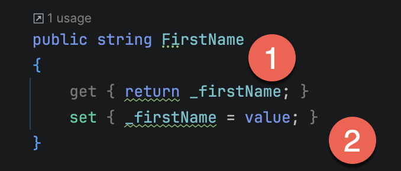
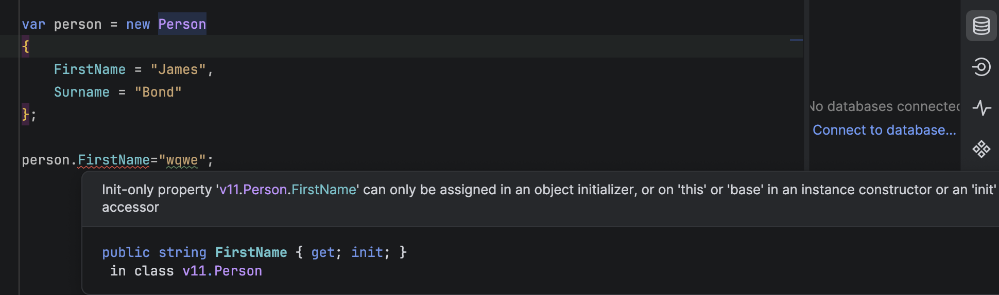
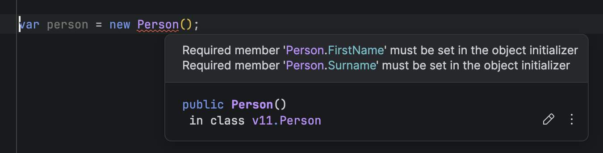

**Properties** are a construct that you probably **routinely use** in your day-to-day programming. You probably use them so **frequently** that you likely haven't thought about how **convenient** and **safe** they have made your programming.

Rather than just linking you to the documentation, **let us look at how things were done before**, and the **incremental improvements** that got us to where we are today.

Take the following type:

```c#
public class Person
{
	public string FirstName;
	public string Surname;
}
```

`FirstName` and `Surname` here are what are called [fields](https://learn.microsoft.com/en-us/dotnet/csharp/programming-guide/classes-and-structs/fields). There are **publicly accessible and modifiable variables** within a `type`.

Our `type` is used like this:

```c#
var james = new Person();
james.FirstName = "James";
james.Surname = "Bond";

Console.WriteLine($"The firstname is {james.FirstName} and the surname is {james.Surname}");
```

Suppose we want to enforce some **restrictions**, such as you **cannot change** the `FirstName` or the `Surname` once the class is **instantiated**.

How do you do this using fields?

**You can't.**

To achieve this, you must provide a [constructor](https://learn.microsoft.com/en-us/dotnet/csharp/programming-guide/classes-and-structs/constructors) to your type, in which you **initialize** your type.

```c#
public class Person
{
    public readonly string FirstName;
    public readonly string Surname;

    public Person(string firstName, string surname)
    {
        FirstName = firstName;
        Surname = surname;
    }
}
```

Now, **after construction**, you **cannot change** either `FirstName` or `Surname`, even if you want to.

The same approach will work in [Java](https://www.java.com/en/):

```java
public class Person
{
    public final String FirstName;
    public final String Surname;

    public Person(String firstName, String surname)
    {
        this.FirstName = firstName;
        this.Surname = surname;
    }
}
```

Another problem you quickly run into is running **custom code before** you set these variables.

For example, you want to ensure that `FirstName` and `Surname` are not **blank** or `null` before setting them.

This cannot be directly done using `fields`.

A simple solution to this problem is a custom [setter](https://en.wikipedia.org/wiki/Mutator_method) method.

```c#
public class Person
{
    public string FirstName;
    public string Surname;

    public void SetFirstName(string firstName)
    {
        if (string.IsNullOrEmpty(firstName))
            throw new ArgumentNullException(nameof(firstName));

        FirstName = firstName;
    }

    public void SetSurname(string surname)
    {
        if (string.IsNullOrEmpty(surname))
            throw new ArgumentNullException(nameof(surname));

        Surname = surname;
    }
}
```

Now, you can set the names like this:

```c#
james.SetFirstName("James");
james.SetSurname("Bond");
```

This solves one problem but creates another: `FirstName` is still **publicly accessible and mutable**. You can directly change them.

The solution to this is two-fold:

1.  Make the **publicly** accessible `fields` **private**
2. Introduced another custom method - a `getter`.

The `type` now looks like this:

```c#
public class Person
{
    private string _firstName;
    private string _surname;

    public void SetFirstName(string firstName)
    {
        if (string.IsNullOrEmpty(firstName))
            throw new ArgumentNullException(nameof(firstName));

        _firstName = firstName;
    }

    public string GetFirstName()
    {
        return _firstName;
    }

    public void SetSurname(string surname)
    {
        if (string.IsNullOrEmpty(surname))
            throw new ArgumentNullException(nameof(surname));

        _surname = surname;
    }

    public string GetSurname()
    {
        return _surname;
    }
}
```

This, in fact, is the solution native to Java.

The problem with this solution is that it is very **verbose**, requiring a lot of **boring boilerplate** code.

This solution also allows you to combine fields in custom logic.

So we can introduce a `GetFullName()` method like this:

```c#
public string GetFullName()
{
	return $"{_firstName} {_surname}";
}
```

`Properties` were introduced to address this problem - something that is not a `field`, so you can **control access**, but is not a `method` either, so it is friendly to things like IDEs and binding code.

The first iteration looked like this:

```c#
public class Person
{
  private string _firstName;
  private string _surname;

  public string FirstName
  {
      get { return _firstName; }
      set { _firstName = value; }
  }

  public string Surname
  {
      get { return _surname; }
      set { _surname = value; }
  }
}
```

This is similar to having setters and getters, but using a construct that looks like a field.

The magic is taking place here:



1. Is the **getter**
2. Is the **setter**

Notice you cannot access `_firstName` or `_surname` directly.

Properties allow you to have computed properties, so we can implement a `FullName` property like this:

```c#
public string FullName
{
	get { return $"{_firstName} {_surname}"; }
}
```

Your code will look like this:

```c#
var person = new Person
{
    FirstName = "James",
    Surname = "Bond"
};
```

If you want your type to be immutable, you initialize your properties using a `constructor` and then remove the **setters**;

The `class` now looks like this:

```c#
public class Person
{
  private string _firstName;
  private string _surname;

  public Person(string firstName, string surname)
  {
      _firstName = firstName;
      _surname = surname;
  }

  public string FirstName
  {
      get { return _firstName; }
  }

  public string Surname
  {
      get { return _surname; }
  }
  public string FullName
  {
  	get { return $"{_firstName} {_surname}"; }
  }
}
```

To solve the problem of custom logic for our setters, we can write custom logic like this:

```c#
public class Person
{
  private string _firstName;
  private string _surname;

  public string FirstName
  {
      get { return _firstName; }
      set
      {
          if (string.IsNullOrEmpty(value))
              throw new ArgumentNullException(nameof(value));
          _firstName = value;
      }
  }

  public string Surname
  {
      get { return _surname; }
      set
      {
          if (string.IsNullOrEmpty(value))
              throw new ArgumentNullException(nameof(value));
          _surname = value;
      }
  }
  public string FullName
  {
  	get { return $"{_firstName} {_surname}"; }
  }
}
```

Notice that our setters **do not have explicit parameters** - the parameter is an **implicit built-in parameter** that you can access using the `value` keyword.

The next iteration that improved this was to **get rid of** (where possible) the `private` **backing field**.

For the simplest of scenarios, this was all you needed:

```c#
public class Person
{
    public string FirstName { get; set; }
    public string Surname { get; set; }
		public string FullName => $"{FirstName} {Surname}";
}
```

To make the `type` immutable:

```c#
public class Person
{
  public string FirstName { get; }
  public string Surname { get; }
  public string FullName => $"{FirstName} {Surname}";

  public Person(string firstName, string surname)
  {
      FirstName = firstName;
      Surname = surname;
  }
}
```

You can also control access to the property within the type with a `private` **setter**.

```c#
public class Person
{
  public string FirstName { get; private set; }
  public string Surname { get; private set; }
  public string FullName => $"{FirstName} {Surname}";

  public Person(string firstName, string surname)
  {
      FirstName = firstName;
      Surname = surname;
  }
}
```

This means **that only methods in the class can set** the property.

If you needed custom logic for the setters or getters, you had to introduce backing fields.

The next iteration addressed the need to require a **constructor for setting immutable properties**.

This was the [init](https://learn.microsoft.com/en-us/dotnet/csharp/language-reference/keywords/init) modifier.

```c#
public class Person
{
  public string FirstName { get; init; }
  public string Surname { get; init; }
}
```

The compiler would enforce that you can't modify either of these.



The next improvement was the [required](https://learn.microsoft.com/en-us/dotnet/csharp/language-reference/keywords/required) modifier.

```c#
{
  public required string FirstName { get; init; }
  public required string Surname { get; init; }
}
```

The previous `type` allowed you to do this:

```c#
var person = new Person();
```

With the `required` keyword, you get the following **compile-time** error:



The latest iteration allows access to the backing field, which I have discussed in the post [Using The Field Keyword In C# & .NET]().

This construct is available to any of the .NET family of languages - [C#](https://dotnet.microsoft.com/en-us/languages/csharp), [Visual Basic .NET](https://learn.microsoft.com/dotnet/visual-basic/?WT.mc_id=dotnet-35129-website), and [F#](https://dotnet.microsoft.com/en-us/languages/fsharp).

And there you have it. A brief evolution of the .NET property construct.

### TLDR

**.NET properties very elegantly solve a number of problems around the getting and setting of class fields.**

The code is in my [GitHub](https://github.com/conradakunga/BlogCode/tree/master/2026-01-24%20-%20FunWithProperties).

Happy hacking!
