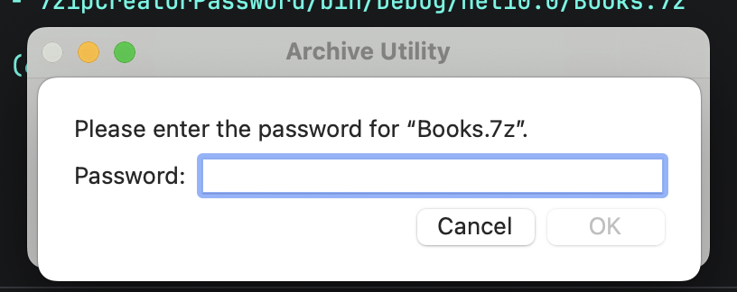

In our previous post, [How To Create A 7-Zip Archive In C# & .NET](), we looked at how to create a [7z](https://en.wikipedia.org/wiki/7z) archive by **automating the command line**.

In this post, we will look at how to create a **password-protected** `7z` archive.

Our project structure looks like this:


To ensure the `Books` folder is copied to the output, we add this element to the `.csproj`.

```xml
<ItemGroup>
  <None Include="Books\**\*">
  	<CopyToOutputDirectory>PreserveNewest</CopyToOutputDirectory>
  </None>
</ItemGroup>
```

The first order of business is to install the [CliWrap](https://github.com/Tyrrrz/CliWrap) library. This is orders of magnitude **easier** and more **flexible** than the native .NET [Process](https://learn.microsoft.com/en-us/dotnet/api/system.diagnostics.process?view=net-10.0) class.

```bash
dotnet add package clirwap
```

The next order of business is that you need to know

1. The **name** of the `7-Zip` **executable**
2. **Where** it is

In [macOS](https://www.apple.com/os/macos/) (that I am using), the executable is actually named `7zz`.

You can find out where it is using the `where` command.

```bash
where 7zz
```

If it is installed, the location will be printed.


We now have enough to write the code.

```c#
using System.Reflection;
using CliWrap;
using CliWrap.Buffered;
using Serilog;

Log.Logger = new LoggerConfiguration()
    .WriteTo.Console().CreateLogger();

// Extract the current folder where the executable is running
var currentFolder = Path.GetDirectoryName(Assembly.GetExecutingAssembly().Location)!;

// Construct the full path to the source files
var folderWithBooks = Path.Combine(currentFolder, "Books");

// Construct the full path to the zip file
var target7ZipFile = Path.Combine(currentFolder, "Books.7z");

// Path to 7zip executable
const string executablePath = "/opt/homebrew/bin/7zz";

// Archive password
const string password = "A$tr0ngP@ssw0rD";

// Delete 7zip file if it exists
if (File.Exists(target7ZipFile))
    File.Delete(target7ZipFile);

// Orchestrate the command line to excute and run
var result = await Cli.Wrap(executablePath) // Set the path to the executable
  .WithArguments(args => args
  .Add("a") //Specify to create an archive
  .Add("-t7z") // Specify the target format - 7z
  .Add(target7ZipFile) // Taget file name
  .Add($"{folderWithBooks}//*") // The files in the source folder
  .Add($"-p{password}") // Set the password
  .Add("-mhe=on") // encrypt file names
  .Add("-mx=9") // max compression
  )
  .ExecuteBufferedAsync();

// Check if the process succeeded
if (result.ExitCode != 0)
    Log.Error("7-Zip failed: {Message}", result.StandardError);
else
    Log.Information("Written files in {SourceFiles} to {Target7ZipFile} : {Message}", folderWithBooks, target7ZipFile, result.StandardOutput);
```

The magic is taking place on these lines:

```c#
.Add($"-p{password}") // Set the password
.Add("-mhe=on") // encrypt file names
```

If we run this code, we should see the following:


The `7-Zip` file is now in the output folder.

If we try to open the archive, we should see a **password prompt**.



### TLDR

**To create a password protected `7-Zip` file, pass the password as an argument to the command-line tool.**

The code is in my [GitHub](https://github.com/conradakunga/BlogCode/tree/master/2026-01-25%20-%207zipCreator).

Happy hacking!
