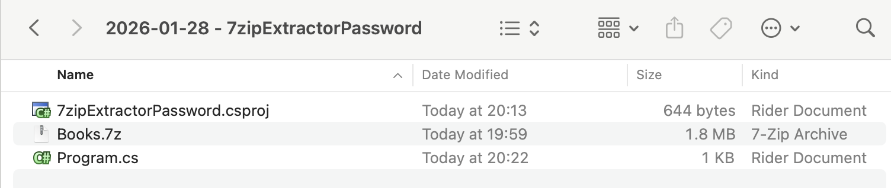
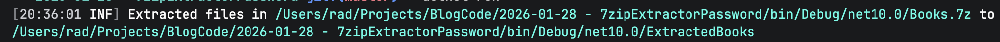
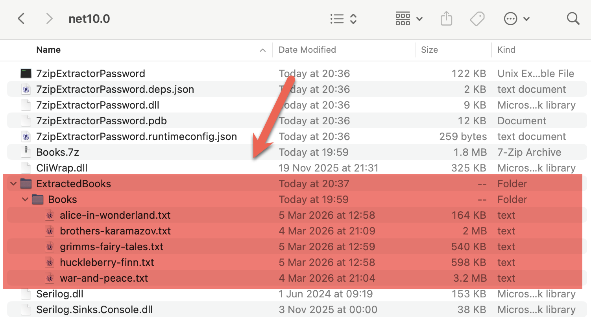

Our previous post, [How To Extract Files From A 7-Zip Archive In C# & .NET,]() looked at how to extract files from a `7z` [7-Zip archive](https://en.wikipedia.org/wiki/7z).

In this post, we will look at how to **extract files from a password-protected** `7z` archive.

Our project structure is as follows:



To ensure that the `7z` is copied to the **output** folder, add the following element:

```xml
<ItemGroup>
  <None Include="Books.7z">
  	<CopyToOutputDirectory>PreserveNewest</CopyToOutputDirectory>
  </None>
</ItemGroup>
```

We then add the [CliWrap](https://github.com/Tyrrrz/CliWrap) library.

```bash
dotnet add package CliWrap
```

The next order of business is that you need to know

1. The **name** of the `7-Zip` **executable**
2. **Where** it is

In [macOS](https://www.apple.com/os/macos/) (that I am using), the executable is actually named `7zz`.

For [Windows](https://www.microsoft.com/en-us/windows?r=1), the executable is named `7z.exe`.

You can find out where it is using the `where` command.

```bash
where 7zz
```

The code itself is as follows:

```c#
using System.IO;
using System.Reflection;
using CliWrap;
using CliWrap.Buffered;
using Serilog;

Log.Logger = new LoggerConfiguration()
    .WriteTo.Console().CreateLogger();

// Extract the current folder where the executable is running
var currentFolder = Path.GetDirectoryName(Assembly.GetExecutingAssembly().Location)!;

// Set the folder we want our files extracted to
var outputFolder = Path.Combine(currentFolder, "ExtractedBooks");

// Construct the full path to the zip file
var source7ZipFile = Path.Combine(currentFolder, "Books.7z");

// Archive password
const string password = "A$tr0ngP@ssw0rD";

// Path to 7zip executable
const string executablePath = "/opt/homebrew/bin/7zz";

var result = await Cli.Wrap(executablePath) // Set the path to the executable
    .WithArguments(args => args
            .Add("x") //Specify to extract an archive
            .Add(source7ZipFile) // Source zip file
            .Add($"-o{outputFolder}") // The output folder
            .Add($"-p{password}") // The archive password
            .Add("-y") // Say yes to all prompts
    )
    .ExecuteBufferedAsync();

// Check if the process succeeded
if (result.ExitCode != 0)
    Log.Error("7-Zip failed: {Message}", result.StandardError);
else
    Log.Information("Extracted files in {SourceFiles} to {TargetFolder} {Message}", source7ZipFile, outputFolder,
        result.StandardOutput);
```

If we run this code, we should see the following output:



And if we view the output folder, we can see our output folder:



### TLDR

**You can extract password-protected `7z` archives by passing the password to the command-line tool in your code.**

The code is in my [GitHub](https://github.com/conradakunga/BlogCode/tree/master/2026-01-28%20-%207zipExtractorPassword).

Happy hacking!
