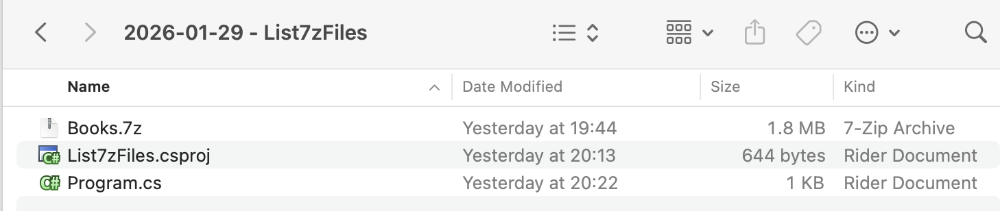
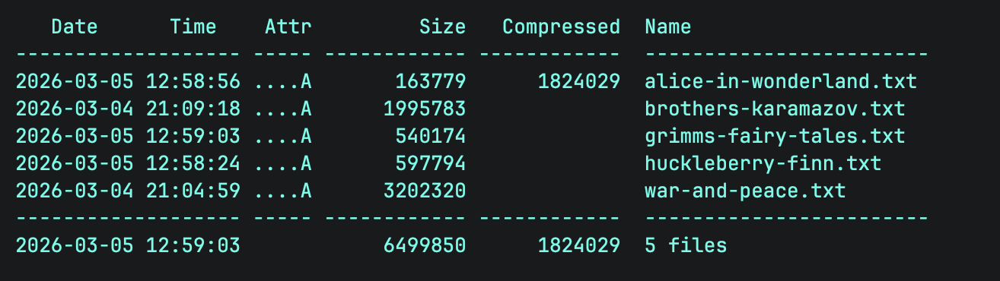

In a previous post, we looked at "[How To Create A 7-Zip Archive In C# & .NET]()" by automating the `7-Zip` command-line utility.

We have also looked at "[How To Extract Files From A 7-Zip Archive In C# & .NET.]()"

In this post, we will look at how to **list the files** in a 7-Zip ([7z](https://en.wikipedia.org/wiki/7z)) archive.

Our project structure is as follows:



To ensure that the `7z` is copied to the **output** folder, add the following element:

```xml
<ItemGroup>
  <None Include="Books.7z">
  	<CopyToOutputDirectory>PreserveNewest</CopyToOutputDirectory>
  </None>
</ItemGroup>
```

We then add the [CliWrap](https://github.com/Tyrrrz/CliWrap) library. This is orders of magnitude **easier** and more **flexible** than the native .NET [Process](https://learn.microsoft.com/en-us/dotnet/api/system.diagnostics.process?view=net-10.0) class.

```bash
dotnet add package CliWrap
```

The next order of business is that you need to know

1. The **name** of the `7-Zip` **executable**
2. **Where** it is

In [macOS](https://www.apple.com/os/macos/) (that I am using), the executable is actually named `7zz`.

You can find out where it is using the `where` command.

```bash
where 7zz
```

For [Windows](https://www.microsoft.com/en-us/windows?r=1), the executable is named `7z.exe`, and is usually in the `Program Files` folder.

The code itself is as follows:

```c#
using System.IO;
using System.Reflection;
using CliWrap;
using CliWrap.Buffered;
using Serilog;

Log.Logger = new LoggerConfiguration()
    .WriteTo.Console().CreateLogger();

// Extract the current folder where the executable is running
var currentFolder = Path.GetDirectoryName(Assembly.GetExecutingAssembly().Location)!;

// Construct the full path to the zip file
var source7ZipFile = Path.Combine(currentFolder, "Books.7z");

// Path to 7zip executable
const string executablePath = "/opt/homebrew/bin/7zz";

var result = await Cli.Wrap(executablePath) // Set the path to the executable
    .WithArguments(args => args
            .Add("l") //Specify to list archive contents
            .Add(source7ZipFile) // Source zip file
    )
    .ExecuteBufferedAsync();

// Check if the process succeeded
if (result.ExitCode != 0)
    Log.Error("7-Zip failed: {Message}", result.StandardError);
else
    Log.Information("Files In {SourceZipFile} - {Listing}", source7ZipFile, result.StandardOutput);
```

Here we are passing the command line tool the `l` argument to list files.

The file listing is actually captured in the **output**, which I access using the `StandardOuput` property of the `result`.

Running the code produces the following:

```plaintext
[12:42:02 INF] Files In /Users/rad/Projects/BlogCode/2026-01-29 - List7zFiles/bin/Debug/net10.0/Books.7z - 
7-Zip (z) 26.00 (arm64) : Copyright (c) 1999-2026 Igor Pavlov : 2026-02-12
 64-bit arm_v:8.5-A locale=UTF-8 Threads:16 OPEN_MAX:10240, ASM

Scanning the drive for archives:
1 file, 1824342 bytes (1782 KiB)

Listing archive: /Users/rad/Projects/BlogCode/2026-01-29 - List7zFiles/bin/Debug/net10.0/Books.7z

--
Path = /Users/rad/Projects/BlogCode/2026-01-29 - List7zFiles/bin/Debug/net10.0/Books.7z
Type = 7z
Physical Size = 1824342
Headers Size = 313
Method = LZMA2:23
Solid = +                                                                                                                                                              
Blocks = 1                                                                                                                                                             
                                                                                                                                                                       
   Date      Time    Attr         Size   Compressed  Name                                                                                                              
------------------- ----- ------------ ------------  ------------------------                                                                                          
2026-03-05 12:58:56 ....A       163779      1824029  alice-in-wonderland.txt                                                                                           
2026-03-04 21:09:18 ....A      1995783               brothers-karamazov.txt                                                                                            
2026-03-05 12:59:03 ....A       540174               grimms-fairy-tales.txt                                                                                            
2026-03-05 12:58:24 ....A       597794               huckleberry-finn.txt                                                                                              
2026-03-04 21:04:59 ....A      3202320               war-and-peace.txt                                                                                                 
------------------- ----- ------------ ------------  ------------------------                                                                                          
2026-03-05 12:59:03            6499850      1824029  5 files    
```



### TLDR

**You can list the files in a `7-Zip` archive by using the 7-Zip command-line tool and passing it the `l` argument.**

The code is in my [GitHub](https://github.com/conradakunga/BlogCode/tree/master/2026-01-29%20-%20List7zFiles).

Happy hacking!
