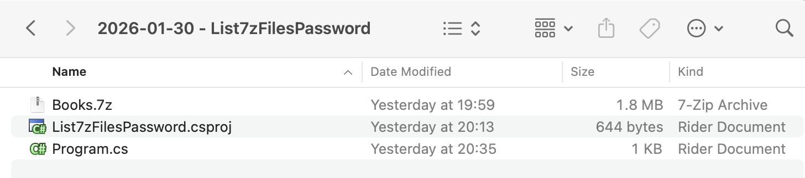
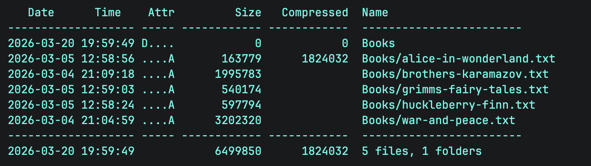

In our previous post, "[Listing Files In A 7-Zip Archive In C# & .NET]()", we looked at how to list the files in a [7-Zip](https://en.wikipedia.org/wiki/7z) `7z` archive.

In this post, we will look at how to **list the files** in a **password-protected** `7z` archive.

We start, as usual, with our project structure.



To ensure that the `7z` is copied to the **output** folder, add the following element:

```xml
<ItemGroup>
  <None Include="Books.7z">
  	<CopyToOutputDirectory>PreserveNewest</CopyToOutputDirectory>
  </None>
</ItemGroup>
```

We then add the [CliWrap](https://github.com/Tyrrrz/CliWrap) library. This is orders of magnitude **easier** and more **flexible** than the native .NET [Process](https://learn.microsoft.com/en-us/dotnet/api/system.diagnostics.process?view=net-10.0) class.

```bash
dotnet add package CliWrap
```

The next order of business is that you need to know

1. The **name** of the `7-Zip` **executable**
2. **Where** it is

In [macOS](https://www.apple.com/os/macos/) (that I am using), the executable is actually named `7zz`.

You can find out where it is using the `where` command.

```bash
where 7zz
```

For [Windows](https://www.microsoft.com/en-us/windows?r=1), the executable is named `7z.exe`, and is usually in the `Program Files` folder.

The code itself is as follows:

```c#
using System.IO;
using System.Reflection;
using CliWrap;
using CliWrap.Buffered;
using Serilog;

Log.Logger = new LoggerConfiguration()
    .WriteTo.Console().CreateLogger();

// Extract the current folder where the executable is running
var currentFolder = Path.GetDirectoryName(Assembly.GetExecutingAssembly().Location)!;

// Construct the full path to the zip file
var source7ZipFile = Path.Combine(currentFolder, "Books.7z");

// Archive password
const string password = "A$tr0ngP@ssw0rD";

// Path to 7zip executable
const string executablePath = "/opt/homebrew/bin/7zz";

var result = await Cli.Wrap(executablePath) // Set the path to the executable
    .WithArguments(args => args
            .Add("l") //Specify to list files in the archive
            .Add(source7ZipFile) // Source zip file
            .Add($"-p{password}") // The archive password
    )
    .ExecuteBufferedAsync();

// Check if the process succeeded
if (result.ExitCode != 0)
    Log.Error("7-Zip failed: {Message}", result.StandardError);
else
    Log.Information("Listing of files in {SourceZipFile} {Message}", source7ZipFile, result.StandardOutput);
```

Here we are passing the command-line tool the `l` argument to list files, as well as the password.

The magic is happening here:

```c#
.Add("l") //Specify to list files in the archive
.Add(source7ZipFile) // Source zip file
.Add($"-p{password}") // The archive password
```

The file listing is actually captured in the **output**, which I access using the `StandardOuput` property of the `result`.

Running the code produces the following:

```plaintext
[12:54:26 INF] Listing of files in /Users/rad/Projects/BlogCode/2026-01-30 - List7zFilesPassword/bin/Debug/net10.0/Books.7z 
7-Zip (z) 26.00 (arm64) : Copyright (c) 1999-2026 Igor Pavlov : 2026-02-12
 64-bit arm_v:8.5-A locale=UTF-8 Threads:16 OPEN_MAX:10240, ASM

Scanning the drive for archives:
1 file, 1824432 bytes (1782 KiB)

Listing archive: /Users/rad/Projects/BlogCode/2026-01-30 - List7zFilesPassword/bin/Debug/net10.0/Books.7z

--
Path = /Users/rad/Projects/BlogCode/2026-01-30 - List7zFilesPassword/bin/Debug/net10.0/Books.7z
Type = 7z
Physical Size = 1824432
Headers Size = 400
Method = LZMA2:23 7zAES
Solid = +
Blocks = 1
                                                                                                                                                                       
   Date      Time    Attr         Size   Compressed  Name                                                                                                              
------------------- ----- ------------ ------------  ------------------------                                                                                          
2026-03-20 19:59:49 D....            0            0  Books                                                                                                             
2026-03-05 12:58:56 ....A       163779      1824032  Books/alice-in-wonderland.txt                                                                                     
2026-03-04 21:09:18 ....A      1995783               Books/brothers-karamazov.txt                                                                                      
2026-03-05 12:59:03 ....A       540174               Books/grimms-fairy-tales.txt                                                                                      
2026-03-05 12:58:24 ....A       597794               Books/huckleberry-finn.txt                                                                                        
2026-03-04 21:04:59 ....A      3202320               Books/war-and-peace.txt                                                                                           
------------------- ----- ------------ ------------  ------------------------                                                                                          
2026-03-20 19:59:49            6499850      1824032  5 files, 1 folders  
```



### TLDR

**You can list the files in a password-protected `7-Zip` archive using the 7-Zip command-line tool by passing the `l` and `p` arguments.**

The code is in my [GitHub](https://github.com/conradakunga/BlogCode/tree/master/2026-01-30%20-%20List7zFilesPassword).

Happy hacking!
