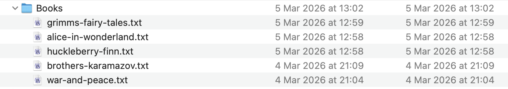
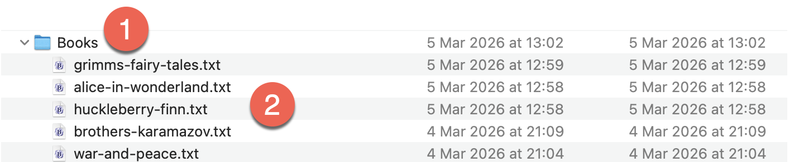
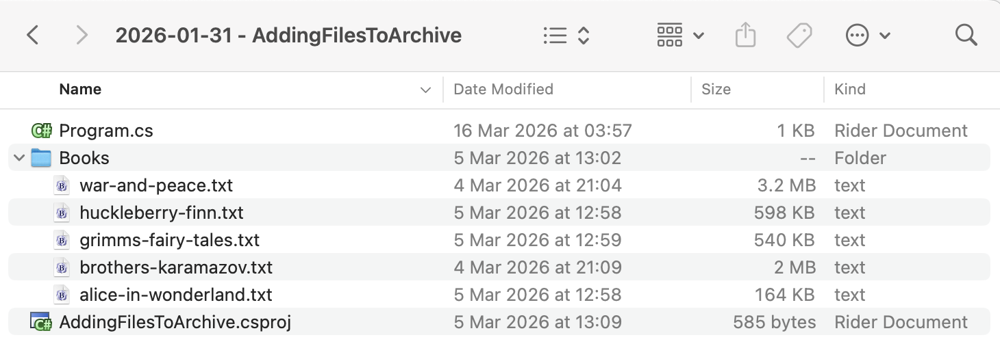

Over the past series of posts, we have been looking at how to add files to various archive types - [Zip](https://en.wikipedia.org/wiki/ZIP_(file_format)), [Gzip](https://en.wikipedia.org/wiki/Gzip), and [7z](https://en.wikipedia.org/wiki/7z).

One thing you must be cognisant of is **how exactly you are adding the files** to the archive.

Are you adding the **directory** containing the files, or **the files themselves**?

Take the following folder:



When you say you want to **add these files** to an archive, you can mean one of two things:



1. Add the **directory** `Books` itself to the archive
2. Add the **files** directly to the archive

This can be illustrated by **creating** **two** archives and **listing** their contents to demonstrate the **difference**.

The folder structure is as follows:



The files to add are in the `Books` folder.

To ensure the folder is always copied to the output, we add the following entry to our `.csproj`.

```xml
<ItemGroup>
  <None Include="Books\**\*">
  	<CopyToOutputDirectory>PreserveNewest</CopyToOutputDirectory>
  </None>
</ItemGroup>
```

The code is as follows:

```c#
using System.IO;
using System.Reflection;
using CliWrap;
using CliWrap.Buffered;
using Serilog;

Log.Logger = new LoggerConfiguration()
    .WriteTo.Console().CreateLogger();

// Extract the current folder where the executable is running
var currentFolder = Path.GetDirectoryName(Assembly.GetExecutingAssembly().Location)!;

// Construct folder to the input files
var folderWithBooks = Path.Combine(currentFolder, "Books");

// Construct the full path to the target archives
var targetArchiveWithFolder = Path.Combine(currentFolder, "BooksWithFolder.7z");
var targetArchiveWithFiles = Path.Combine(currentFolder, "BooksWithFiles.7z");

// Path to 7zip executable
const string executablePath = "/opt/homebrew/bin/7zz";

// Create the first archive, with the folder
var result = await Cli.Wrap(executablePath) // Set the path to the executable
    .WithArguments(args => args
            .Add("a") //Specify to create an archive
            .Add("-t7z") // Specify the target format - 7z
            .Add(targetArchiveWithFolder) // Target file name
            .Add($"{folderWithBooks}") // The files in the source folder
            .Add("-mhe=on") // encrypt file names
            .Add("-mx=9") // max compression
    )
    .ExecuteBufferedAsync();

// Check if the process succeeded
if (result.ExitCode != 0)
    Log.Error("7-Zip failed: {Message}", result.StandardError);
else
    Log.Information("Added folder to {File}", targetArchiveWithFolder);


// Create the second archive, with the files
result = await Cli.Wrap(executablePath) // Set the path to the executable
    .WithArguments(args => args
            .Add("a") //Specify to create an archive
            .Add("-t7z") // Specify the target format - 7z
            .Add(targetArchiveWithFiles) // Target file name
            .Add($"{folderWithBooks}//*") // The files in the source folder
            .Add("-mhe=on") // encrypt file names
            .Add("-mx=9") // max
    )
    .ExecuteBufferedAsync();

// Check if the process succeeded
if (result.ExitCode != 0)
    Log.Error("7-Zip failed: {Message}", result.StandardError);
else
    Log.Information("Added folder to {File}", targetArchiveWithFolder);

//
// Extract both archives
//

result = await Cli.Wrap(executablePath) // Set the path to the executable
    .WithArguments(args => args
            .Add("l") //Specify to list archive contents
            .Add(targetArchiveWithFolder) // Source zip file
    )
    .ExecuteBufferedAsync();

// Check if the process succeeded
if (result.ExitCode != 0)
    Log.Error("7-Zip failed: {Message}", result.StandardError);
else
    Log.Information("Files In {File} (Folder) - {Listing}", targetArchiveWithFolder, result.StandardOutput);

result = await Cli.Wrap(executablePath) // Set the path to the executable
    .WithArguments(args => args
            .Add("l") //Specify to list archive contents
            .Add(targetArchiveWithFolder) // Source zip file
    )
    .ExecuteBufferedAsync();

// Check if the process succeeded
if (result.ExitCode != 0)
    Log.Error("7-Zip failed: {Message}", result.StandardError);
else
    Log.Information("Files In {File} (Folder) - {Listing}", targetArchiveWithFolder, result.StandardOutput);

result = await Cli.Wrap(executablePath) // Set the path to the executable
    .WithArguments(args => args
            .Add("l") //Specify to list archive contents
            .Add(targetArchiveWithFiles) // Source zip file
    )
    .ExecuteBufferedAsync();

// Check if the process succeeded
if (result.ExitCode != 0)
    Log.Error("7-Zip failed: {Message}", result.StandardError);
else
    Log.Information("Files In {File} (Folder) - {Listing}", targetArchiveWithFolder, result.StandardOutput);
```

The difference is in **how** we add the files to the archive.

For the **directory** itself, we do it like this:

```c#
.Add(targetArchiveWithFolder) // Target file name
.Add($"{folderWithBooks}") // The files in the source folder
```

For the **files** in the directory, we do it like this:

```c#
.Add(targetArchiveWithFiles) // Target file name
.Add($"{folderWithBooks}//*") // The files in the source folder
```

If we run the code, it will print the two different listings.

The archive to which we added the directory will list as follows:

```plaintext
 Date      Time    Attr         Size   Compressed  Name                                                                                                              
------------------- ----- ------------ ------------  ------------------------                                                                                          
2026-03-21 13:35:41 D....            0            0  Books                                                                                                             
2026-03-05 12:58:56 ....A       163779      1824029  Books/alice-in-wonderland.txt                                                                                     
2026-03-04 21:09:18 ....A      1995783               Books/brothers-karamazov.txt                                                                                      
2026-03-05 12:59:03 ....A       540174               Books/grimms-fairy-tales.txt                                                                                      
2026-03-05 12:58:24 ....A       597794               Books/huckleberry-finn.txt                                                                                        
2026-03-04 21:04:59 ....A      3202320               Books/war-and-peace.txt 
```

Note here the `Books` prefix.

The archive to which we added the files will list as follows:

```plaintext
   Date      Time    Attr         Size   Compressed  Name                                                                                                              
------------------- ----- ------------ ------------  ------------------------                                                                                          
2026-03-05 12:58:56 ....A       163779      1824029  alice-in-wonderland.txt                                                                                           
2026-03-04 21:09:18 ....A      1995783               brothers-karamazov.txt                                                                                            
2026-03-05 12:59:03 ....A       540174               grimms-fairy-tales.txt                                                                                            
2026-03-05 12:58:24 ....A       597794               huckleberry-finn.txt                                                                                              
2026-03-04 21:04:59 ....A      3202320               war-and-peace.txt                                                                                                 
------------------- ----- ------------ ------------  ------------------------                                                                                          
2026-03-05 12:59:03            6499850      1824029  5 files
```

### TLDR

**When adding files to an archive, it is important to be clear whether you are adding the `directory` or the `files` in the directory.**

The code is in my [GitHub](https://github.com/conradakunga/BlogCode/tree/master/2026-01-31%20-%20AddingFilesToArchive).

Happy hacking!
