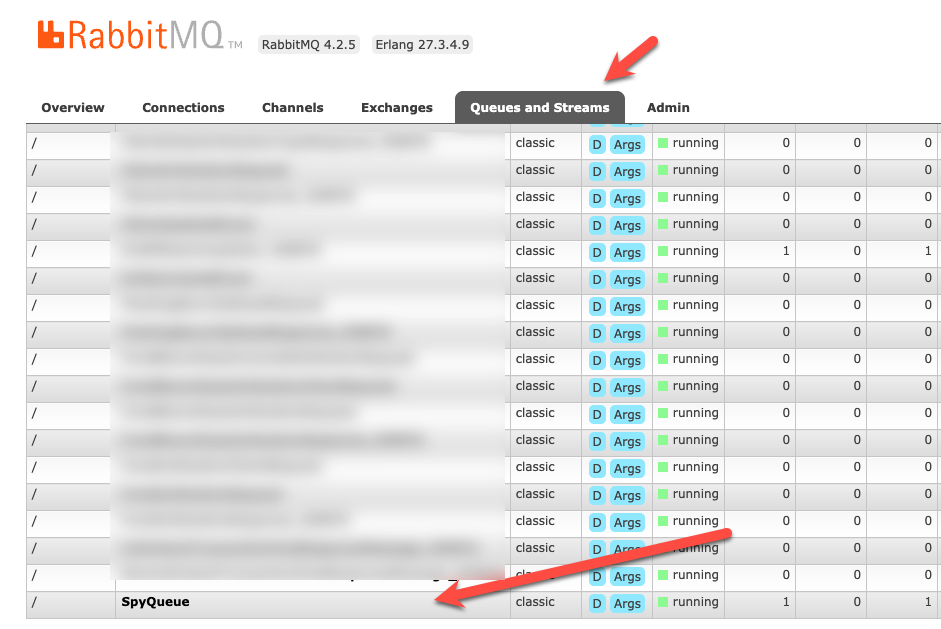
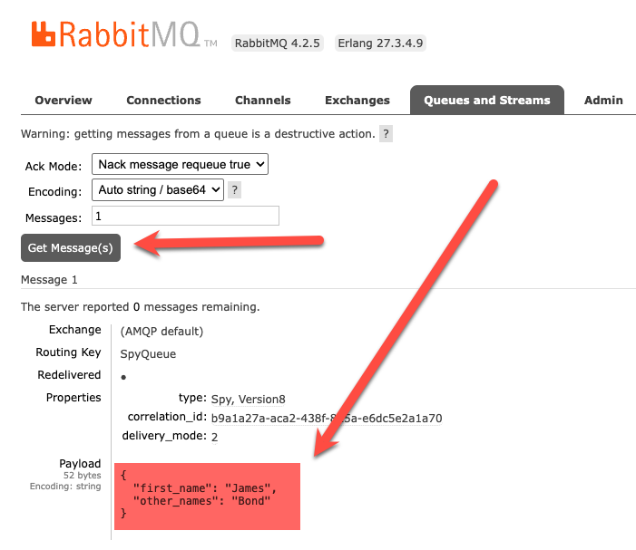

Yesterday's post, "[Using EasyNetQ Version 8 in C# & .NET]()" looked at the new, overhauled [EasyNetQ](https://www.nuget.org/packages/EasyNetQ) package that makes working with [RabbitMQ](https://www.rabbitmq.com/) easier as it is a **simpler**, **opinionated** library.

Setting up the project to support `EasyNetQ`, as we saw yesterday, is as simple as adding the relevant package:

```bash
dotnet add package EasyNetQ --Version 8.2.0
```

We then configure the [dependency injection]() as follows:

```c#
using EasyNetQ;

var builder = WebApplication.CreateBuilder(args);
builder.Services.AddEasyNetQ(builder.Configuration.GetConnectionString("RabbitMQ"));
var app = builder.Build();
```

We can then request an instance of the `IBus` from wherever we need one, like so:

```c#
app.MapGet("/", async (IBus bus, ILogger<Program> logger) =>
{
    try
    {
      //
      // Your logic here
      //
    }
    catch (Exception ex)
    {
        return Results.InternalServerError(ex.Message);
    }
});
```

Out of the box, `EasyNetQ` uses [System.Text.Json](https://learn.microsoft.com/en-us/dotnet/api/system.text.json?view=net-10.0) as the `Json` serializer, with a bunch of defaults that are friendly to **legacy clients**.

If you need to, you can **configure** and **control** the **serialization** that will be used internally, if you:

1. Want to squeeze out every last bit of **performance**.
2. You are consuming `Json` from a client or a **source outside your control**.
3. You have some **advanced** serialization **customizations** you want to leverage
4. You want control over things like `null` and `default` values

Take, for example, a situation where you are **publishing** objects for consumption by another system that is **subscribed** to the `RabbitMQ` instance.

The `type` is as follows:

```c#
using EasyNetQ;

[Queue("SpyQueue")]
public sealed record Spy(string FirstName, string OtherNames);
```

The attribute `Queue` allows us to specify the **name** of the queue the object will go into.

Let us create a sample:

```c#
var spy = new Spy("James", "Bond");
```

By default, this will serialize like this:

```c#
{"FirstName":"James","OtherNames":"Bond"}
```

The target consumer might be **unable** or **unwilling** to consume `Json` in this format.

Let us say the target consumer was built in [Python](https://www.python.org/), and it is expecting `Json` in [snake_case](https://en.wikipedia.org/wiki/Snake_case).

How do we address this?

We can configure `EasyNetQ` in the startup, like this:

```c#
using System.Text.Json;
using EasyNetQ;

var builder = WebApplication.CreateBuilder(args);

// Set up our serialization options
var options = new JsonSerializerOptions
{
    PropertyNamingPolicy = JsonNamingPolicy.SnakeCaseLower,
    WriteIndented = true
};

// Register our DI
builder.Services.AddEasyNetQ(builder.Configuration.GetConnectionString("RabbitMQ"))
    .UseSystemTextJsonV2(options); // Set the serialization options

var app = builder.Build();

app.MapGet("/", async (IBus bus, ILogger<Program> logger) =>
{
    try
    {
        var spy = new Spy("James", "Bond");

        logger.LogInformation("Publishing message ...");

        // Publish a message
        await bus.SendReceive.SendAsync("SpyQueue", spy);

        // Return OK
        return Results.Ok();
    }
    catch (Exception ex)
    {
        return Results.InternalServerError(ex.Message);
    }
});

await app.RunAsync();
```

Here we are using `Send`, rather than `Publish`, because I don't want the bother of setting up **subscribers**.

We can then log in to `RabbitMQ` to view the message that we have just sent.

To get `RabbitMQ` up and running, I use  [Docker](https://www.docker.com/) with the following `docker-compose.yaml:`

```yaml
services:
  rabbitmq:
    image: rabbitmq:management-alpine
    container_name: rabbitmq
    restart: always
    volumes:
      - ./rabbitmq.conf:/etc/rabbitmq/rabbitmq.conf
    environment:
      - TZ=Africa/Nairobi
    ports:
      - 5672:5672
      - 15672:15672
```

The `rabbitmq.conf` file that I use to configure the container is as follows:

```plaintext
default_user = test
default_pass = test
```

The admin URL should be http://localhost:15672/



We can then click on the queue name to navigate to access it.



Click **Get Message** to view the popped `RabbitMQ` message.

You can see here that it is **snake_case**.

### TLDR

**You can control the serialization that will be used to send, request, or publish messages to `RabbitMQ`.**

The code is in my GitHub.

Happy hacking!
