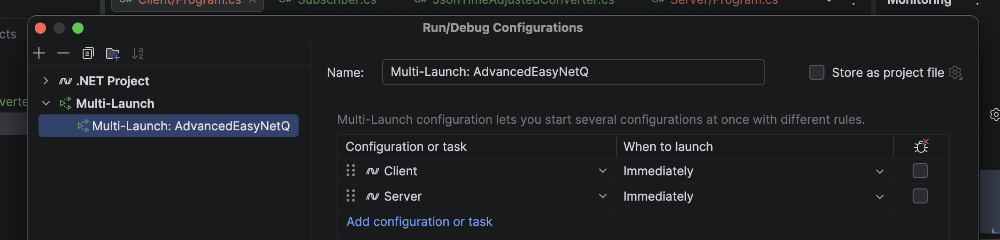
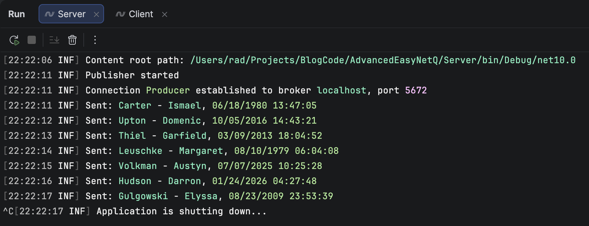
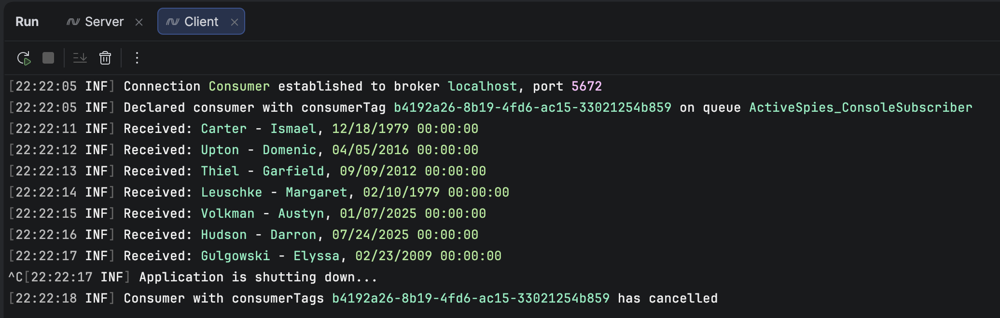

The past few posts, "[Using EasyNetQ Version 8 in C# & .NET]()" and "[Configuring Serialization For EasyNetQ Version 8 In C# & .NET]()"  have looked at the overhauled [EasyNetQ](https://easynetq.com/) `8` package and how it can be leveraged to control **serialization** and **deserialization** to [RabbitMQ](https://www.rabbitmq.com/).

In this post, we will look at a scenario in which we can override the `EasyNetQ` serialization logic to **dynamically modify what is retrieved** from the message broker without changing our core application logic.

For this example, we will use the following `type`.

```c#
[Queue("ActiveSpies")]
public sealed class Spy
{
    public string FirstName { get; set; }
    public string Surname { get; set; }
    public DateTime DateOfBirth { get; set; }
}
```

Here, the `Queue` attribute indicates the **queue** in which we store the object.

Our scenario is as follows:

1. We have a **Publisher** console application. This generates `Spy` objects with full metadata
2. We have a **Subscriber** console application. This receives `Spy` objects from the message broker. However, it is aware that the `DateOfBirth` is `6` months too late, and does not care about the **time** of the date of birth.

Typically, you would do this manipulation **after** retrieving the message from RabbitMQ.

This example will show how to do it **during** retrieval.

We start off by creating a **directory** to store our **projects** (we will need 3).

```bash
mkdir AdvancedEasyNetQ
```

Change to the directory:

```bash
cd AdvancedEasyNetQ/
```

Create our `3` projects:

```bash
dotnet new console -o Client
dotnet new console -o Server
dotnet new classlib -o Logic
```

`Logic` is a shared project that will store our `type` definition, which is referenced from the `Client` and `Server` projects.

Create a solution:

```bash
dotnet new sln
```

Add our projects to the solution:

```bash
dotnet sln add Client/ Logic/ Server/
```

Next, add a reference to `Logic` from `Client` and `Server`

```bash
dotnet add reference ../Logic
```

Finally, add a reference to `EasyNetQ` to all 3 projects.

```bash
donnet add package EasyNetQ
```

In our `Logic` project, we add the `Spy` type specified above.

In our `Server` project, we create a [BackgroundService](https://learn.microsoft.com/en-us/aspnet/core/fundamentals/host/hosted-services?view=aspnetcore-10.0) that does the work.

To help in generating test data, we add the [Bogus](https://github.com/bchavez/Bogus) package.

```bash
dotnet add package Bogus
```

The code for the service is as follows:

```c#
using Bogus;
using EasyNetQ;
using Logic;
using Microsoft.Extensions.Hosting;
using Microsoft.Extensions.Logging;

namespace Server;

public class Publisher : BackgroundService
{
    private readonly IPubSub _pubSub;
    private readonly ILogger<Publisher> _logger;
    private readonly Faker<Spy> _faker;

    // Inject publisher and logger
    public Publisher(IPubSub pubSub, ILogger<Publisher> logger)
    {
        _pubSub = pubSub;
        _logger = logger;
        // Configure Bogus to generate spies
        _faker = new Faker<Spy>()
            .RuleFor(o => o.FirstName, f => f.Name.FirstName())
            .RuleFor(o => o.Surname, f => f.Name.LastName())
            .RuleFor(o => o.DateOfBirth, f => f.Date.Past(50));
    }

    protected override async Task ExecuteAsync(CancellationToken stoppingToken)
    {
        // Wait for the subscriber to start first
        await Task.Delay(TimeSpan.FromSeconds(5), stoppingToken);

        _logger.LogInformation("Publisher started");

        // Loop until application is stopped
        while (!stoppingToken.IsCancellationRequested)
        {
            // Generate spy
            var spy = _faker.Generate();

            // Publish the spy
            await _pubSub.PublishAsync(spy, stoppingToken);

            // Log what was published
            _logger.LogInformation(
                "Sent: {Surname} - {FirstName}, {DateOfBirth}", spy.Surname, spy.FirstName,
                spy.DateOfBirth);

            // Wait
            await Task.Delay(TimeSpan.FromSeconds(1), stoppingToken);
        }
    }
}
```

Next, we set up the **host**:

```c#
using EasyNetQ;
using Microsoft.Extensions.Hosting;
using System.Text.Json;
using Microsoft.Extensions.DependencyInjection;
using Serilog;
using Server;

// Configure Serilog
Log.Logger = new LoggerConfiguration()
    .WriteTo.Console()
    .CreateLogger();

var builder = Host.CreateDefaultBuilder(args);
builder.UseSerilog();

// Configure DI
builder.ConfigureServices((context, services) =>
{
    const string connection = "host=localhost;username=test;password=test";

    var options = new JsonSerializerOptions();
    services.AddEasyNetQ(connection).UseSystemTextJsonV2(options);
    services.AddHostedService<Publisher>();
});

// Start the application
var host = builder.Build();

await host.RunAsync();
```

Next, we turn to the `Client` project.

This also has a `BackgroundService`:

```c#
using EasyNetQ;
using Logic;
using Microsoft.Extensions.Hosting;
using Microsoft.Extensions.Logging;

namespace Client;

public class Subscriber : BackgroundService
{
    private readonly IPubSub _pubSub;
    private readonly ILogger<Subscriber> _logger;

    // Inject subscriber and logger
    public Subscriber(IPubSub pubSub, ILogger<Subscriber> logger)
    {
        _pubSub = pubSub;
        _logger = logger;
    }

    protected override async Task ExecuteAsync(CancellationToken stoppingToken)
    {
        // Configure subscription event
        await _pubSub.SubscribeAsync<Spy>("ConsoleSubscriber", message =>
        {
            // Log result
            _logger.LogInformation(
                "Received: {Surname} - {FirstName}, {DateOfBirth}", message.Surname, message.FirstName,
                message.DateOfBirth);
        }, cancellationToken: stoppingToken);
    }
}
```

Our problem definition was that there was an issue with the `DateOfBirth`:

> However, it is aware that the `DateOfBirth` is `6` months too late, and does not care about the **time** of the date of birth.

We can solve this by writing a [JsonConverer](https://learn.microsoft.com/en-us/dotnet/api/system.text.json.serialization.jsonconverter-1?view=net-10.0). We have looked at [these before]().

```c#
using System.Globalization;
using System.Text.Json;
using System.Text.Json.Serialization;

namespace Client;

// Essentially parse the date, extract the date, and move it back 6 months
public class JsonTimeAdjustedConverter : JsonConverter<DateTime>
{
    // This is the deserializer
    public override DateTime Read(ref Utf8JsonReader reader, Type typeToConvert, JsonSerializerOptions options)
    {
        return DateTime.Parse(reader.GetString()!, CultureInfo.InvariantCulture).Date.AddMonths(-6);
    }

    // This is the serializer
    public override void Write(Utf8JsonWriter writer, DateTime value, JsonSerializerOptions options)
    {
        writer.WriteStringValue(value.ToString(CultureInfo.InvariantCulture));
    }
}
```

Finally, we wire our `Client` host and set up our [dependency injection]() to use this `JsonConverter`.

```c#
using System.Text.Json;
using Client;
using EasyNetQ;
using Microsoft.Extensions.DependencyInjection;
using Microsoft.Extensions.Hosting;
using Serilog;

// Setup logging
Log.Logger = new LoggerConfiguration()
    .WriteTo.Console()
    .CreateLogger();

var builder = Host.CreateDefaultBuilder(args);
builder.UseSerilog();

// Configure DI
builder.ConfigureServices((context, services) =>
{
    const string connection = "host=localhost;username=test;password=test";

    // Configure our serializer to attach the JsonConverer
    var options = new JsonSerializerOptions
    {
        Converters = { new JsonTimeAdjustedConverter() }
    };

    // Wire in EasyNetQ
    services.AddEasyNetQ(connection).UseSystemTextJsonV2(options);
    services.AddHostedService<Subscriber>();
});

// Build the host
var host = builder.Build();

// Start the app
await host.RunAsync();
```

Using your IDE of choice, set up your solution to **run both apps simultaneously**.

In [JetBrains](https://www.jetbrains.com/) [Rider](https://www.jetbrains.com/rider/), it looks like this:



You should see two **consoles** for each of the projects:

The `Server` will look like this:



The `Client` will look like this:



You can see that **Carter**, **Ismael** `DateOfBirth` on the client side now is **midnight**, `6` months **earlier** than it was on the `Server`.

We can thus have **granular control over the serialization and deserialization of our types**.

This is very useful when **interfacing with other systems** that may not support the exact types that .NET does.

There is, of course, the question of whether t**his is the best place to have such logic**.

**That, I leave to you to decide!**

### TLDR

**You can control almost any aspect of the serialization of types to `RabbitMQ` using `EasyNetQ`.**

The code is in my GitHub.

Happy hacking!
