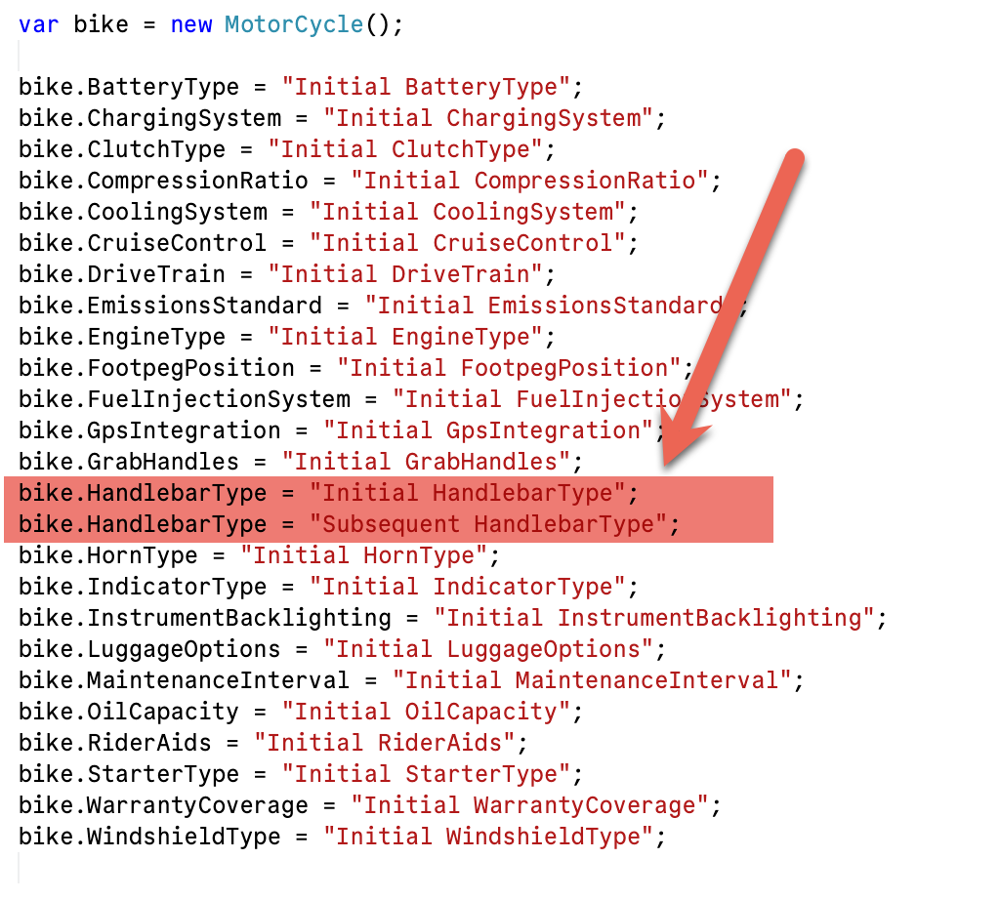

**Code Housekeeping** refers to general rules of thumb that make code easier to **read**, **digest**, and **modify** for other developers, **yourself** included.

We have all opened some code **we wrote** months ago and found ourselves **bewildered**.


Today, we look at a fairly common situation.

Suppose you have a `type` like this:

```c#
public class MotorCycle
{
  public string EngineType { get; set; }
  public string CoolingSystem { get; set; }
  public string CompressionRatio { get; set; }
  public string StarterType { get; set; }
  public string ClutchType { get; set; }
  public string FuelInjectionSystem { get; set; }
  public string DriveTrain { get; set; }
  public string HandlebarType { get; set; }
  public string FootpegPosition { get; set; }
  public string RiderAids { get; set; }
  public string GpsIntegration { get; set; }
  public string CruiseControl { get; set; }
  public string WindshieldType { get; set; }
  public string LuggageOptions { get; set; }
  public string GrabHandles { get; set; }
  public string HornType { get; set; }
  public string IndicatorType { get; set; }
  public string BatteryType { get; set; }
  public string ChargingSystem { get; set; }
  public string InstrumentBacklighting { get; set; }
  public string OilCapacity { get; set; }
  public string MaintenanceInterval { get; set; }
  public string WarrantyCoverage { get; set; }
  public string EmissionsStandard { get; set; }
}
```

As you can see, this `type` has **many** properties, and if you wanted to find one in particular, you would have to **skim over all of them**.

Why not make life easier for yourself, and anyone else reading this code, by **sorting** the properties?

```c#
public class MotorCycle
{
  public string BatteryType { get; set; }
  public string ChargingSystem { get; set; }
  public string ClutchType { get; set; }
  public string CompressionRatio { get; set; }
  public string CoolingSystem { get; set; }
  public string CruiseControl { get; set; }
  public string DriveTrain { get; set; }
  public string EmissionsStandard { get; set; }
  public string EngineType { get; set; }
  public string FootpegPosition { get; set; }
  public string FuelInjectionSystem { get; set; }
  public string GpsIntegration { get; set; }
  public string GrabHandles { get; set; }
  public string HandlebarType { get; set; }
  public string HornType { get; set; }
  public string IndicatorType { get; set; }
  public string InstrumentBacklighting { get; set; }
  public string LuggageOptions { get; set; }
  public string MaintenanceInterval { get; set; }
  public string OilCapacity { get; set; }
  public string RiderAids { get; set; }
  public string StarterType { get; set; }
  public string WarrantyCoverage { get; set; }
  public string WindshieldType { get; set; }
}
```

This is much easier to **scan** and **find** things.

This is also very helpful again when you are **setting the properties** for a large `type`.

```c#
var bike = new MotorCycle();

bike.EngineType = "Initial EngineType";
bike.CoolingSystem = "Initial CoolingSystem";
bike.CompressionRatio = "Initial CompressionRatio";
bike.StarterType = "Initial StarterType";
bike.ClutchType = "Initial ClutchType";
bike.FuelInjectionSystem = "Initial FuelInjectionSystem";
bike.DriveTrain = "Initial DriveTrain";
bike.HandlebarType = "Initial HandlebarType";
bike.FootpegPosition = "Initial FootpegPosition";
bike.RiderAids = "Initial RiderAids";
bike.GpsIntegration = "Initial GpsIntegration";
bike.CruiseControl = "Initial CruiseControl";
bike.WindshieldType = "Initial WindshieldType";
bike.LuggageOptions = "Initial LuggageOptions";
bike.GrabHandles = "Initial GrabHandles";
bike.HornType = "Initial HornType";
bike.IndicatorType = "Initial IndicatorType";
bike.BatteryType = "Initial BatteryType";
bike.ChargingSystem = "Initial ChargingSystem";
bike.InstrumentBacklighting = "Initial InstrumentBacklighting";
bike.OilCapacity = "Initial OilCapacity";
bike.MaintenanceInterval = "Initial MaintenanceInterval";
bike.WarrantyCoverage = "Initial WarrantyCoverage";
bike.EmissionsStandard = "Initial EmissionsStandard";
bike.HandlebarType = "Subsequent HandlebarType";
```

For this example, you have almost certainly not noticed that `HandlebarType` has been **set twice**.

This would be much easier to catch if the code was **sorted**.

```c#
bike.BatteryType = "Initial BatteryType";
bike.ChargingSystem = "Initial ChargingSystem";
bike.ClutchType = "Initial ClutchType";
bike.CompressionRatio = "Initial CompressionRatio";
bike.CoolingSystem = "Initial CoolingSystem";
bike.CruiseControl = "Initial CruiseControl";
bike.DriveTrain = "Initial DriveTrain";
bike.EmissionsStandard = "Initial EmissionsStandard";
bike.EngineType = "Initial EngineType";
bike.FootpegPosition = "Initial FootpegPosition";
bike.FuelInjectionSystem = "Initial FuelInjectionSystem";
bike.GpsIntegration = "Initial GpsIntegration";
bike.GrabHandles = "Initial GrabHandles";
bike.HandlebarType = "Initial HandlebarType";
bike.HandlebarType = "Subsequent HandlebarType";
bike.HornType = "Initial HornType";
bike.IndicatorType = "Initial IndicatorType";
bike.InstrumentBacklighting = "Initial InstrumentBacklighting";
bike.LuggageOptions = "Initial LuggageOptions";
bike.MaintenanceInterval = "Initial MaintenanceInterval";
bike.OilCapacity = "Initial OilCapacity";
bike.RiderAids = "Initial RiderAids";
bike.StarterType = "Initial StarterType";
bike.WarrantyCoverage = "Initial WarrantyCoverage";
bike.WindshieldType = "Initial WindshieldType";
```

Not only is it **easy to tell where** exactly to go to set a property, we can also see when we have **repeated ourselves**:



### TLDR

**Sort code wherever it is probable that it will make it easier to parse, read, understand, and modify.**

Happy hacking!
