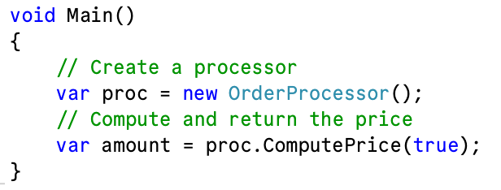
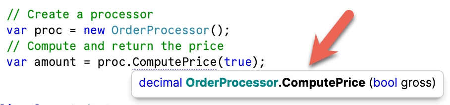
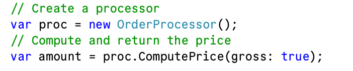

This is **Part 3** of the **CodeHousekeeping Series**.

**Code Housekeeping** refers to general rules of thumb that make code easier to **read**, **digest**, and **modify** for other developers, **yourself** included.

Today we will look at a simple concept - **avoid `boolean` parameters.**

My objection to this is nothing to do with **functionality** but everything to do with **readability**.

Take the following simplified example:

```c#
public class OrderProcessor
{
	public decimal ComputePrice(bool gross)
	{
		if (gross)
			return 100;
		return 84;
	}
}
```

On the surface this looks perfectly **reasonable**.

You pass `true` and you get back the `GrossPrice`. Pass `false` and get back the `NetPrice`.

The problem is when you see the code in the wild.



Quick, just by reading the code **do you understand** what the `amount` is going to represent?

You can argue that this isn't an issue with a modern IDE - you can mouseover to see what the parameter represents.



Or you can **decorate** the parameter like this:



Slightly better but there are still problems:

1. What if I am **not using an IDE** - I could be reading the code on GitHub
2. **Why do I need to mouseover** things to understand the code
3. What, in fact, does **passing `true` mean**? That I get back the `Gross` or the `Net`

It is much clearer to use [Enums](https://learn.microsoft.com/en-us/dotnet/csharp/language-reference/builtin-types/enum) for this purpose.

We create one like so:

```c#
public enum PriceMode
{
  Gross,
  Net
}
```

Then we create our type like this:

```c#
public class OrderProcessor
{
  public decimal ComputePrice(PriceMode mode)
  {
    switch (mode)
    {
      case PriceMode.Net:
      	return 84;
      default:
      	return 100;
    }
  }
}
```

We invoke it like this:

```c#
var proc2 = new OrderProcessor.v2.OrderProcessor();
// Compute and return the price
amount = proc2.ComputePrice(PriceMode.Gross);

Console.WriteLine(amount);
```

This has the following benefits:

1. Easier to **read**
2. Easier to to **parse & undertand**
3. Easier to **extend** - with `boolean` you have only **two** options

### TLDR

**Generally, use `enum` over `boolean` as parameters.**

The code is in my [GitHub](https://github.com/conradakunga/BlogCode/tree/master/2026-02-12%20-%20EnumsOverBools).

Happy hacking!
