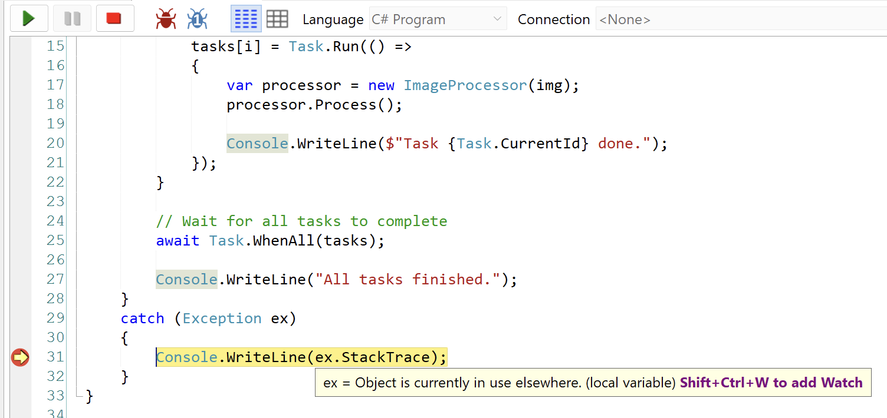

Recently, I was refactoring some code to **improve performance** and converted it from single-threaded to [multi-threaded](https://learn.microsoft.com/en-us/dotnet/standard/threading/using-threads-and-threading).

The code was in the form of a `Processor` that injected an [Image](https://learn.microsoft.com/en-us/dotnet/api/system.drawing.image?view=windowsdesktop-10.0) in its **constructor**, and then used it **internally** for some operations.

The `Processor` was as follows:

```c#
public class ImageProcessor
{
	private readonly Bitmap _img;
	public ImageProcessor(Bitmap img)
	{
		_img = img;
	}

	public void Process()
	{
		using (var g = Graphics.FromImage(_img))
		{
			g.Clear(Color.Wheat);
		}
	}
}
```

The new code invoked this as follows:

```c#
async Task Main()
{
	const int taskCount = 10;

	var img = new Bitmap(500, 500);

	// Create an array of tasks
	Task[] tasks = new Task[taskCount];

	for (int i = 0; i < taskCount; i++)
	{
		tasks[i] = Task.Run(() =>
		{
			var processor = new ImageProcessor(img);
			processor.Process();

			Console.WriteLine($"Task {Task.CurrentId} done.");
		});
	}

	// Wait for all tasks to complete
	await Task.WhenAll(tasks);

	Console.WriteLine("All tasks finished.");
}
```

This code, when run, inevitably threw an [exception](https://learn.microsoft.com/en-us/dotnet/api/system.exception?view=net-10.0):



The stack-trace is as follows:

```c#
at System.Drawing.Graphics.FromImage(Image image)
   at UserQuery.ImageProcessor.Process() in C:\Users\rad\AppData\Local\Temp\LINQPad5\_xjstuxvs\query_bpcpjn.cs:line 81
   at UserQuery.<>c__DisplayClass0_0.<Main>b__0() in C:\Users\rad\AppData\Local\Temp\LINQPad5\_xjstuxvs\query_bpcpjn.cs:line 53
   at System.Threading.Tasks.Task.InnerInvoke()
   at System.Threading.Tasks.Task.Execute()
--- End of stack trace from previous location where exception was thrown ---
   at System.Runtime.CompilerServices.TaskAwaiter.ThrowForNonSuccess(Task task)
   at System.Runtime.CompilerServices.TaskAwaiter.HandleNonSuccessAndDebuggerNotification(Task task)
   at System.Runtime.CompilerServices.TaskAwaiter.GetResult()
   at UserQuery.<Main>d__0.MoveNext() in C:\Users\rad\AppData\Local\Temp\LINQPad5\_xjstuxvs\query_bpcpjn.cs:line 60
```

Now you might say, **of course, you'd get such an `exception`** - the `Processor` is **modifying** the passed instance of the image.

To which my response is this is just a **simplistic example** - the actual scenario was that the `Processor` was a **reporting tool** to which I was passing an `Image` for display, and I had no **visibility** into how the `Image` was being used **internally**.

For the exception, it is clear that a [Graphics](https://learn.microsoft.com/en-us/dotnet/api/system.drawing.graphics?view=windowsdesktop-10.0) object in use internally was the root of my problems.

The solution was simple - **don't pass the `Image` at all**.

Pass a `byte` [array](https://learn.microsoft.com/en-us/dotnet/csharp/language-reference/builtin-types/arrays) instead, and have the **consumer be responsible for re-constituting the image**.

The new `Processor` would look like this:

```c#
public class ImageProcessor2
{
	private readonly byte[] _img;

	public ImageProcessor2(byte[] img)
	{
		_img = img;
	}

	public void Process()
	{
		using (var ms = new MemoryStream(_img))
		{
			using (var bmp = new Bitmap(ms))
			{
				// use the bitmap in here
			}
		}
	}
}
```

Here, the `Graphics` object (or whatever equivalent) internal to the processor is created per instance.

We also have the added benefit of being able to **safely dispose** of the `Graphics` object once we're done with it, since it implements [IDisposable](https://learn.microsoft.com/en-us/dotnet/api/system.idisposable?view=net-10.0).

### TLDR

**Passing around `Image` objects will likely land you in problems, due to threading and `Graphics` issues.**

**Pass the data instead and have the consumers reconstitute the `Image` when needed.**

Happy hacking!
