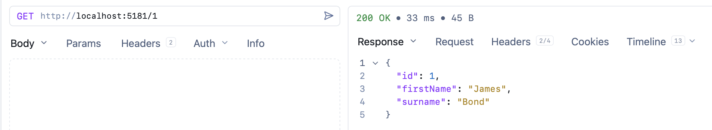
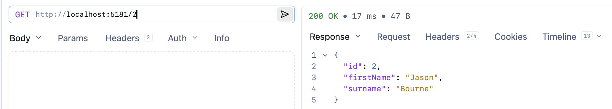
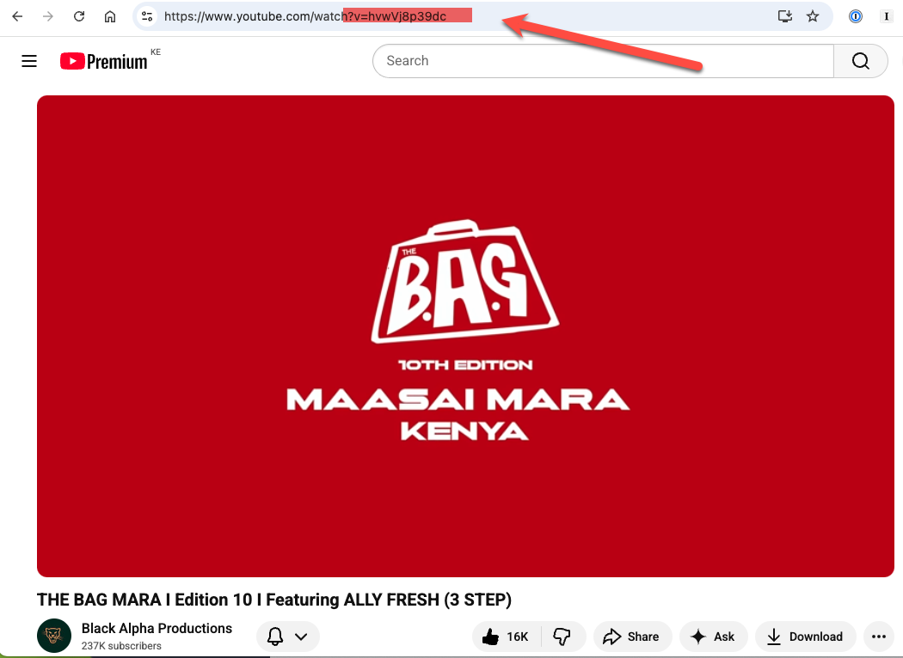
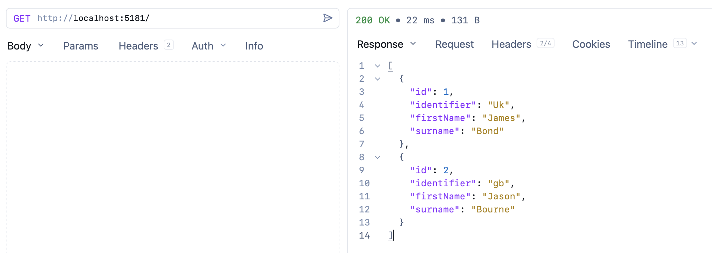
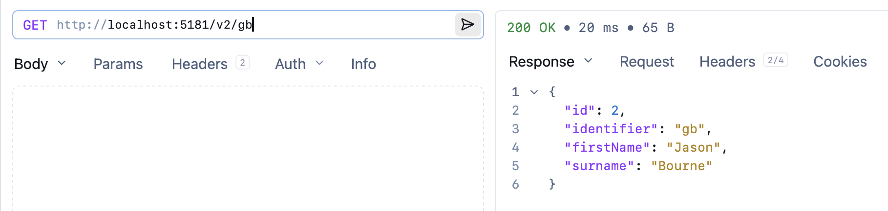
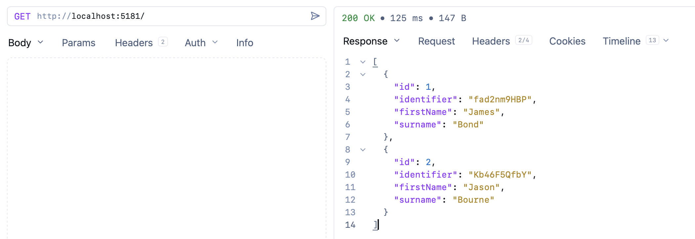
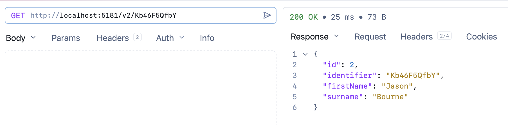

A common issue we run into, yet never think much of, is generating **identifiers**.

Take the following `type`:

```c#
public sealed record Person
{
    public required string ID { get; init; }
    public required string FirstName { get; init; }
    public required string Surname { get; init; }
}
```

Creating a `Person` is straightforward enough:

```c#
var person = new Person()
{
    ID = 1,
    FirstName = "James",
    Surname = "Bond"
};
```

Suppose we were to use this in a [REST](https://en.wikipedia.org/wiki/REST) API.

It would look like this:

`````c#
var builder = WebApplication.CreateBuilder(args);

var people = new List<Person>
{
    new()
    {
        ID = 1,
        FirstName = "James",
        Surname = "Bond"
    },
    new()
    {
        ID = 2,
        FirstName = "Jason",
        Surname = "Bourne"
    }
};

var app = builder.Build();

app.MapGet("/", () => "Hello World!");
app.MapGet("/{ID}", (int id) =>
{
    var person = people.FirstOrDefault(x => x.ID == id);
    if (person is null)
        return Results.NotFound();
    return Results.Ok(person);
});

await app.RunAsync();
`````

We then invoke the API.



Here I am using my preferred API client, [Yaak](https://yaak.app/).

The challenge here is that, given the route identifier is an `integer`, a user can just **guess the next** one.



Generally, you don't want this.

This is the challenge sites like [YouTube](https://www.youtube.com/) face.



You can see here that the video has an **identifier** consisting of **letters** and **numbers**.

You can achieve the same result by using a package for generating identifiers, like [sqlids](https://www.nuget.org/packages/Sqids).

```c#
dotnet add package sqids
```

We then update our code.

First, our updated `Person` class:

```c#
public sealed record Person
{
  public required int ID { get; init; }
  public string Identifier => new SqidsEncoder<int>().Encode(ID);
  public required string FirstName { get; init; }
  public required string Surname { get; init; }
}
```

Then our API:

```c#
using Sqids;

var builder = WebApplication.CreateBuilder(args);

var people = new List<Person.v2.Person>
{
    new()
    {
        ID = 1,
        FirstName = "James",
        Surname = "Bond"
    },
    new()
    {
        ID = 2,
        FirstName = "Jason",
        Surname = "Bourne"
    }
};

var app = builder.Build();

app.MapGet("/", () => Results.Ok(people));
app.MapGet("/v1/{ID:int}", (int id) =>
{
    var person = people.FirstOrDefault(x => x.ID == id);
    if (person is null)
        return Results.NotFound();
    return Results.Ok(person);
});


app.MapGet("/v2/{identifier}", (string identifier) =>
{
    //Decode the ID
    var decoder = new SqidsEncoder<int>();
    var id = decoder.Decode(identifier)[0];
    var person = people.FirstOrDefault(x => x.ID == id);
    if (person is null)
        return Results.NotFound();
    return Results.Ok(person);
});
await app.RunAsync();
```

Of interest is the following code:

```c#
 var id = decoder.Decode(identifier)[0];
```

We are using `[0]` index access because the `Decode` method allows you to **decode multiple identifiers at once**, returning a `List`.

First, we view our `List` of `Person`:



Here, you can see that our `Identifier` is **generated**.

We can use this to access our required `Person` via the new endpoint.



There are several opportunities for improvement with this code:

1. We are repeatedly creating a `SqidsEncoder`
2. Our identifier is too **short**. Perhaps we want it to have a **minimum** length
3. We might want to **customize** the **alphabet** in use

We can update the code as follows:

```c#
using Sqids;

var builder = WebApplication.CreateBuilder(args);

var generator = new SqidsEncoder<int>(new()
{
    MinLength = 10,
    Alphabet = "ABCDEFGHKLMNPQRSTUVWYZabcdefghklmnpqrstuvwxyz23456789",
});

var people = new List<Person.v3.Person>
{
    new()
    {
        ID = 1,
        FirstName = "James",
        Surname = "Bond",
        Identifier = generator.Encode(1)
    },
    new()
    {
        ID = 2,
        FirstName = "Jason",
        Surname = "Bourne",
        Identifier = generator.Encode(2)
    }
};

var app = builder.Build();

app.MapGet("/", () => Results.Ok(people));
app.MapGet("/v1/{ID:int}", (int id) =>
{
    var person = people.FirstOrDefault(x => x.ID == id);
    if (person is null)
        return Results.NotFound();
    return Results.Ok(person);
});


app.MapGet("/v2/{identifier}", (string identifier) =>
{
    var id = generator.Decode(identifier)[0];
    var person = people.FirstOrDefault(x => x.ID == id);
    if (person is null)
        return Results.NotFound();
    return Results.Ok(person);
});
await app.RunAsync();
```

The magic is taking place here:

```c#
var generator = new SqidsEncoder<int>(new()
{
    MinLength = 10,
    Alphabet = "ABCDEFGHKLMNPQRSTUVWYZabcdefghklmnpqrstuvwxyz23456789",
});
```

We are creating an `SqidsEncoder` and configuring it:

1. With a minimum length of 10
2. With an alphabet that strips out `i`,`j`, q (lower and upper case), as well as `1` and `0`

We then use this to **encode** and **decode**.

In a more elaborate API, you can create a `SqidsEncoder` and use [dependency injection]() to access it from within endpoints.

If we now list our `Person` objects:



And our endpoint still works:



You can also write the endpoint like this, and **skip decoding** altogether:

```c#
app.MapGet("/v2/{identifier}", (string identifier) =>
{
    var id = generator.Decode(identifier)[0];
    var person = people.FirstOrDefault(x => x.Identifier == identifier);
    if (person is null)
        return Results.NotFound();
    return Results.Ok(person);
});
```

Your use case will determine the approach that you take.

### TLDR

**To generate unique, distributed identifiers, the library `sqlids` is an excellent choice.**

The code is in my GitHub.

Happy hacking!
