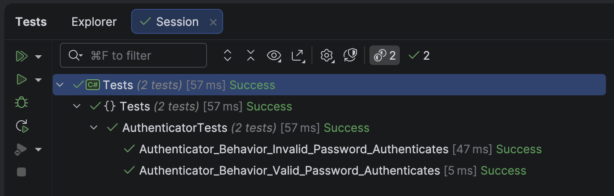

When it comes to [authentication](https://www.microsoft.com/en-us/security/business/security-101/what-is-authentication), there are lots of solutions on the table, ranging from **custom, hand-rolled** solutions to **elaborate** ones like [OAuth](https://www.microsoft.com/en-us/security/business/security-101/what-is-oauth).

One option on the table is to leverage the [LDAP](https://en.wikipedia.org/wiki/Lightweight_Directory_Access_Protocol) protocol, which is available on multiple operating systems, including [Windows](https://www.microsoft.com/en-us/windows).

If your application requires authentication, especially in a domain context, rather than rolling out your own database-based solution, you can leverage something like [Active Directory](https://learn.microsoft.com/en-us/windows-server/identity/ad-ds/get-started/virtual-dc/active-directory-domain-services-overview) and **delegate authentication** to it.

The solution for this is in the [System.DirectoryServices.Protocols](https://www.nuget.org/packages/System.DirectoryServices.Protocols/) package.

First, we create an [interface](https://learn.microsoft.com/en-us/dotnet/csharp/language-reference/keywords/interface) that we will build on to implement multiple `Authentators`.

```c#
namespace Authenticators;

public interface IAuthenticator
{
    public void Authenticate(string username, string password);
}
```

This has a single method that takes a `username` and a `password`.

Our logic is as follows:

1. If authentication succeeds, **do nothing** (return `void`)
2. If authentication fails, **throw** an [Exception](https://learn.microsoft.com/en-us/dotnet/api/system.exception?view=net-10.0).

Rather than throw a generic `Exception`, let us create a **custom** one.

```c#
namespace Authenticators;

public class AuthenticationException : Exception
{
    public AuthenticationException(string message) : base(message)
    {
    }

    public AuthenticationException(string message, Exception exception) : base(message, exception)
    {
    }
}
```

Designing and writing an `Authenticator` to support testing is a bit of a challenge, but we can take several steps to mitigate it.

Here we turn to our old friend, [Moq](https://github.com/devlooped/moq) so that we can write behaviour tests.

We will use this to define our expected behavior.

```c#
using Authenticators;
using AwesomeAssertions;
using Moq;

namespace Tests;

[Trait("Category", "Behaviour")]
public class AuthenticatorBehaviourTests
{
    private readonly IAuthenticator _authenticator;

    public AuthenticatorBehaviourTests()
    {
        // Set up our mock
        var sut = new Mock<IAuthenticator>();
        // Configure success path for a valid password
        sut.Setup(x => x.Authenticate("username", "ValidPassword"));
        // Configure success path for an invalid password
        sut.Setup(x =>
                x.Authenticate(It.IsNotIn("username"), It.IsNotIn("ValidPassword")))
            .Throws<AuthenticationException>();

        // Get an instance from the mock
        _authenticator = sut.Object;
    }

    [Fact]
    public void Authenticator_Behavior_Valid_Password_Authenticates()
    {
        var act = () => _authenticator.Authenticate("username", "ValidPassword");
        act.Should().NotThrow();
    }

    [Fact]
    public void Authenticator_Behavior_Invalid_Password_Authenticates()
    {
        var act = () => _authenticator.Authenticate("username", "InvalidPassword");
        act.Should().Throw<AuthenticationException>();
    }
}
```

If we run our tests, they should pass.



Next, we implement a `FakeLDAPAuthenticator`, so we can inject it for testing.

```c#
namespace Authenticators;

public sealed class FakeLDAPAuthenticator : IAuthenticator
{
    // This simulates a user database
    private readonly IReadOnlyDictionary<string, string> _users;

    public FakeLDAPAuthenticator()
    {
        _users = new Dictionary<string, string>
        {
            ["user1"] = "password1",
            ["user2"] = "password2",
            ["user3"] = "password3"
        };
    }

    public void Authenticate(string username, string password)
    {
        if (!(_users.TryGetValue(username, out var storedPassword)
              && storedPassword == password))
            throw new AuthenticationException("LDAP authenticator failed");
    }
}
```

Some **tests** to verify all is well:

```c#
using Authenticators;
using AwesomeAssertions;

namespace Tests;

[Trait("Category", "Fake LDAP")]
public class FakeLDAPAuthenticatorTests
{
    private readonly FakeLDAPAuthenticator _authenticator;

    public FakeLDAPAuthenticatorTests()
    {
        _authenticator = new FakeLDAPAuthenticator();
    }

    [Fact]
    public void Valid_Username_And_ValidPassword_Succeeds()
    {
        var act = () => _authenticator.Authenticate("user1", "password1");
        act.Should().NotThrow();
    }

    [Fact]
    public void Valid_Username_And_InValidPassword_Fails()
    {
        var act = () => _authenticator.Authenticate("user1", "FAIL");
        act.Should().Throw<AuthenticationException>();
    }

    [Fact]
    public void Valid_Username_And_ValidPassword_For_Different_User_Fails()
    {
        var act = () => _authenticator.Authenticate("user1", "password2");
        act.Should().Throw<AuthenticationException>();
    }

    [Fact]
    public void Invalid_Username_And_InValidPassword_For_Different_User_Fails()
    {
        var act = () => _authenticator.Authenticate("INVALID", "INVALID");
        act.Should().Throw<AuthenticationException>();
    }
}
```

Finally, we write the `LDAPAuthenticator`.

`````c#
using System.DirectoryServices.Protocols;
using System.Net;

namespace Authenticators;

public sealed class LDAPAuthenticator : IAuthenticator
{
    private readonly string _domain;

    public LDAPAuthenticator(string domain)
    {
        ArgumentException.ThrowIfNullOrEmpty(domain);
        _domain = domain;
    }

    public void Authenticate(string username, string password)
    {
        ArgumentException.ThrowIfNullOrEmpty(username);
        ArgumentException.ThrowIfNullOrEmpty(username);
        try
        {
            var ldap = new LdapConnection(new LdapDirectoryIdentifier(_domain))
            {
                AuthType = AuthType.Basic
            };

            var credential = new NetworkCredential(username, password);

            ldap.Bind(credential);
        }
        catch (Exception ex)
        {
            throw new Exception("Error authenticating user!", ex);
        }
    }
}
`````

Our integration tests will look like this:

```c#
using Authenticators;
using AwesomeAssertions;

namespace Tests;

[Trait("Category", "LDAP")]
public class LDAPAuthenticatorTests
{
    [Theory]
    [InlineData("yourDomain.com", "yourUser", "yourPassword")]
    public void Valid_Username_And_ValidPassword_Succeeds(string domain, string user, string password)
    {
        var authenticator = new LDAPAuthenticator(domain);
        var act = () => authenticator.Authenticate(user, password);
        act.Should().NotThrow();
    }

    [Theory]
    [InlineData("yourDomain.com", "yourUser", "INVALID")]
    public void Valid_Username_And_InValidPassword_Fails(string domain, string user, string password)
    {
        var authenticator = new LDAPAuthenticator(domain);
        var act = () => authenticator.Authenticate(user, password);
        act.Should().Throw<AuthenticationException>();
    }

    [Fact]
    public void Null_Domain_Throws_Exception()
    {
        var act = () => new LDAPAuthenticator("");
        act.Should().Throw<ArgumentException>();
    }

    [Fact]
    public void Null_UserName_Throws_Exception()
    {
        var authenticator = new LDAPAuthenticator("yourDomain.com");
        var act = () => authenticator.Authenticate("", "password");
        act.Should().Throw<ArgumentException>();
    }

    [Fact]
    public void Null_Password_Throws_Exception()
    {
        var authenticator = new LDAPAuthenticator("yourDomain.com");
        var act = () => authenticator.Authenticate("user", "");
        act.Should().Throw<ArgumentException>();
    }
}
```

In this way, we can leverage LDAP authentication in our applications.

### TLDR

**You can leverage `LDAP` using types in the [System.DirectoryServices.Protocols]() namespace.**

The code is in my [GitHub](https://github.com/conradakunga/BlogCode/tree/master/Authenticators).

Happy hacking!
