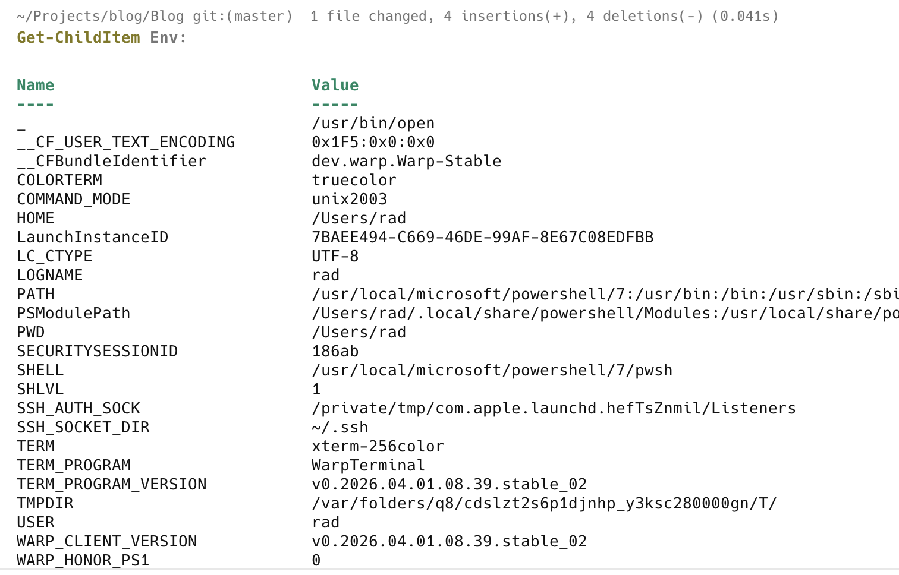
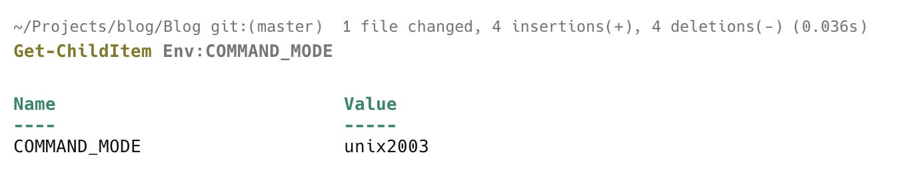
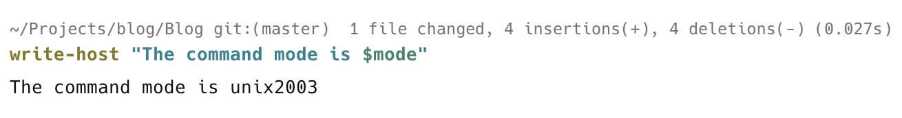

Occasionally, you might want to **read** an [environment variable](https://en.wikipedia.org/wiki/Environment_variable) from your [PowerShell](https://learn.microsoft.com/en-us/powershell/) session.

This is pretty trivial.

To **list** all the environmental variables, run the following command:

```powershell
Get-ChildItem Env:
```

This will return a response like this:



To **get** a particular variable, you need to know its **name**.

Let us take, for example, `COMMAND_MODE`

```powershell
Get-ChildItem Env:COMMAND_MODE
```

You will see something like this:



If you want to **capture** it for subsequent use, you do it like this:

```bash
$mode = $env:COMMAND_MODE
```

You can then use it subsequently in your script or in the shell session.

```bash
write-host "The command mode is $mode"
```



### TLDR

**You can access environment variables from `PowerShell` using the [Get-ChildItem](https://learn.microsoft.com/en-us/powershell/module/microsoft.powershell.management/get-childitem?view=powershell-7.6) cmdlet or the [$env](https://learn.microsoft.com/en-us/powershell/module/microsoft.powershell.core/about/about_environment_variables?view=powershell-7.5) variable.**

Happy hacking!
