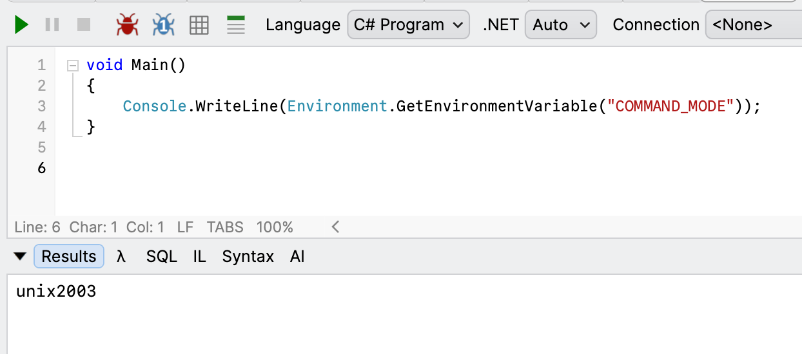
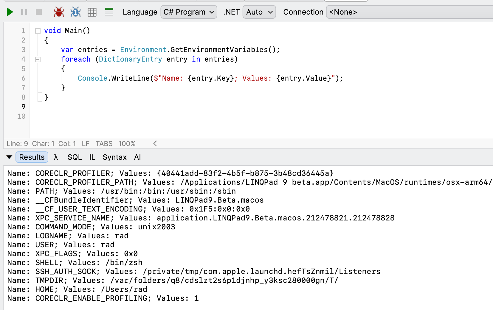

Our previous post, "[How To Read Environment Variables In PowerShell]()", looked at how you can **read** [environment variables](https://en.wikipedia.org/wiki/Environment_variable) using [PowerShell](https://learn.microsoft.com/en-us/powershell/module/microsoft.powershell.management/get-childitem?view=powershell-7.6) and either just **view** them or **use** them subsequently in your scripts.

In this post, we will look at how to do the same in C# & .NET.

The [Environment](https://learn.microsoft.com/en-us/dotnet/api/system.environment?view=net-10.0) `class` has a method, [GetEnvironmentVariable()](https://learn.microsoft.com/en-us/dotnet/api/system.environment.getenvironmentvariable?view=net-10.0), for this purpose.

```c#
Console.WriteLine(Environment.GetEnvironmentVariable("COMMAND_MODE"));
```

This will print what we are expecting:



It is also possible to get all the environment variables via the appropriately named [GetEnvironmentVariables()](https://learn.microsoft.com/en-us/dotnet/api/system.environment.getenvironmentvariables?view=net-10.0) method.

```c#
var entries = Environment.GetEnvironmentVariables();
foreach (DictionaryEntry entry in entries)
{
	Console.WriteLine($"Name: {entry.Key}; Values: {entry.Value}");
}
```

This will print something like this:



### TLDR

**You can retrieve environment variables in C# using either `GetEnvironmentVariable()` or `GetEnvironmentVariables()` methods from the `Environment` object.**

Happy hacking!
