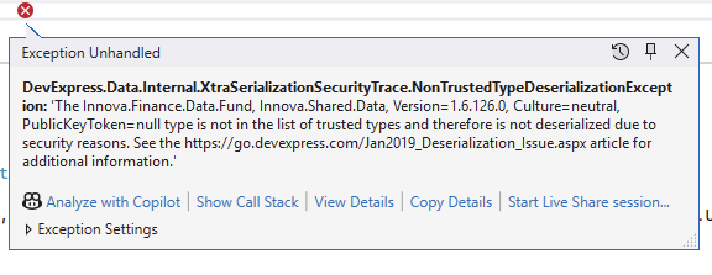

In a previous post, "[Tip - DevExpress XtraReports CodeDomLayoutSerializationRestrictedException]()", we looked at an exception that you may get when you attempt to load a [XtraReport](https://docs.devexpress.com/XtraReports/DevExpress.XtraReports.UI.XtraReport) that has been serialized using [CodeDOM](https://learn.microsoft.com/en-us/dotnet/framework/reflection-and-codedom/using-the-codedom).

In this post, we will look at a similar error, `DevExpress.Data.Internal.XtraSerializationSecurityTrace.NonTrustedTypeDeserializationException` that you may get when attempting to **deserialize** an [XML](https://en.wikipedia.org/wiki/XML)-formatted report.

The error presents as follows:



The text is as follows:

```plaintext
DevExpress.Data.Internal.XtraSerializationSecurityTrace.NonTrustedTypeDeserializationException: 'The Innova.Finance.Data.Fund, Innova.Shared.Data, Version=1.6.126.0, Culture=neutral, PublicKeyToken=null type is not in the list of trusted types and therefore is not deserialized due to security reasons
```

Naturally, the exact `type` it will complain about depends on your code.

The problem here is that, by default, **the engine will not trust any serialized types** unless you tell it to.

This is a security feature designed to mitigate deserialization of potentially **dangerous payloads**, which may occur if you allow users to provide their own serialized reports.

The quickest way is to proactively tell the reporting engine that you trust **all the types in a specific assembly**.

Like so:

```vb
DevExpress.Utils.DeserializationSettings.RegisterTrustedAssembly(GetType(Client).Assembly)
```

In [C#](https://learn.microsoft.com/en-us/dotnet/csharp/), it will look like this:

```c#
DevExpress.Utils.DeserializationSettings.RegisterTrustedAssembly(typeof(CustomClass).Assembly);
```

If the `Assembly` is too broad for your consideration, you can register the specific `type` you want trusted, like so:

```c#
DevExpress.Utils.DeserializationSettings.RegisterTrustedAssembly(typeof(CustomClass));  
```

The `XtraReport` engine will now be able to load your serialized report and any types that it requires.

### TLDR

**You have to tell the DevExpress reporting engine to trust any types that it will require for serialized report definitions.**

Happy hacking!
