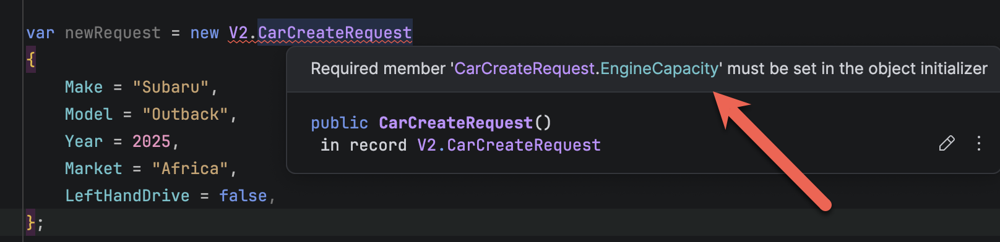

**Code Housekeeping** refers to general rules of thumb that make code easier to **read**, **digest**, and **modify** for other developers, **yourself** included.

In our previous post, "[Code Housekeeping - Part 7 - Eschew Methods With Many Parameters]()", we looked at the problems that can arise from `methods` that have **many parameters**.

Our solution to this was to create an `object`, and pass that to the `method`.

The `object` looked like this:

```c#
public sealed record CarCreateRequest(
    string make,
    string model,
    int year,
    string market,
    bool leftHandDrive,
    int engineCapacity);
```

And it was invoked like this:

```c#
var request = new CarCreateRequest("Subaru", "Outback", 2025, "Africa", false, 2000);
factory.CreateCar(request);
```

The challenge here was that we had moved the problem of **readability** and **ease of refactoring** from the `method` parameters to the `object` `constructor`.

A good solution to this is the [object initializer](https://learn.microsoft.com/en-us/dotnet/csharp/programming-guide/classes-and-structs/object-and-collection-initializers).

We can **refactor** our `CarCreateRequest` as follows:

```c#
public sealed record CarCreateRequest
{
  public required string Make { get; set; }
  public required string Model { get; set; }
  public required int Year { get; set; }
  public required string Market { get; set; }
  public required bool LeftHandDrive { get; set; }
  public required int EngineCapacity { get; set; }
}
```

This is now invoked like this:

```c#
var newRequest = new V2.CarCreateRequest
{
  Make = "Subaru",
  Model = "Outback",
  Year = 2025,
  Market = "Africa",
  LeftHandDrive = false,
  EngineCapacity = 2000
};
```

Compare and contrast the readability of these two:

```c#
var request = new V1.CarCreateRequest("Subaru", "Outback", 2025, "Africa", false, 2000);

var newRequest = new V2.CarCreateRequest
{
  Make = "Subaru",
  Model = "Outback",
  Year = 2025,
  Market = "Africa",
  LeftHandDrive = false,
  EngineCapacity = 2000
};
```

The second is orders of magnitude **easier to read**, even without an **IDE** to assist with the **parameter names**.


An additional benefit is that the [required](https://learn.microsoft.com/en-us/dotnet/csharp/language-reference/keywords/required) modifier will **force you to provide all the parameters**. If you **omit** one, the **compiler will let you know** about it and refuse to compile.

If we were to omit `EngineCapacity`, we would get the following  **compiler error**:



In this way we improve the **legibility** and **understanding** of our code.

Naturally, this will **not always be possible** as there are scenarios where you must use a **traditional** `constructor`.

### TLDR

**Prefer object initializers to object constructors wherever possible.**

The code is in my [GitHub](https://github.com/conradakunga/BlogCode/tree/master/2026-03-09%20-%20ObjectInitializers).

Happy hacking!
