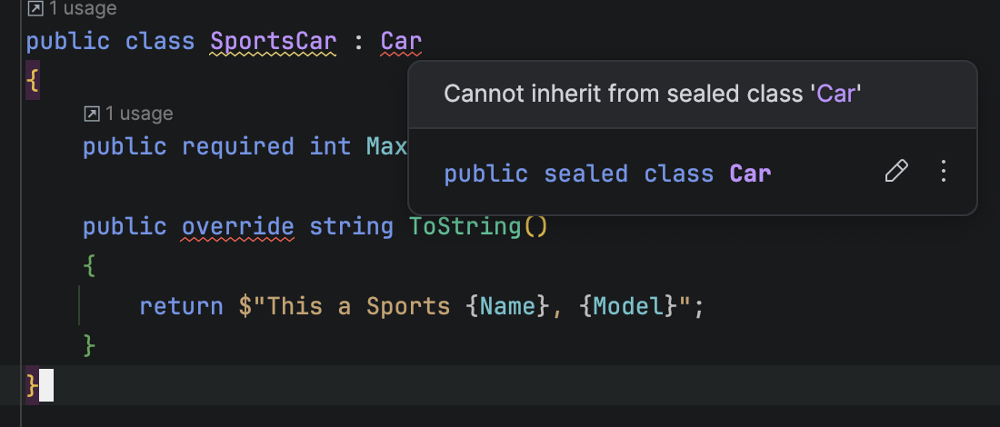

**Code Housekeeping** refers to general rules of thumb that make code easier to **read**, **digest**, and **modify** for other developers, **yourself** included.

If I were to open any of your projects, I can bet almost all of your classes will look like this:

```c#
public class Car
{
    public required string Name { get; set; }
    public required string Model { get; set; }
    public required int YearOfManufacture { get; set; }

    public override string ToString()
    {
        return $"{Name}, {Model} ({YearOfManufacture})";
    }
}
```

Your modifiers is almost always `public` .

This means that any downstream user can **extend** your `class`.

```c#
public class SportsCar : Car
{
    public required int MaxSpeed { get; set; }

    public override string ToString()
    {
        return $"This a Sports {Name}, {Model}";
    }
}
```

But why is that by default the `class` is extensible?

The reality is a `class` that allows **extensibility** must be **designed with extensibility in mind**. This is almost always **not** the case.

Get into the habit of [sealing](https://learn.microsoft.com/en-us/dotnet/csharp/language-reference/keywords/sealed) your `classes` by default, like this:

```c#
public sealed class Car
{
  public required string Name { get; set; }
  public required string Model { get; set; }
  public required int YearOfManufacture { get; set; }

  public override string ToString()
  {
  	return $"{Name}, {Model} ({YearOfManufacture})";
  }
}
```

By default, you cannot extend this.

If later down the road **you**, or a **downstream user** requires to **extend** the class, a **conversation** can be had about it, and the appropriate **design modifications** can be done to the `class` to allow this.

Otherwise trying to inherit a `sealed` class gives you a compiler error:



If i had my way I would have the default modifier for modern IDEs to be `sealed` for any new code.

### TLDR

**Seal classes by default, until a need arises to extend them.**

The code is in my [GitHub](https://github.com/conradakunga/BlogCode/tree/master/2026-03-10%20-%20DefaultSealed).

Happy hacking!
