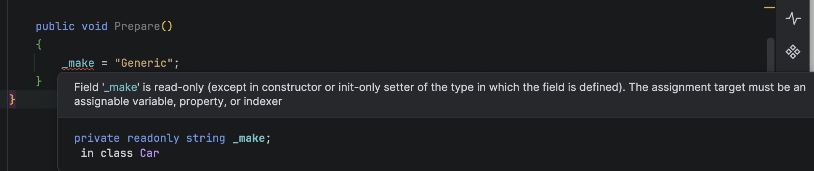

**Code Housekeeping** refers to general rules of thumb that make code easier to **read**, **digest**, and **modify** for other developers, **yourself** included.

Our last post, "[Code Housekeeping - Part 9 - Seal Classes & Records By Default]()", looked at how, by default, [C#](https://learn.microsoft.com/en-us/dotnet/csharp/) classes are **extensible** as they are not [sealed](https://learn.microsoft.com/en-us/dotnet/csharp/language-reference/keywords/sealed).

This generally is a result of **code generated** by your IDE (or t**y**ped if you are hand crafting the `classes`).

This "default" behaviour also extends to [private](https://learn.microsoft.com/en-us/dotnet/csharp/language-reference/keywords/private) `members`.

Your typical `class` will look like this:

```c#
public sealed class Car
{
    private string _name;
    private string _make;
    private string _model;

    public Car(string name, string make, string model)
    {
        _name = name;
        _make = make;
        _model = model;
    }
}
```

This is a `Car` class, that takes some parameters in the `constructor` that it **assigns** to `private` **members**.

Simple enough.

It is unlikely that the `Make`, `Name` or `Model` of the car will **change** during the lifetime of the `class`.

But at present, there is **nothing** stopping a user from doing this:

```c#
public void Prepare()
{
    _make = "Generic";
}
```

Any of the `private` members can be **modified**, whether by **accident** or **design**.

A good rule of thumb is if you know for a fact that the **members should not be modified** in the lifetime of the class, declare them as [readonly](https://learn.microsoft.com/en-us/dotnet/csharp/language-reference/keywords/readonly) so that they are only set in the `constructor` and are **fixed** from then on.

```c#
public sealed class Car
{
    private readonly string _name;
    private readonly string _make;
    private readonly string _model;

    public Car(string name, string make, string model)
    {
        _name = name;
        _make = make;
        _model = model;
    }
}
```

If you now try and change any of the members, you will get a **compiler error**:



Naturally, you should not do this if your logic **mutates these members**.

### TLDR

**Where appropriate, make your members `readonly`.**

The code is in my [GitHub](https://github.com/conradakunga/BlogCode/tree/master/2026-03-11%20-%20ReadOnlyMembers).

Happy hacking!
