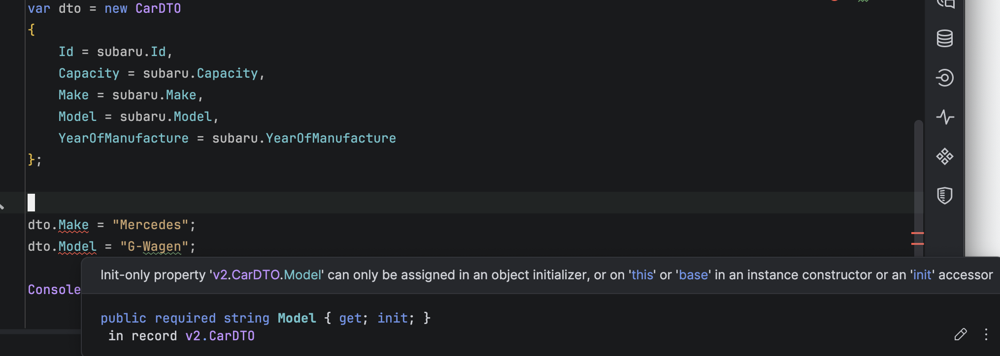

**Code Housekeeping** refers to general rules of thumb that make code easier to **read**, **digest**, and **modify** for other developers, **yourself** included.

In your typical application, your `types` will typically have [mutable](https://khaledov.medium.com/understanding-mutable-and-immutable-types-in-c-93c29813a476) `properties` or `fields`.

Take this `Car` class that is used to persist to the database.

```c#
public sealed class Car
{
    public required int Id { get; set; }
    public required string Make { get; set; }
    public required string Model { get; set; }
    public required int Capacity { get; set; }
    public required int YearOfManufacture { get; set; }
}
```

We also have a [DTO](https://en.wikipedia.org/wiki/Data_transfer_object) that we use to interface with the rest of the the application:

```c#
public sealed record CarDTO
{
    public required int Id { get; set; }
    public required string Make { get; set; }
    public required string Model { get; set; }
    public required int Capacity { get; set; }
    public required int YearOfManufacture { get; set; }
}
```

The usage of these is straightforward enough.

```c#
var subaru = new Car
{
    Id = 1,
    Capacity = 2000,
    Make = "Subaru",
    Model = "Outback",
    YearOfManufacture = 2026
};

var dto = new CarDTO
{
    Id = subaru.Id,
    Capacity = subaru.Capacity,
    Make = subaru.Make,
    Model = subaru.Model,
    YearOfManufacture = subaru.YearOfManufacture
};
```

The problem here is that there is **nothing** stopping you from doing this:

```c#
dto.Make = "Mercedes";
dto.Model = "G-Wagen";

Console.WriteLine(dto);
```

If we run this code it will print the following:


You have successfully **modified** the `DTO` (which makes no sense), despite the fact that the **underlying data model is unchanged**.

This has been the source of many unintended **bugs** and **failures**.

The solution to this is to make the `DTO` **immutable**. Once it is set, **that is it**.

```c#
public sealed record CarDTO
{
  public required int Id { get; init; }
  public required string Make { get; init; }
  public required string Model { get; init; }
  public required int Capacity { get; init; }
  public required int YearOfManufacture { get; init; }
}
```

Now, we cannot **change** the `DTO` **even if we wanted to**.



You enjoy a number of benefits from this:

1. Cannot accidentally (or deliberately) **change** the `DTO` properties
2. **Communicates** clearly the **intent** of the `type`
3. As it is immutable, it can be **safely** accessed from **multiple threads**

### TLDR

**Whenever possible, make your types `immutable`.**

The code is in my GitHub.

Happy hacking!
